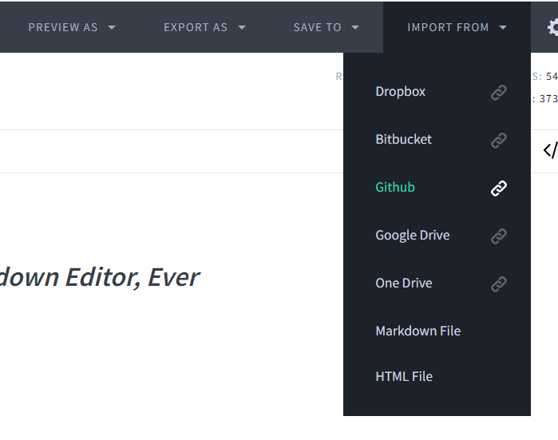

# bmth-arg-wiki.github.io

This wiki project uses Jekyll to build pages for its wiki and GitHub for its hosting, using a custom 
theme.

[Contributing to the Wiki](#contributing-to-the-wiki)
[Developing the Wiki](#developing-the-wiki)

## Contributing to the Wiki

If you want to be a collaborator on the wiki, please reach out on the ARG Discord or
email [bmthargwiki@gmail.com](mailto:bmthargwiki@gmail.com).

Our less technical volunteers can contribute by writing [Markdown (tutorial)](https://www.youtube.com/watch?v=qhoXn4bIE1s). This is a relatively simple technology 
that you can learn the basics of in just a few minutes. It is widely used and you may even know 
some of it from a forum or Discord already!

Also check out the [markdown example](markdown_example) (rendered) vs. [the code](markdown_example.md)!

You can use any Markdown editor, including online ones like [Dillinger](https://dillinger.io/). 
Dillinger can retrieve the files and make changes directly to GitHub. You will need to 
[create an account](https://www.github.com) by clicking "Sign up" and following the instructions.

You will be asked to log in to GitHub. Log in, then click the same button again. You 
should have access to the repository given by an admin. You can import all public 
repositories. You can now import the document you wish to edit. When you are done editing, 
you click "Save to", where you will be prompted to add a short description of what you changed. 
Please keep this clear and concise.

## Developing the Wiki

This project is a simple front-end built with HTML/CSS and JavaScript.

Are you a dev on this project or do you just want to run it? Here's the way to do it.

### Step 1: Get Ruby installed

- MacOS has Ruby pre-installed.
- Linux usually boils down to [sudo apt-get install ruby-full](https://www.ruby-lang.org/en/documentation/installation/#package-management-systems)

#### Windows

Use [RubyInstaller](https://rubyinstaller.org/downloads/) for Windows. Be sure to use the 
checkmark to add it to your path, or you will have to do it manually. Restart your computer 
when the installation is complete.

### Step 2: git from GitHub

`https://github.com/bmth-arg-wiki/bmth-arg-wiki.github.io/`

You need to get the code onto your computer. Clone the repository in the desired location 
on your computer. This might take a while due to the resources used on the webpage. Hosting is 
expensive and we are thankful for GitHub pages in this house. 🏠

### Step 3: Run Ruby

1. Open up your terminal. Run `gem -v`. If it shows anything at all: congrats! Ruby is installed.

2. Navigate to the folder you just cloned the repository into. All the code, articles, images
and more should now be in here, including something called `Gemfile` (no extension).

3. We will now install the required libraries using something called `bundler`, with the command 
`bundle install`. Make sure you are in the same folder as the `Gemfile`.

4. Read your error messages and warnings: if the system tells you to update, you need to follow 
the instructions.

5. If there are no more error messages/warnings and everything has been installed, you can now 
run the project locally by executing the following command: 

`bundle exec jekyll serve`

6. View the project on `http://127.0.0.1:4000`. If strange things start happening, terminate the
program and re-run the jekyll command. -
