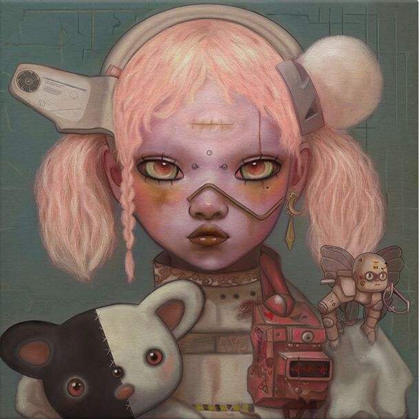
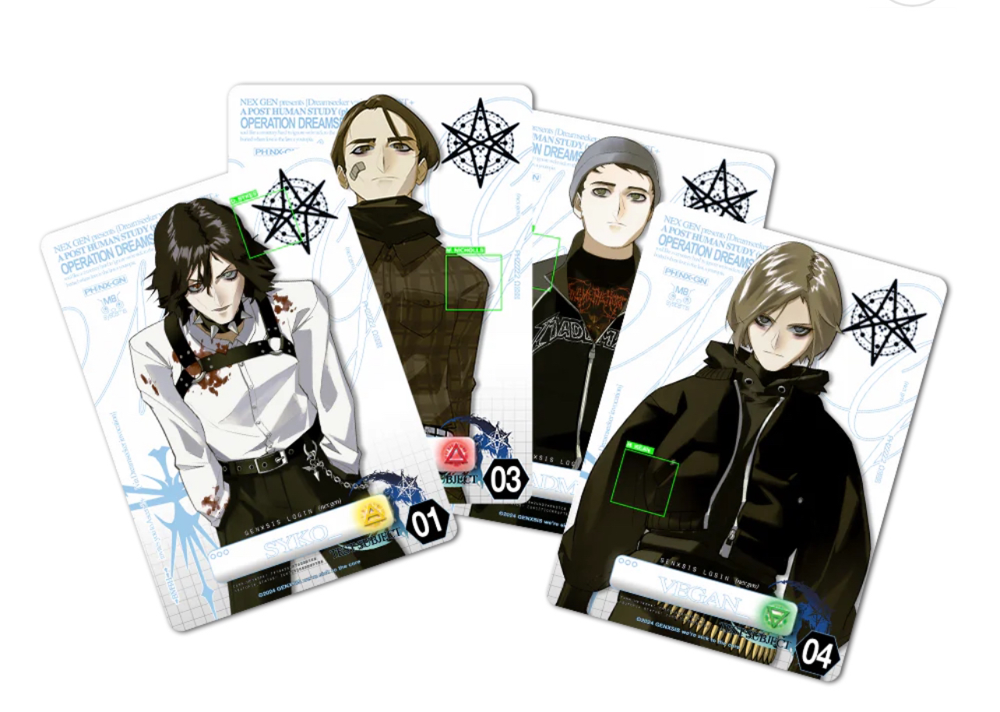

# Welcome to YOUtopia

Welcome to this (currently small) wiki about BMTH's NexGen ARG. This is a work in progress. 
This wiki will focus on objective information as much as possible and indicate whenever something is not confirmed.

## Getting started

There is a lot going on in this ARG! This section will attempt to explain the most important sources.

### The Album

The album itself contains many tracks, with some of them hiding secrets! Nearly all tracks 
have a lyric video and there are many official videos too.

### The Webpage

The webpage for the ARG can be found [here](https://www.multidimensionalnavigator8.help/index-desktop.html) 
and provides the bulk of what we know about the Nex Gen lore. The wiki also covers [the webpage](pages/webpage) 
itself and the components on it.

Currently, many functionalities (including wi-fi) are disabled. Updates have mostly opened up 
files in a folder called [FOR SOF](pages/files/for-sof). The recommended order is to read about the webpage first, 
then read more about the files in this folder. All passwords are spoiler-tagged, but articles about characters, songs 
or the lore will obviously contain many spoilers.

### Socials & other sources

BMTH also post ARG- and Nex Gen-related posts on their Instagram, Twitter/X, YouTube and Facebook. Some important 
posts are covered on [the page on social posts](pages/socials/social-posts).

Some [other webpages](pages/other-webpages) have also been linked or are theorised to link to this ARG, 
they are discussed in their own article.

## Collaborators and conspirators

Want to get in on the project and lore discussions with our team? Let us know in the Discord ARG server or email to 
bmthargwiki@gmail.com.

You will need:
- A GitHub account
- Any Markdown editor (like Dillinger)
- Some knowledge of Markdown that is super easy to pick up.