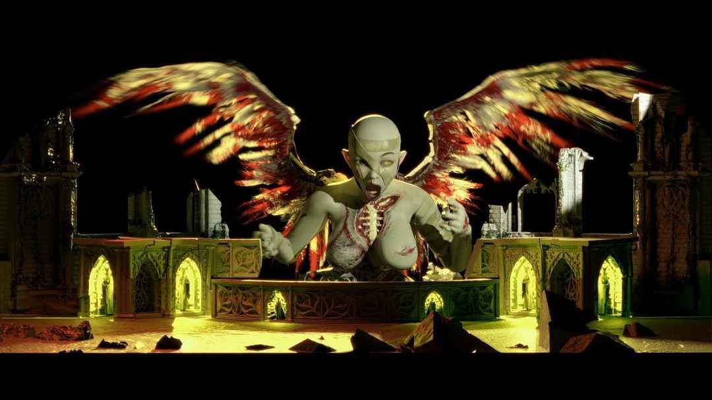

# Angeldust

Angeldust appears in the live shows as a 'rotten angel' (as she is described by the artist on 
Instagram), who attacks the [Church of Genxsis](../lore/church). 
When her arrival is communicated to [E.V.E](eve), it becomes clear that she is an enemy to her.

***

## Read More

- [Kool-Aid](../music/song-koolaid)
- [Nex Gen Corporation](../lore/nex-gen-corporation)
- [Church of Genxsis](../lore/church)

Angeldust might also be linked to [Project D.U.S.T.](../files/project_dust).

***

## See More

- [Rock Am Ring live show on YouTube](https://www.youtube.com/watch?v=zSwqLsuJRY0&pp=ygUebGl2ZSBzaG93IGJyaW5nIG1lIHRoZSBob3Jpem9u)
- [BMTH live in London](https://www.youtube.com/watch?v=iDLwJ_ZqMk8)
- [BMTH live at Graspop](https://www.youtube.com/watch?v=YNhjDaZmaac)

***

## Gallery

