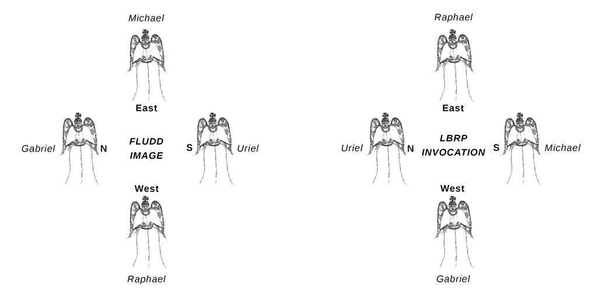

# Archangels

The archangels are four of the users in the system, connected to the 
[four insights](../lore/insights)

## Link (spi)ritual

```
Before me Raphael,
Behind me Gabriel,
On my right hand Michael,
On my left hand Uriel…
```

There are several references to this configuration of the four archangels, which is 
also mentioned as being part of the 
[Lesser Banishing Ritual of the Pentagram](https://www.futureconscience.com/before-me-raphael-sacred-magic-and-the-four-archangels/). 
The same invocation can be found in the source on this ritual.




Angels can also be found in the [spectrograms](../music/spectrograms) in 
[(spi)ritual](../music/song-spiritual).

## Read More

- [The Insights](../lore/insights)
- [Raphael](raphael)
- [Gabriel](gabriel)
- [Michael](michael)
- [Uriel](uriel)