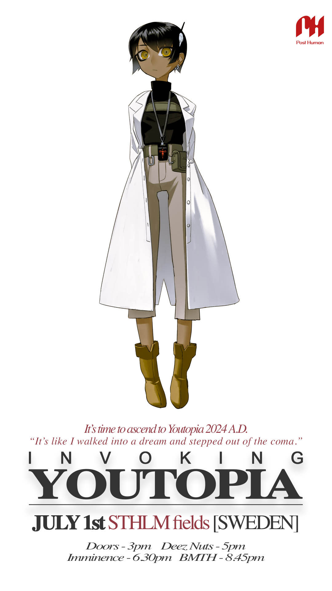

# Characters

The following page contains a categorization and short summary of all users in the system, as well as any other 
significant characters in this ARG. It will help you get an overview of the most 
important names and how the characters relate to each other.

## E.V.E (L)

[E.V.E](eve) (Evolutionary Virtual Experiment), an AI supercomputer with questionable 
intentions for humanity. She is user 0000 in the system, where she seems to be labeled 
as just 'EVE'. This makes her the first user in the system.

## Sof

[Sof](sof) is the daughter of Selene and the girl on the NexGen album cover. She has no user in the 
[multidimensional navigator 8](../m8). She has pink hair, which may be due to a rare phenomenon 
discussed in [The Science Study newspaper](../files/thesciencestudy).

## M8

[M8](../m8) or Multidimensional Navigator 8, is a system assisting us during the ARG, as well as 
the 'computer environment' we seem to be in. M8 is referred to as a **she** in the audio log 
for Sof by [Selene](selene). M8 also has at least two predecessors in D8, which we learn about in 
[Ren's log](../files/lauren_d8_log), and [R8](../files/r8).

## Selene

[Selene](selene) is Sof's mother, leaving her about 20 minutes after birth. She 
knows a lot about how M8 functions and claims it has saved her several times. She is user 0003 
in the system.

## Emily

The name "Emily" is rank 9 out of 10 ranks to appear for a Discord event centered around the 
[church of Genxsis](../lore/church). E.V.E is ranked 8th, implying that Emily is somehow above her in the ranks of Genxsis.

## The Archangels

[The archangels](archangels) and their [insights](../lore/insights)

- [Raphael - Connection](raphael)
- [Gabriel - Empathy](gabriel)
- [Michael - Purpose](michael)
- [Uriel - Vision](uriel)

Raphael, strangely, is users 0004, 0007 and 0008 in the system. 
Gabriel is user 0017, Michael is 0011 and Uriel is 0002.

## Omens

The following characters are omens of the [insights](../lore/insights):

- [Pan - Connection](pan)
- [Miseria - Empathy](miseria)
- [Vanth: Princess of Darkness - Purpose](vanth)

Uriel's insight is [Vision](../lore/insight4-vision), which has the omen 'the Babylon'. 
It is unknown whether this refers to a character, or the real life Babalon.

Pan's user number is 0009, Miseria's is 0010 and Vanth's is 0018. Pan might also 
play a role in [Night of Pan](../lore/night-of-pan) ritual.

## The Band Members

In the NexGen we can see that the band members are all tagged.

The band members have also all changed their profile pictures to characters 
of the game, strongly implying that these are the band's in-universe characters.

The following characters correspond to the members:
- [Syko - Oliver Sykes](syko)
- [Vegan - Matt Kean](vegan)
- [Madman - Lee Malia](madman)
- [Pickles - Mat Nicholls](pickles)

Sykes/Syko is 0005, Kean/Vegan is 0001, Malia/Madman is 0010 and Nicholls/Pickles is 0012.

A promotional image of the band on cards also links them to the [four insights](../lore/insights).

## Nex Gen & Trinity employees

### Trinity

The members of the Trinity are three scientists, mentioned first in the [trinity document](../files/trinity_document).

#### Strassman
The first member is [Dr. Karl Strassman](strassman), a doctor that works with [Eve](eve), as 
evidenced by the [strassman codec](../files/strassmancodec). He is user 0014 on the [webpage](../webpage).

#### Skys
The second member is cult leader Skys, who we see in the music video for [Mantra](../music/amo-mantra). Some 
imagery related to Mantra also appears in the music video for [Sugar, Honey, Ice and Tea](../music/amo-shit).

#### Dallus Lauren

Dallus Lauren was the head of R&D at Arc/Hive (see [Project D.U.S.T.](../files/project_dust)). 
He passed away before 2037, as evidenced by the [D8 log](../files/lauren_d8_log) from his son 
[Ikaro (Ren) Lauren](ren). The project D.U.S.T. file explains that he suffers from mares, despite 
a desensitization protocol. 

The following is speculation and has not been confirmed:

One of the photos on the [trinity document](../files/trinity_document) 
also bears a strong resemblance to Forest Whitaker (actor) in the [In the Dark](../music/amo-in-the-dark) 
music video, who seems to be going through what looks like this desensitization protocol. This video 
also contains (a second version of) the altilium chordata tank we see in the project D.U.S.T. file.

### Victor Carmine

Victor Carmine is a mysterious man mentioned in the [Tekka Interview](../files/tekka_interview). Jax Jackson, 
the interviewer from Tekka mentions that he is a "big player" and that some call him a visionary, others call 
him a psycho.

### Dr. Elias Mortem

Dr. Elias Mortem was the lead scientist at Arc/Hive Research Division.

### Iara

[Iara](../characters/iara) works at Nex Gen, which is confirmed by several details. 
First of all, she is noted as "Iara (work)" in the [codek messenger](../webpage#codek). 
We also see her wearing a Nex Gen access card on her poster, which was published on 
[social media](../socials/social-posts). She is also number 0015 on the [webpage](../webpage).

### Rebecca

Rebecca was a terminally ill lab assistant at Arc/Hive, before becoming the first 
synth. She is [interviewed](../files/tekka_interview) about the ambitious project from Nex Gen 
by a magazine called Tekka.

## Read More

- [Sof](sof)
- [Selene](selene)
- [E.V.E](eve)
- [The Archangels](archangels)
  - [Raphael](raphael)
  - [Gabriel](gabriel)
  - [Michael](michael)
  - [Uriel](uriel)
- Omens
  - [Pan](pan)
  - [Miseria](miseria)
  - [Vanth](vanth)
  - The Babalon
- Band Members
  - [Syko](syko)
  - [Madman](madman)
  - [Vegan](vegan)
  - [Pickles](pickles)
- Nex Gen and Trinity
  - [Trinity document](../files/trinity_document)
  - [Tekka Interview](../files/tekka_interview)
  - [Project D.U.S.T.](../files/project_dust)
- Character Journals
  - [Ren](../files/lauren_d8_log)
  - [Scott/Syko](../files/scott_personal_journal)
  - [Selene](../files/selene_personal_journal)