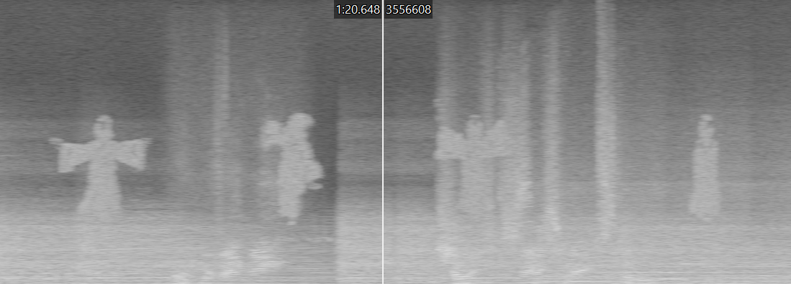
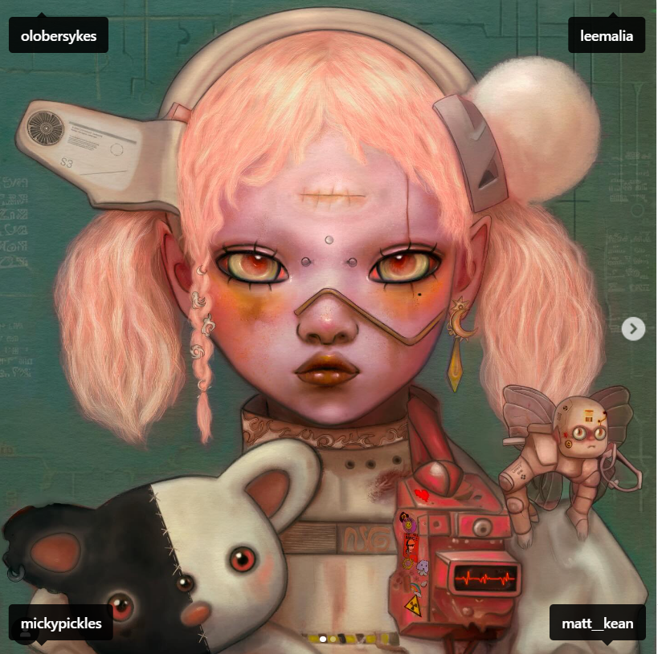
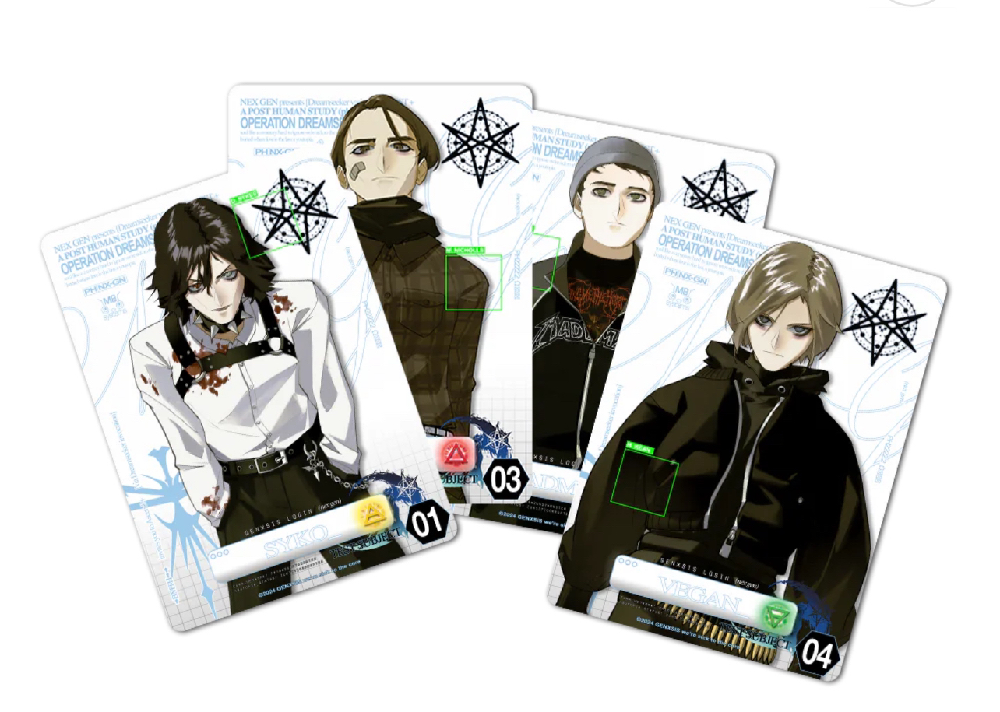

# Characters

The following page contains a categorization and short summary of all users in the system, as well as any other 
significant characters in this ARG. It will help you get an overview of the most 
important names and how the characters relate to each other.

***

## System Users

The following characters are mentioned on the website:

- [0000 E.V.E.](eve) 
- [0001 Vegan](vegan)
- [0002 Uriel](uriel)
- [0003 Selene](selene)
- [0004 Raphael](raphael)
- [0005 Syko](syko)
- [0006 M8](../m8)
- [0007 Raphael](raphael)
- [0008 Pan](pan)
- [0009 Miseria](miseria)
- [0010 Michael](michael)
- [0011 Pickles](pickles)
- [0012 Madman](madman)
- [0013 Strassman](strassman)
- [0014 Ren](ren)
- [0015 Iara](iara)
- [0016 Gabriel](gabriel)
- [0017 Vanth](vanth)

Additionally, there are characters not listed on M8. These are:

- [Sof](sof)
- [Emily](#emily)
- [Victor Carmine](#victor-carmine)
- [Dr. Elias Mortem](#dr-elias-mortem)
- [Rebecca](#rebecca)

***

## Other Characters

These characters have been mentioned in documents and currently do not have 
enough information to have their own dedicated page.

### Emily

The name "Emily" is rank 9 out of 10 ranks to appear for a Discord event centered around the 
[church of Genxsis](../lore/church). E.V.E is ranked 8th, implying that Emily is somehow above her in the ranks of Genxsis.

### Victor Carmine

Victor Carmine is a mysterious man mentioned in the [Tekka Interview](../files/tekka_interview). Jax Jackson,
the interviewer from Tekka mentions that he is a "big player" and that some call him a visionary, others call
him a psycho.

### Dr. Elias Mortem

Dr. Elias Mortem was the lead scientist at Arc/Hive Research Division.

### Rebecca

Rebecca was a terminally ill lab assistant at Arc/Hive, before becoming the first
synth. She is [interviewed](../files/tekka_interview) about the ambitious project from Nex Gen
by a magazine called Tekka.

***

## Categorisations

### The Archangels

The archangels and their [insights](../lore/insights)

- [Raphael - Connection](raphael)
- [Gabriel - Empathy](gabriel)
- [Michael - Purpose](michael)
- [Uriel - Vision](uriel)

Angels can also be found in the [spectrograms](../music/spectrograms) in
[(spi)ritual](../music/song-spiritual).

## Omens

The following characters are omens of the [insights](../lore/insights):

- [Pan - Connection](pan)
- [Miseria - Empathy](miseria)
- [Vanth: Princess of Darkness - Purpose](vanth)

Uriel's insight is [Vision](../lore/insight4-vision), which has the omen 'the Babylon'. 
It is unknown whether this refers to a character, or the real life Babalon.

Pan's user number is 0009, Miseria's is 0010 and Vanth's is 0018. Pan might also 
play a role in [Night of Pan](../lore/night-of-pan) ritual.

## Band Members

In the NexGen we can see that the band members are all tagged.

The band members have also all changed their profile pictures to characters 
of the game, strongly implying that these are the band's in-universe characters.

The following characters correspond to the members:
- [Syko - Oliver Sykes](syko)
- [Vegan - Matt Kean](vegan)
- [Madman - Lee Malia](madman)
- [Pickles - Mat Nicholls](pickles)

Sykes/Syko is 0005, Kean/Vegan is 0001, Malia/Madman is 0010 and Nicholls/Pickles is 0012.

A promotional image of the band on cards also links them to the [four insights](../lore/insights).

## The Trinity

### Trinity

The members of the Trinity are three scientists, mentioned first in the [trinity document](../files/trinity_document).

#### Strassman

The first member is [Dr. Karl Strassman](strassman), a doctor that works with [Eve](eve), as 
evidenced by the [strassman codec](../files/strassmancodec). He is user 0014 on the [webpage](../webpage).

#### Skys

The second member is cult leader Skys, who we see in the music video for [Mantra](../music/amo-mantra). Some 
imagery related to Mantra also appears in the music video for [Sugar, Honey, Ice and Tea](../music/amo-shit).

#### Dallus Lauren

Dallus Lauren was the head of R&D at Arc/Hive (see [Project D.U.S.T.](../files/project_dust)). 
He passed away before 2037, as evidenced by the [D8 log](../files/lauren_d8_log) from his son 
[Ikaro (Ren) Lauren](ren). Dallus Lauren also invented the MOXYPAK and possibly synths, according to the 
same log. The project D.U.S.T. file explains that he suffers from mares, despite a desensitization protocol. 

The following is speculation and has not been confirmed:

One of the photos on the [trinity document](../files/trinity_document) 
also bears a strong resemblance to Forest Whitaker (actor) in the [In the Dark](../music/amo-in-the-dark) 
music video, who seems to be going through what looks like this desensitization protocol. This video 
also contains (a second version of) the altilium chordata tank we see in the project D.U.S.T. file.

## Read More

- Nex Gen and Trinity
  - [Trinity document](../files/trinity_document)
  - [Tekka Interview](../files/tekka_interview)
  - [Project D.U.S.T.](../files/project_dust)
- Character Journals
  - [Ren](../files/lauren_d8_log)
  - [Scott/Syko](../files/scott_personal_journal)
  - [Selene](../files/selene_personal_journal)