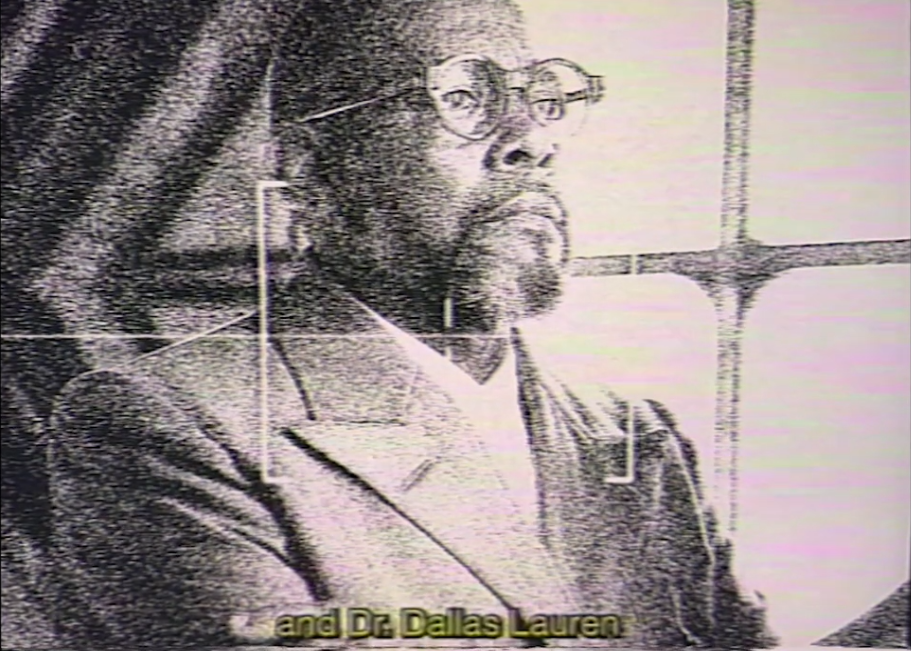

# Dallus Lauren

Dallus Lauren, also referred to as 'Dallas Lauren' in the [Unbeleevable](../files/unbeleevable) 
video, is one of [the Trinity](characters#trinity).
According to the [D8 log](../files/lauren_d8_log), he died in or before 2037.

Dallus Lauren and [Skys](skys) on the [Operation Trinity document](../files/trinity_document).

***

## Backstory

> The MOXYPAK was revolutionary, a personal air purification device that transforms CO2 into breathable oxygen using BioCores. Still widely used, even if considered rudimentary now.
And the Synthetic Neurological Transference Human Project – systems designed to house human consciousness, enhancing cognitive functions and augmenting intellectual capacities.
My father envisioned a future where these would mitigate the environmental collapse, though they’re currently limited to military use and the ultra-wealthy.
> 
> - Ren in the [D8 log](../files/lauren_d8_log)

Dallus Lauren has a son named [Ikaro Lauren](ren), whose [log](../files/lauren_d8_log) 
is captured in 2037.
This log speaks about the birth of E.V.E, but also reflects on his father's death.
Ren (as they are nicknamed at the start of the log), reflects on his father's invention of 
the Moxypak, "a personal air purification device that transforms CO2 into breathable oxygen using BioCores". 
Ren also speaks about his father's involvement with the development of the synth project, 
which is short for "Synthetic Neurological Transference Human Project".

The [trinity document](../files/trinity_document) shows us that Dallus in the man we see 
in the music video for [In the Dark](../music/amo-in-the-dark).
The [Project D.U.S.T.](../files/project_dust) file also tells us that Dallus has a **youngest** daughter, implying 
he might have two daughters.
However, the youngest was taken away from him and also happened to draw many suspicious drawings,
that indicate that she may have inherited her father's *mares*.
These seem to be haunting memories or experiences, related to trauma.
Dallus is undergoing desensitization therapy for them in 2021, according to the 
project D.U.S.T. file, repeatedly being exposed to them.

***

## Read More

More on the Trinity:

- [The Trinity (characters)](characters#trinity)
- [Skys](skys)
- [Karl Strassman](strassman)

More on ARC/HIVE:

- [ARC/HIVE](../lore/archive)
- [In the Dark](../music/amo-in-the-dark)
- [Lauren's D8 log](../files/lauren_d8_log)
- [Operation Trinity](../files/trinity_document)
- [Project D.U.S.T.](../files/project_dust)