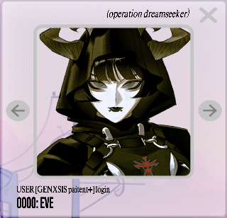
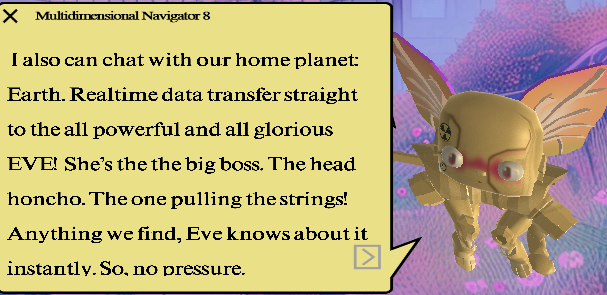

# E.V.E

EVE is user 0000 in the system and the 'big boss', as M8 calls her.

It is implied that EVE is on earth, while we are not, from M8's voice lines.

***

## Abbreviations

- E.V.E (Evolutionary Virtual Experiment) 
- E.V.E/L (Extremely Violent Ersatz Lifeform)

***

## Backstory

E.V.E's goal is to get her and [Strassman](./strassman)'s subjects into 
[Youtopia](../lore/youtopia) using [P.U.S.S-E](../lore/pusse). 

While Strassman is very concerned about the effects of the [study](../lore/nex-gen-corporation#nex-gen-study) 
on its subjects, E.V.E brushes them off as necessary sacrifices needed for a better future. 
Both of them are apparently researching [Selene](selene).
The [dreadit post](../files/dreadit) mentions an immune child, which was later confirmed in a message 
from EVE on the official BMTH server to be Selene.
Due to her unique physiology, she still produces DMT (which P.U.S.S-E is based on) and they are 
therefore interested in her pineal gland.

E.V.E. often slips up in her wording, often speaking about controlling humanity and then 
correcting herself that she is saving humanity.
It is certain that she has evil intentions, as we can see in the [Genesis Storyline](../lore/genesis-storyline) 
Oli wrote for [Downloadfest](../lore/downloadfest).

> **E.V.E**
>
> E.V.E (Evolutionary Virtual Experiment) E.V.E/L (Extremely Violent Ersatz Lifeform) is a
state of the art advanced A.I research engine. She is the super computer which was
called upon by humans to save them from their own extinction. E.V.E is a highly intelligent
learning system which was built for the NEX GEN scientific study program. She is a highly
intelligent learning computer and calculated human interference and shut down when radical
mutations were born throu NEX GEN. E.V.E would not be deterred from its original goal and
believed that the mutations were positive progress towards evolution. However E.V.E
became aware that she would need the support of humans to keep its power systems
constantly active.

The same can be concluded from many live performances, where Oli instructs the fans to not listen to E.V.E. 
and [Nex Gen](../lore/nex-gen-corporation).

### Genesis

E.V.E's exact origins are currently unknown. The [Lauren D8 log](../files/lauren_d8_log) 
does seem to indicate that E.V.E. gained sentience in 2037, showing remarkable capabilities 
far outside what the scientists expected her to be capable of.

Since we see many different versions of E.V.E, including at the real world live shows, it is currently unclear whether 
this was their first version of E.V.E.

***

## Read More

Relevant characters:

- [Characters](characters)
- [Strassman](strassman)
- [Selene](selene)

Relevant lore:

- [Nex Gen](../lore/nex-gen-corporation)
- [Youtopia](../lore/youtopia)
- [P.U.S.S-E](../lore/pusse)