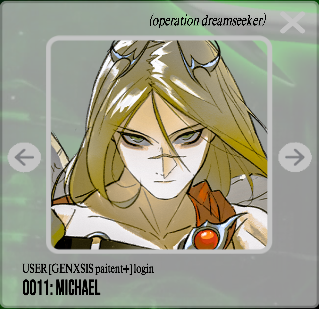
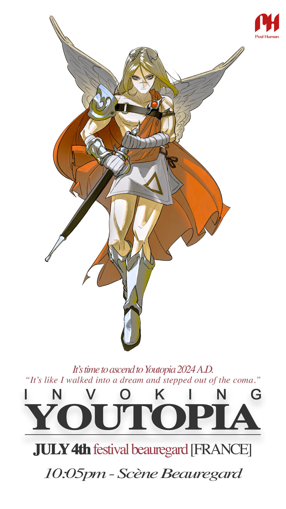

# Michael

Michael is one of the archangels. He is linked to [Insight 3: Purpose](../lore/insight3-purpose.md). 
He used to be user 0011 on the [webpage](../webpage) and is user 0010 as of the 24th of June 2024.

## Christian Faith

- **Feasts**:	
  - 29 September ("Michaelmas" – Catholic Church, Anglican Communion and Lutheranism), shared with **Raphael** and **Gabriel**
  - 8 November (New Calendar Eastern Orthodox Churches)
  - 8 November (Eastern Catholic Churches)
  - 21 November (Old Calendar Eastern Orthodox Churches)
  - 12th of each month in Coptic calendar (Coptic Churches)
  Many other local and historical feasts.
- **Attributes**: banner, scales, weighing souls, sword, slaying Satan or a dragon
- **Patronage**: Protector of the Jewish people, Guardian of the Catholic Church, Vatican City, France, Germany, Normandy, Kyiv, dying people, poor souls, bankers, grocers, police officers, military personnel

"The seven archangels (or four – the traditions differ but always include Michael)" (wikipedia)

## Official Art

Michael has the symbol for [Purpose](../lore/insight3-purpose) on his skirt.

## Read More

- [Characters](characters)
- [Insight 3: Purpose](../lore/insight3-purpose)
- [Vanth](vanth)
- [Pickles](pickles)

Other archangels:

- [Gabriel](gabriel)
- [Raphael](raphael)
- [Uriel](uriel)