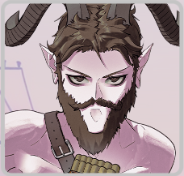
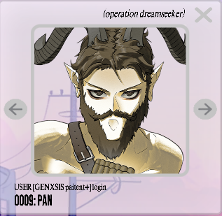
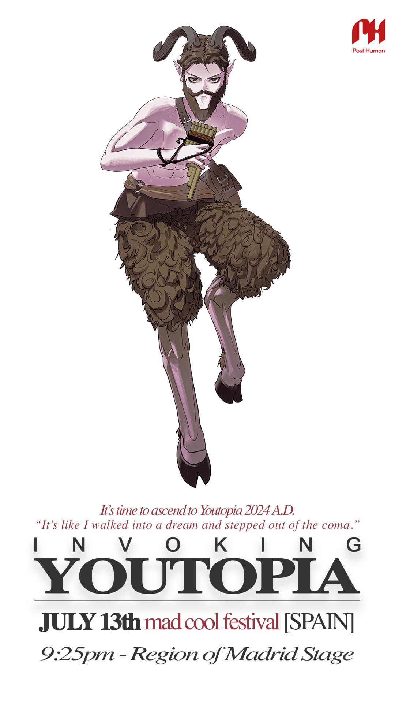

# Pan

Omen of [Insight 1: Connection](../lore/insight1-connection). Before June 4th 2024, his number was 0009 in the system. 
It is currently 0008. His skin tone also changed during a later update in June, giving his 
light skin tone a pinkish hue.

***

## Backstory

Marked on [Selene's](selene) map as "a beautiful mistake". Currently we do not 
have more context for this information.

***

## Speculation

Possibly related to [Night of Pan](../lore/night-of-pan). His skin 
tone is also the only character's we've seen that matches [Sof](sof), indicating 
that he might be her father or otherwise related.

***

## Read more

- [Characters](characters)

Insight 1: Connection

- [Insight 1: Connection](../lore/insight1-connection)
- [Raphael — Archangel of Connection](raphael)
- [Syko](syko)

Other [omens](characters#omens):

- [Miseria](miseria)
- [Vanth](vanth)

***

## More Art

Pan's old avatar, where his skin does not look pink.

