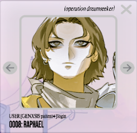

# Archangel Raphael

Raphael is one of the archangels and is linked to [Insight 1: Connection](../lore/insight1-connection.md).

Raphael used to have three different user ID's: 0004, 0007 and 0008. After the June 4th 2024 update user 0008 has seemingly 
disappeared, causing other characters to have 1 substracted from their user number. With this update, we went from 18 
to 17 profiles.

Currently, the picture from 0004 and 0008 is used for the Raphael profiles, the middle 
image is actually [Uriel](uriel).

## Christian Faith

Feast: 29 September; 24 October
Attributes: holding a bottle or flask; walking with Tobias; sounding a trumpet; carrying a fish or a staff
Patronage: travelers; lovers; the youth; finding one’s spouse; ordained marriage; mental health; healing; guardian angels; 
shepherds; pharmacists; druggists; nurses; physicians; illness; eye afflictions; the sick; the blind; against nightmares;
(source: wikipedia)

## Official Art

Raphael also has the logo for [Connection](../lore/insight1-connection) on his chest.

## Read More

- [Insight 1: Connection](../lore/insight1-connection)
- [Syko](syko)
- [Pan](pan)

Other [archangels](archangels):

- [Gabriel](gabriel)
- [Michael](michael)
- [Uriel](uriel)