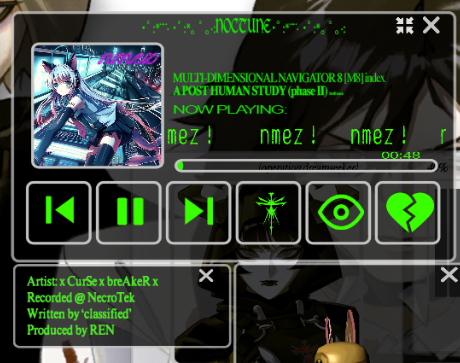
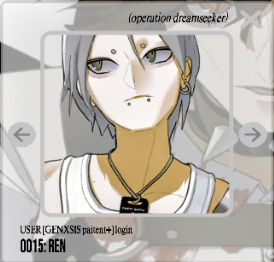

# Ren

Ren is user number 0014 in the [M8](../webpage) system.

***

## Backstory

Ren's full name is Lauren Ikaro, and he is a scientist at [Nex Gen](../lore/nex-gen-corporation), 
as evidenced by [his log](../files/lauren_d8_log). In this log, he activates E.V.E., 
who shows remarkable capabilities, far exceeding initial expectations. He also reminiscisces 
about his father [Dallus Lauren](dallus-lauren), who passed away before he 
could activate E.V.E.

Screenshot of the music player on the 27th of May 2024. Ren might also be a producer!

***

## Read More

- [Characters](characters)
- [Dallus Lauren](dallus-lauren)
- [Ren's D8 log](../files/lauren_d8_log)
- [ARC/HIVE](../lore/archive)

*** 

## More Art

Ren used to be user 0015 in the system. He is user 0014 since the 4th of June 2024.
His skin tone drastically changed in an update in June, at the same time as [Pan](pan)'s
skin colour changing to a pinkish hue.