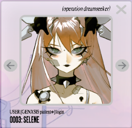
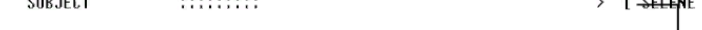
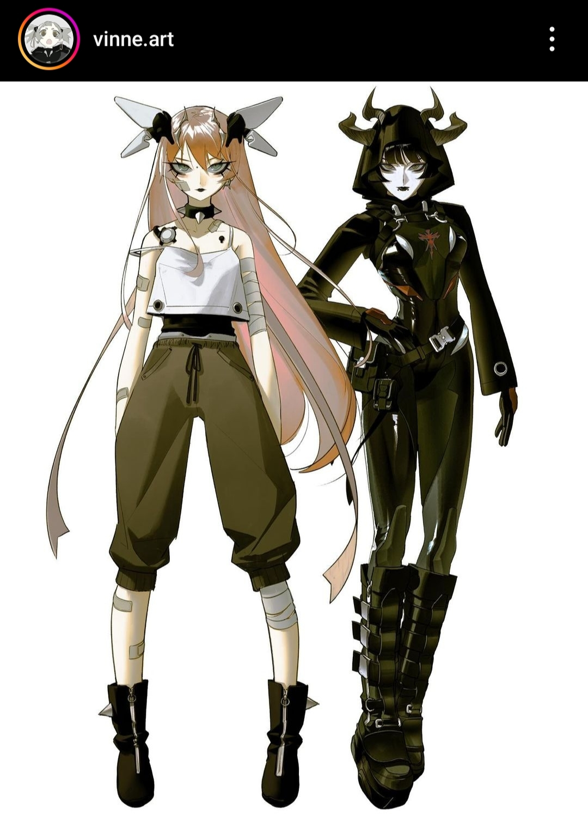
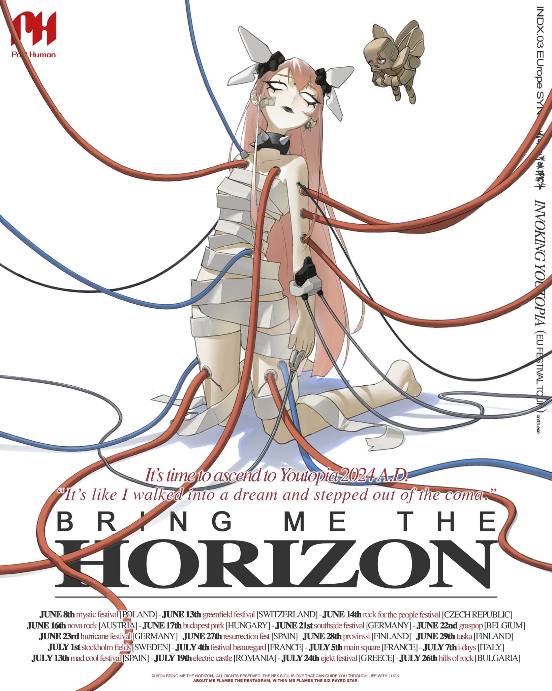

# Selene

Selene is one of the users that can be viewed on the M8 system. She has user number 0003.

It is revealed in the [msgforsof Audio Log](../files/msgforsof) that Selene is [SOF](sof)'s mother, that left her within 20 minutes of her birth. Selene states 
that she 'has to do something first' and leaves after hearing an alarm, stating to Sof that 
the alarm is 'her cue'. She indicates that [M8](../m8) has been with her for some 
time and has saved her life countless times, even highlighting the fact M8 may have 
done the same for Sof by now.

Top right corner of the log-in page displays `SUBJECT SELENE`.

## Selene & the capslock doc

Selene also has a connection to the [capslock doc](../files/capslock_doc.md), which 
was opened earlier in the timeline than expected by the devs. For this reason, 
spoilers for this document are contained to that specific article.

## Official Art

## Read More

- [Characters](characters)
- [Eve](eve)
- [Sof](sof)
- [M8](../m8)