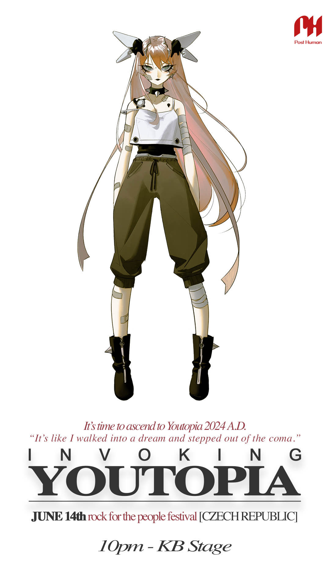

# Selene

Selene is one of the users that can be viewed on the M8 system. She has user number 0003.

***

## Backstory

### Introduction

It is revealed in the [msgforsof Audio Log](../files/msgforsof) that Selene is [SOF](sof)'s mother, that left her within 20 minutes of her birth. Selene states 
that she 'has to do something first' and leaves after hearing an alarm, stating to Sof that 
the alarm is 'her cue'. She indicates that [M8](../m8) has been with her for some 
time and has saved her life countless times, even highlighting the fact M8 may have 
done the same for Sof by now.

Top right corner of the log-in page displays `SUBJECT SELENE`.

### Selene's diary and Scott's diary

> If Scott’s not at school tomorrow, I’m definitely going to swing by his house after class to check on him. Gotta make sure he’s okay.
>
> Damn, it he’s got me this worked up over nothing, he’s a dead man.
>
> Later,
> Selene
> 
> - From [Selene's diary](../files/selene_personal_journal)

[Selene's diary](../files/selene_personal_journal) is a file containing some of 
Selene's personal experiences in 2037, the year of the VSPR-37 outbreak. 
This is the virus from [Scott's diary](../files/scott_personal_journal), who also happens 
to be Selene's crush and band member [Syko](syko).

> Need meet…fresh…Selen…mis u. wan to see her 1 last time, but scare of wat i do. her face is only thing that stil mek sense.
her tasty face…
> - Scott on Selene in his [diary](../files/scott_personal_journal)

In the diaries she is only 16 years old, putting her birthday somewhere in 2021 or 2020.
She also mentions that they are "in Eli", likely referring to a region or a city. 
Selene also mentions that her mother has been glued to the news, hoping that her mom is not 
back on "Soms".

### Dreadit post

> 'trusted' (lol) sources are reporting that NEXGEN have found a
> young girl who's immune. Yeah, immune. And apparently, it's all because of her pineal
> gland.

The [dreadit post](../files/dreadit) contains a reference to an immune child who still produces 
DMT. We get confirmation that this immune child is indeed Selene in a message from [E.V.E](eve) 
on Discord.

>E.V.E — 08-07-2024 18:06
> Good evening @everyone
>
>As you know, our Earth has been ravaged following the terrible virus that spread like wildfire across our beautiful planet. However, we at NeX GEn dedicated ourselves to control, I mean rebuild society from the ashes. We have been able to go deeper than anyone else has before, and we have found salvation !
>
>Thanks to a very willing subject named Selene, who was immune to the virus, we have been able to probe the innermost recesses of her mind. Within this domain, she found herself ensnared in a dreamscape beyond her wildest imagination. She named this place [Youtopia](../lore/youtopia), a domain accessible to every human, with definitely no side effects. if you, too, wish to access Youtopia, all you need to do is…

***

## Selene & the capslock doc

Selene also has a connection to the [capslock doc](../files/capslock_doc.md), which 
was opened earlier in the timeline than expected by the devs. For this reason, 
spoilers for this document are contained to that specific article.

***

## Read More

Related characters:

- [Characters](characters)
- [Eve](eve)
- [Sof](sof)
- [M8](../m8)

Related files:

- [Files for Sof (folder)](../files/for-sof)
- [Message for sof](../files/msgforsof)
- [Selene's map](../files/selenes_map)
- [Selene's diary](../files/selene_personal_journal)
- [Scott's diary](../files/scott_personal_journal)
- [Dreadit post](../files/dreadit)
- [The Science Study](../files/thesciencestudy)

***

## More Art

Official art from social media posts.