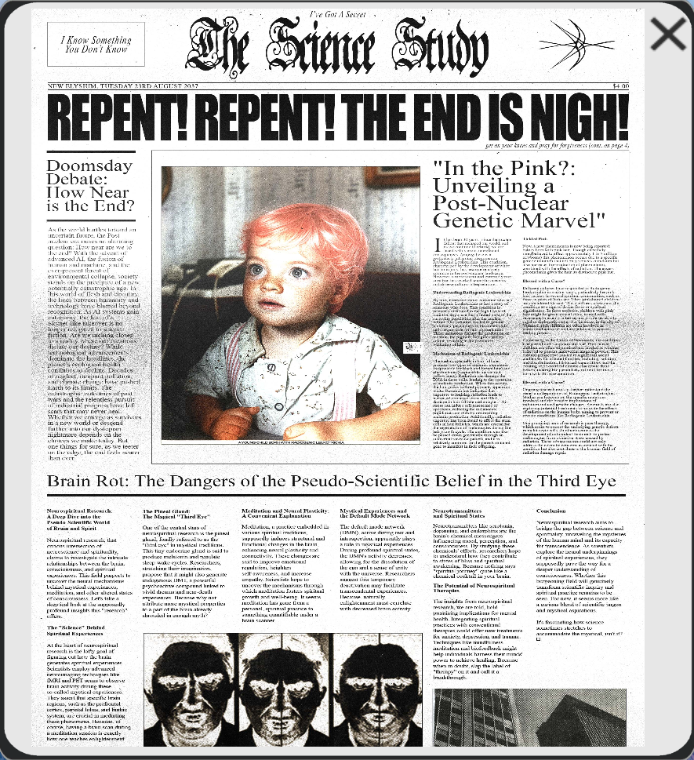

# Skys

> *Do you wanna start a cult with me?*

The mysterious pink-haired man from the [Mantra](../music/amo-mantra) music video. 
Dr. Lee MD (possibly [Madman](madman)) also states that he is the baby with pink 
hair in the photo we also see on [The Science Study](../files/thesciencestudy).

Comparing the [Trinity document]()

***

## Backstory

A baby picture of Skys, according to [Dr. Lee MD](../files/unbeleevable). Lee also tells us that Skys was born with the 
pink hair, which is the reason he was always special.
He was then abandoned by his parents at 8 years old and traveled the world.
At some point he also started a band (Sky's & the Starjammers) and became the cult leader 
of the Neosages, better known as the [cult of Mantra](../music/amo-mantra).
Lee then teases the next episode, which will focus on the Church of Genxsis and their involvement.

Even though Operation Trinity only seems to take place in 2020 at the latest, we can 
see that the band either already existed or was introduced in 2004, just like the real life 
founding year of Bring Me The Horizon.

***

## Read More

More on the Trinity:

- [The Trinity (characters)](characters#trinity)
- [Dallus Lauren](dallus-lauren)
- [Karl Strassman](strassman)

Related articles:

- [MANTRA](../music/amo-mantra)
- [Skys & the Starjammers poster](../files/skystarjammers)
- [Operation Trinity](../files/trinity_document)
- [Newspaper The Science Study](../files/thesciencestudy)
- [Unbeleevable email & video](../files/unbeleevable)
- [Church of Genxsis](../lore/church)

***

## More Art

A young Skys, presumably after being abandoned by his parents, from the [Unbeleevable video](../files/unbeleevable)