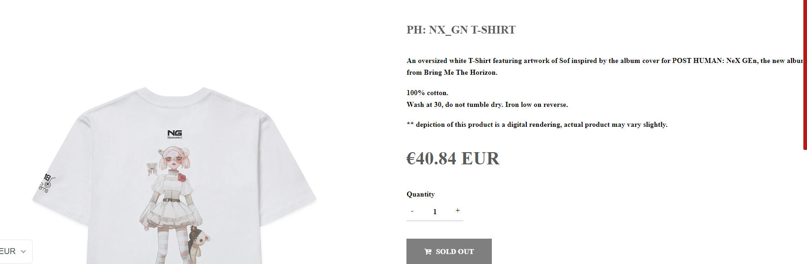
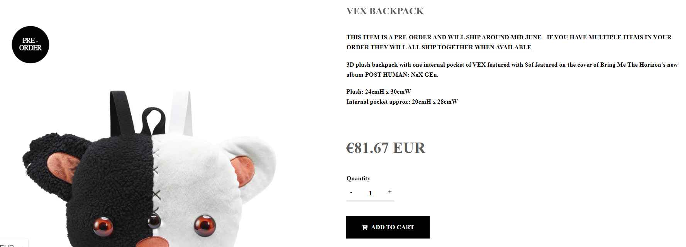
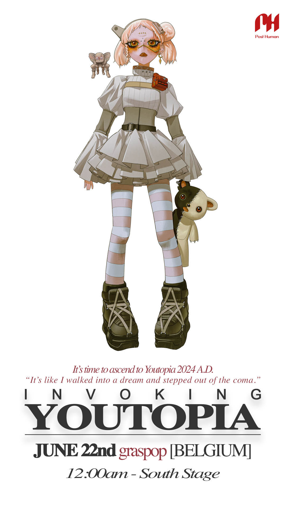
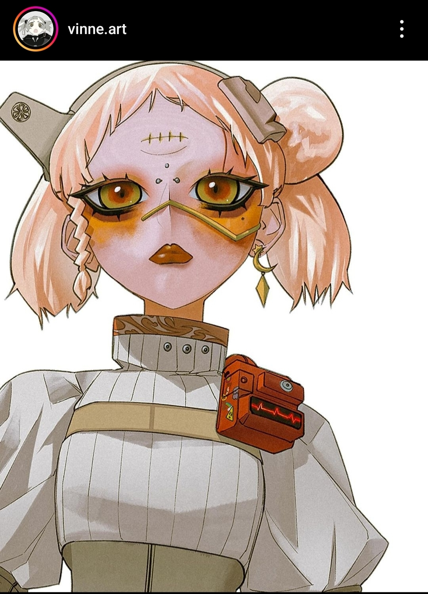
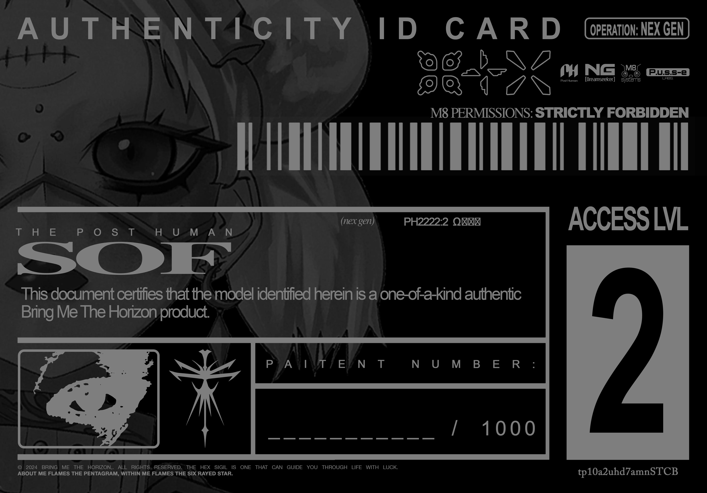

# SOF

Sof is the girl from the cover art. She is referred to as such in several descriptions 
on the Horizon merch website.
The [first file](../files/msgforsof) introduces the relationship between her and her mother, [Selene](selene).

***

## Identification

Since Sof is not a user in the [M8 system](webpage), her name had to be determined from 
other sources.

It seems that the bear pictured with her is called VEX from the Horizon merch listings.

While she originated from earth, as stated by [M8](../m8), she does not currently seem to reside there.

> *"I can also chat with our home planet; Earth. Realtime data transfer straight to the all powerful and all glorious EVE! 
She's the big boss. The head honcho. The one pulling the strings! Anything we find, Eve knows about it instantly. 
So, no pressure."*
> 
> - [M8](../m8) when prompted with "Who are u?"

***

## FOR SOF

[`FOR SOF`](../files/for-sof) refers to the folder in the ARG that we got access to using the first password within the website, 
after gaining access with the code 93934521 from M8's head on the album cover. The files 
we are seeing in this folder have all been left for her, to discover what her mom 
[Selene](selene) is trying to tell her.

***

## Speculation

She is theorized to also be on the cover of Post Human: Survival Horror. The NexGen album 
cover seems to show her with her third eye sewn shut. While the timeline is generally 
assumed to be linear (i.e. PH1 comes before PH2 in the timeline), there is still some 
discussion around the timeline.

## Read More

- [Characters](characters)
- [M8](../m8)
- [Selene](selene)
- [E.V.E](eve)

***

## Official Art

More original artwork from `@vinne.art`.

This access card was designed to be shipped with the Sof statue, bundled with
some [band cards](characters#the-band-members) and other goodies along with the album.
The authenticity card specifically refers to Sof as "The Post Human".