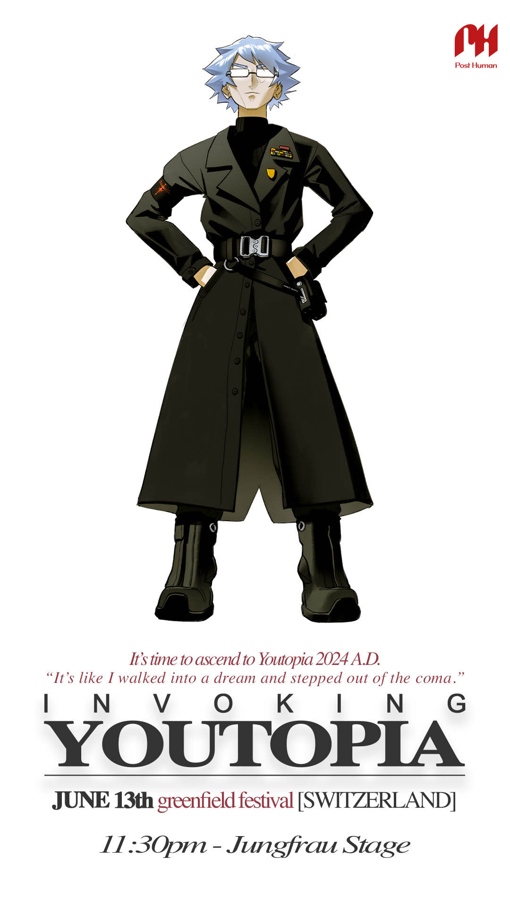

# Dr. Karl Strassman

> "Your mission was to help them, not harvest them. You were created to protect and uplift
> humanity, not turn them into mere batteries for your own survival. Eve, I’m begging you to
> listen to me."
> 
> - Karl Strassman in the [Strassman codec](../files/strassmancodec)

Dr. Karl Strassman is (or was) a scientist at [Nex Gen Corporation](../lore/nex-gen-corporation).
Early in the ARG, we learn that he helped [E.V.E](../characters/eve) gain control over humanity under false pretenses.

***

## Backstory

Karl Strassman is a doctor that works with [E.V.E](eve), as seen in a 
[video](../files/strassmancodec) unlocked on the 26th of May in the 
[FOR SOF](../files/for-sof) folder. This was one of the earliest files and 
has been upgraded in quality from its initial release.

In the video he can be seen speaking to Eve about the effects of [P.U.S.S-E](../lore/pusse). 
He stresses that there are a lot of negative side effects to its use, to have people 
enter into [Youtopia](../lore/youtopia).

He seemingly shoots himself/is shot at the end of the audio for [ABWMNO](../music/song-abwmno). 
It is unconfirmed who shot him, or whether he survived or not. It is unclear 
when this audio was recorded in-universe.

***

## Read More

See [all characters](characters).

Strassman before Nex Gen corporation:

- [Trinity](characters#trinity)
- [Skys](skys)
- [Dallus Lauren](dallus-lauren)
- [ARC/HIVE](../lore/archive)
- [Operation Trinity](../files/trinity_document)
- [Unbeleevable video](../files/unbeleevable)

Strassman at Nex Gen corporation:

- [E.V.E](eve)
- [Selene](selene)
- [Nex Gen Corporation](../lore/nex-gen-corporation)
- [Youtopia](../lore/youtopia)
- [P.U.S.S-E](../lore/pusse)
- [Strassman codek (conversation with E.V.E)](../files/strassmancodec)

***

## Official Art

