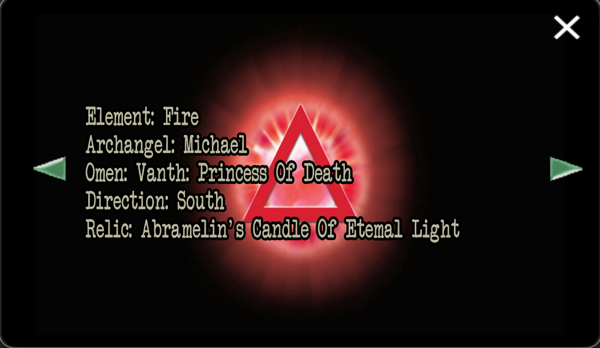

# Vanth

Vanth was user 0018 in the system and is user 0017 as of the 4th of June 2024. 
They are the Omen of [Insight 3: Purpose](../lore/insight3-purpose). In the documents, Vanth is referred to as a princess 
in the [Purpose](../lore/insight3-purpose) document. 

## Backstory

In the [insights](../lore/insights) files, we see the omens [Pan](pan), [Miseria](miseria) and the Babylon on 
[Selene's map](../for-sof#YOUTOPIA_selenes_mapvis), but instead of 'Vanth: Princess of Death' in
we see '**Prince of Death**' in the South region of the map. Vanth's gender has not been confirmed.

Vanth **Princess** of Death

Boss fight: **Prince** Of Death

***

## Read More

- [Characters](../characters)
- [Selene's map](../for-sof/selenes_map)

Insight 3: Purpose

- [Insight 3: Purpose](../lore/insight3-purpose)
- [Michael](michael)
- [Pickles](pickles)

Other [omens](../characters#omens):

- [Miseria](miseria)
- [Pan](pan)

***

## Gallery


