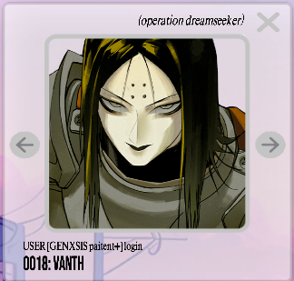
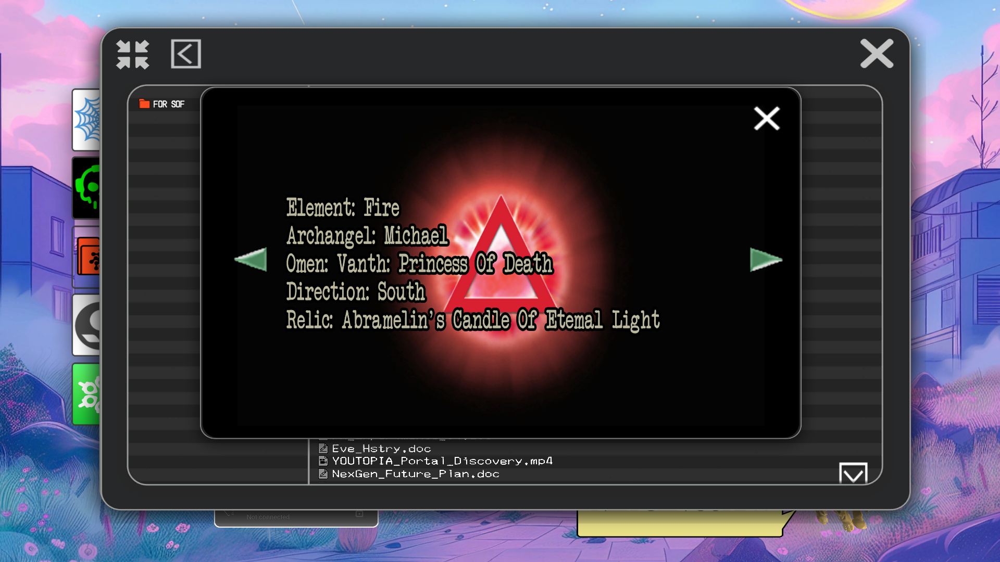
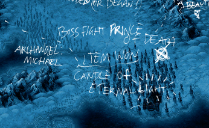

# Vanth

Vanth is user 0018 in the system. They are the Omen of [Insight 3: Purpose](../lore/insight3-purpose). 
In the documents, Vanth is referred to as a princess in the [Purpose](../lore/insight3-purpose) document. 

Later in the files, we see the omens [Pan](pan), [Miseria](miseria) and the Babylon on 
[Selene's map](../files/for-sof#YOUTOPIA_selenes_map.vis), but instead of 'Vanth: Princess of Death' in
we see '**Prince of Death**' in the South region of the map. Vanth's gender has not been confirmed.

Vanth **Princess** of Death

Boss fight: **Prince** Of Death

## Read More

- [Insight 3: Purpose](../lore/insight3-purpose)