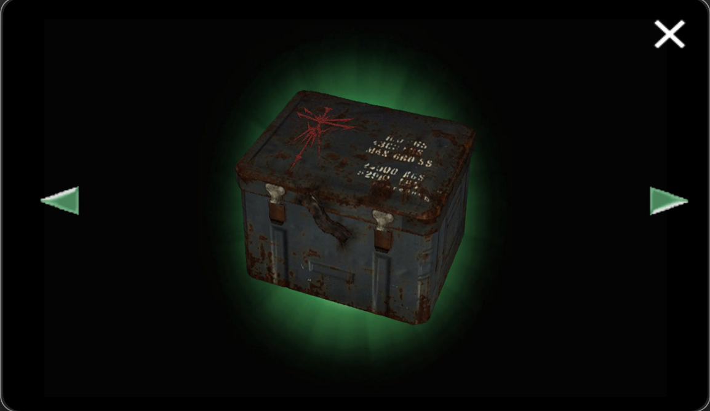
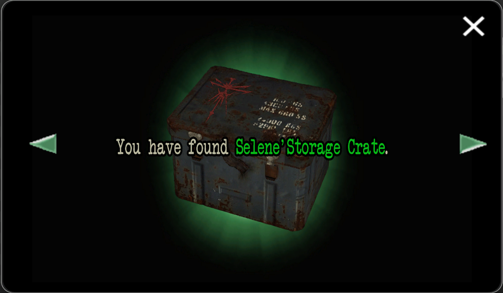
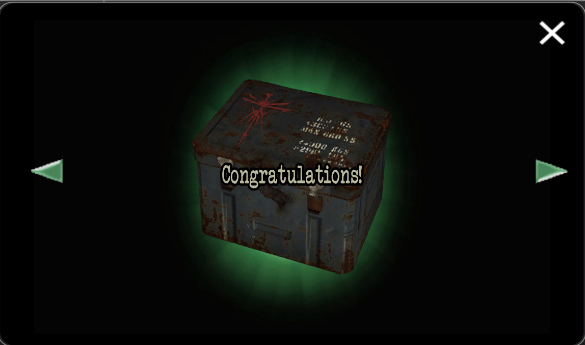
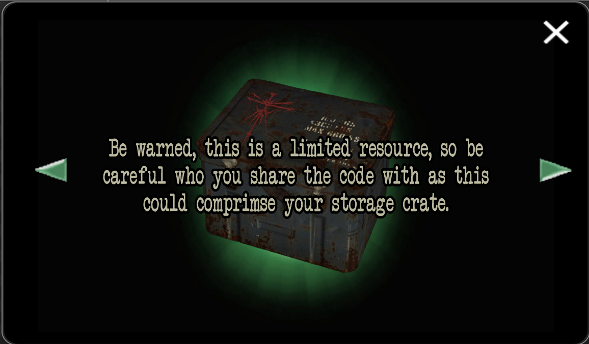
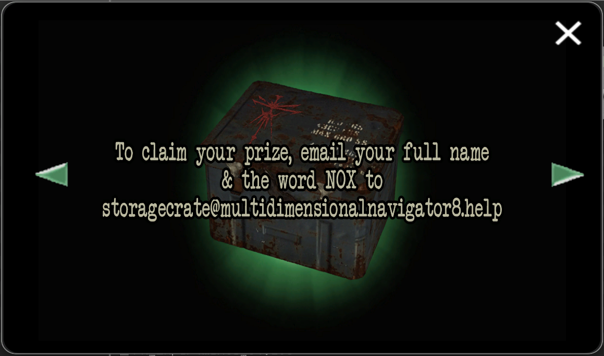

# Capslock Doc

The capslock doc can be found in the `FOR SOF` folder on the computer.

**(SPOILER) WARNING**: The password for this document was uncovered earlier than it was supposed to be. Using the information 
from this article might spoil your experience.

Enjoy this picture of buff M8 as a buffer between you and the spoilers.

***

## Contents

We find a storage crate that belongs to [Selene](../characters/selene.md).

**!!! DO NOT EMAIL THIS ADDRESS, IT IS A PLACEHOLDER AND 
WAS NEVER MEANT TO BE FOUND !!!**

***

## Transcription

> YOU HAVE FOUND SELENE' STORAGE CRATE. 
>
> CONGRATULATIONS! 
>
> Be warned, this is a limited resource so be careful who you share the code with as this could comprimse your storage crate. 
>
> To claim your prize, email your full name + NOX to storagecrate@multidimensionalnavigator8.help
>
> (transcription by @elliecoptaaa on discord)

***

## Decrypting the password

The password was decrypted using the capital letters from the tracklist/songs? (source needed).

  
Password

DEKODE THE MATRIX TO ATTAIN YOUR CONCEALED ORIGINS

***

## System Breach Email

If you followed the instructions in the past, you may have received the following response, 
warning you that this secret was not supposed to be discovered yet. The email address was 
confirmed by the official moderators to be a placeholder. While they are aware of the 
community figuring this out the intended way, they have asked us **not to email the 
placeholder address anymore**.

> *SYSTEM BREACH!* Re: [your email subject]
> M8 here!!!
>
> It appears you've illicitly hacked into the M8 server to decode hidden
> secrets. As the ever-diligent M8, it's my duty to inform you that this
> behaviour is both naughty and counterproductive!
>
> You see, the whole idea of this program is to unravel the mysteries at
> a tantalizing pace, allowing everyone to enjoy the thrill of
> discovery. By bypassing the system and sharing the secrets
> prematurely, you're spoiling the fun for everyone! It's like eating
> all the popcorn before the movie even starts.
>
> So a friendly warning: your recent unauthorized access to our website
> has not gone unnoticed. While I admire your enthusiasm, it's time to
> address the consequences of your actions.
>
> If you continue to hack into the system, you'll be permanently blocked
> from accessing any part of it. This means no more juicy secrets, no
> more thrilling discoveries, and certainly no more supply drops or
> physical items being sent to your physical location. In addition, your
> address and identity will be blacklisted, ensuring you’re completely
> cut off from our network.
> So, let’s play fair and enjoy the journey together. After all, a
> little patience goes a long way in making the experience truly
> enjoyable for everyone.
>
> So stop being a dipshit, and play fair!
>
>              (\ __ /)
>               (UwU)
>        ＿ノ ヽ ノ＼＿
>     /　`/ ⌒Ｙ⌒ Ｙ　 \
>  (　 (三ヽ人　 /　　 |
> |　ﾉ⌒＼ ￣￣ヽ　 ノ
> ヽ＿＿＿＞､＿＿／
>           ｜( 王 ﾉ〈
>            /ﾐ`ー―彡\
>           |╰         ╯|
>           |       /\       |.  M8 XOXOX
>           |      /  \      |
>           |    /     \     |

The email ends with an ASCII art rendering of M8, which has been screen captured to preserve this 
authentic artwork.

***

## Read More

More from [📁 FOR SOF](./for-sof)

Related files:

- [Strassman Codec](strassmancodec)
- [Dreadit post](dreadit)
- [Selene's map](selenes_map)
- [Selene's diary](selene_personal_journal)

Related characters:

- [M8](../m8)
- [Selene](../characters/selene.md)