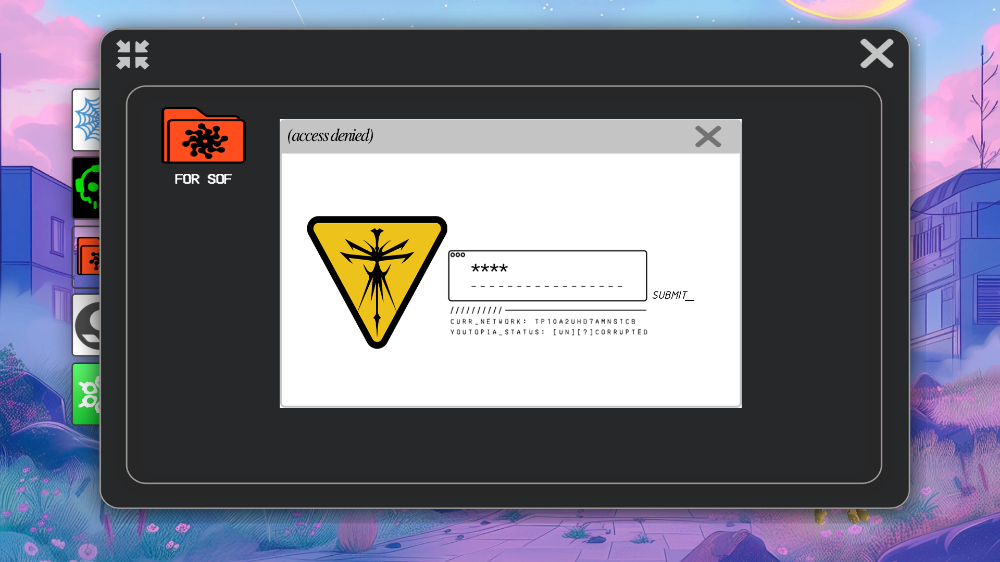
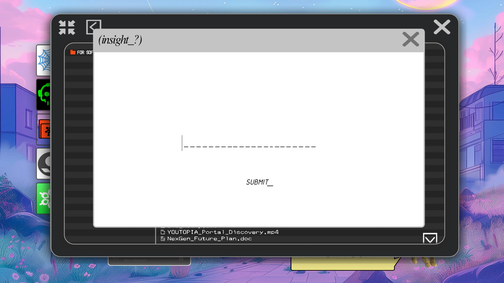
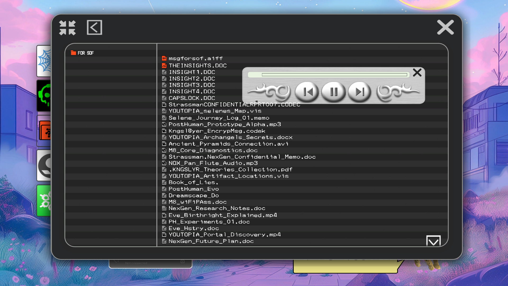
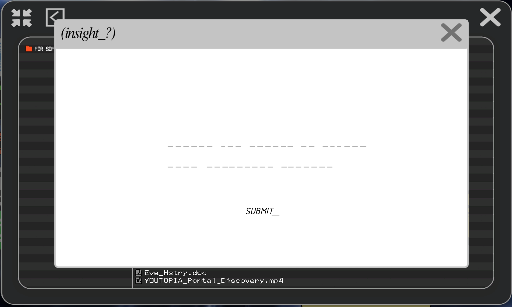
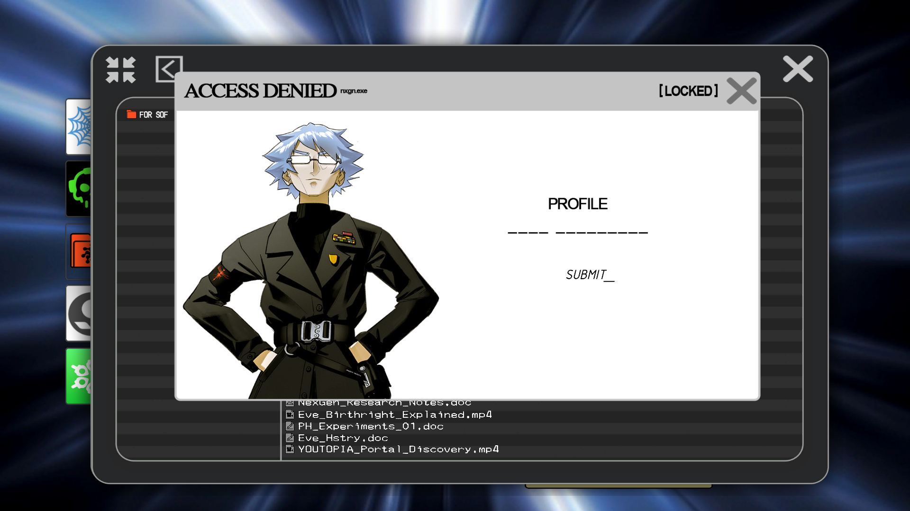
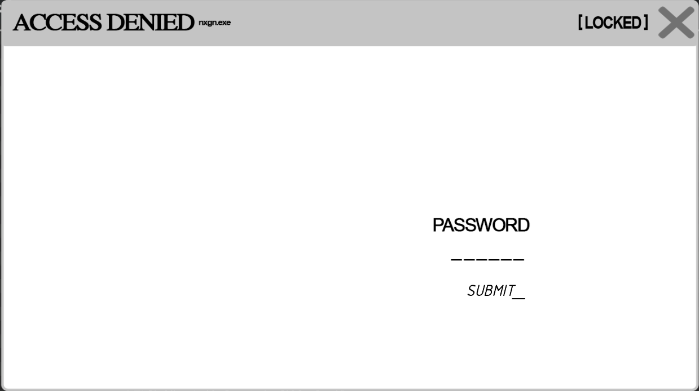
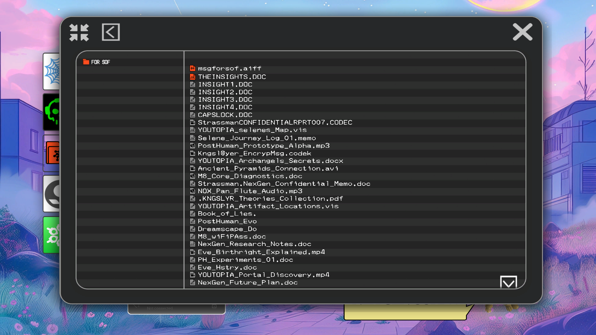
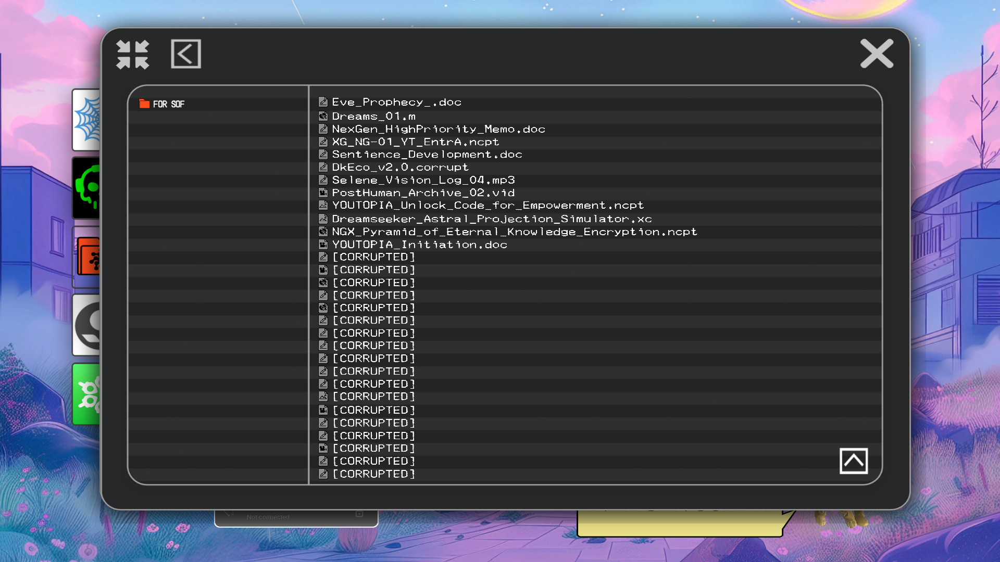
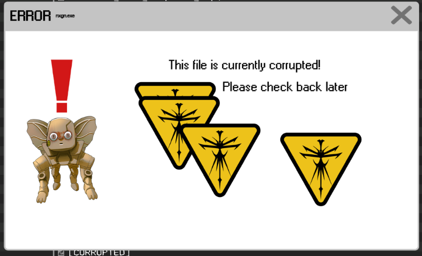

# FOR SOF

`FOR SOF` is a folder in the ARG that can be accessed on the computer. It is password 
protected and was found on 26-05-2024 to require the password `past` to access.

M8 says "You have 132 documents and one audio log" when you open the folder. This doesn't 
match the contents of what we see (at least not yet).

It contains documents on the [four insights](../lore/insights.md) and many more.

**SPOILER ALERT: this article contains every known password.**

## Directory content

This table contains two links: the filename links to a relevant article (if there is one), the folder icon will bring 
you to the known information (including password) about the file.

| File                                                                                                 | Status | About                                    |
|------------------------------------------------------------------------------------------------------|--------|------------------------------------------|
| [msgforsoff.aiff](msgforsof)                                                                         | ✔️     | [📁](#msgforsoffaiff)                    |
| [The Insight Documents](../lore/insights)                                                            | ✔️     | [📁](#the-insightsdoc-insight1-4-docs)   |
| [StrassmanCONFIDENTIALPRT007.CODEC](strassmancodec)                                                  | ✔️     | [📁](#strassmanconfidentialprt007codec)  |
| [DREADITScreenshot 2051.1.5.59.43.vis](dreadit)                                                      | ✔️     | [📁](#dreaditscreenshot-2051155943vis)   |
| [YOUTOPIA_selenes_map.vis](selenes_map)                                                              | ✔️     | [📁](#youtopia_selenes_mapvis)           |
| [R8/fulfilment_source[m0n0].doc](r8)                                                                 | ✔️     | [📁](#r8fulfilment_sourcem0n0doc)        |
| [Selene_Personal_Journal_2037.02.doc](selene_personal_journal)                                       | ✔️     | [📁](#selene_personal_journal_203702doc) |
| [Lauren_D8_Log_203701.docx](lauren_d8_log)                                                           | ✔️     | [📁](#lauren_d8_log_203701docx)          |
| [Scott_Personal_Journal_VSPR-37.doc](scott_personal_journal)                                         | ✔️     | [📁](#scott_personal_journal_vspr-37doc) |
| [Selene_Journey_Log_01/midname?.memo](#selene_journey_log_01midnamememo)                             | ❌      | [📁](#msgforsoffaiff)                    |
| [Posthuman_Prototype_Alpha.mp3](#posthuman_prototype_alphamp3)                                       | ❌      | [📁](#msgforsoffaiff)                    |
| [Kingsl@yer_EncrypMsg.codek](#kingslyer_encrypmsgcodek)                                              | ❌      | [📁](#msgforsoffaiff)                    |
| [YOUTOPIA_Archangels_Secrets.docx](#youtopia_archangels_secretsdocx)                                 | ❌      | [📁](#msgforsoffaiff)                    |
| [Ancient_Pyramids_Connection.avi](#ancient_pyramids_connectionavi)                                   | ❌      | [📁](#msgforsoffaiff)                    |
| [M8_Core_Diagnostics.doc](#m8_core_diagnosticsdoc)                                                   | ❌      | [📁](#msgforsoffaiff)                    |
| [Strassman.NexGen_Confidential_Memo.doc](#strassmannexgen_confidential_memodoc)                      | ❌      | [📁](#msgforsoffaiff)                    |
| [NOX_Pan_Flute_Audio.mp3](#nox_pan_flute_audiomp3)                                                   | ❌      | [📁](#msgforsoffaiff)                    |
| [.KNGSLYR_Theories_Collection.pdf](#kngslyr_theories_collectionpdf)                                  | ❌      | [📁](#msgforsoffaiff)                    |
| [YOUTOPIA_Artifact_Locations.vis](#youtopia_artifact_locationsvis)                                   | ❌      | [📁](#msgforsoffaiff)                    |
| [Book_of_Lies.vis](#book_of_liesvis)                                                                 | ❌      | [📁](#msgforsoffaiff)                    |
| [PostHuman_Evolution_Chart.doc](#posthuman_evolution_chartdoc)                                       | ❌      | [📁](#msgforsoffaiff)                    |
| [Dreamscape_Dossier.docx](#dreamscape_dossierdocx)                                                   | ❌      | [📁](#msgforsoffaiff)                    |
| [M8_wiFiPAss.doc](#m8_wifipassdoc)                                                                   | ❌      | [📁](#msgforsoffaiff)                    |
| [NexGen_Research_Notes.doc](#nexgen_research_notesdoc)                                               | ❌      | [📁](#msgforsoffaiff)                    |
| [Eve_Birthright_Explained.mp4](#eve_birthright_explainedmp4)                                         | ❌      | [📁](#msgforsoffaiff)                    |
| [PH_Experiments_01.doc](#ph_experiments_01doc)                                                       | ❌      | [📁](#msgforsoffaiff)                    |
| [Eve_Hstry.doc](#eve_hstrydoc)                                                                       | ❌      | [📁](#msgforsoffaiff)                    |
| [YOUTOPIA_Portal_Discovery.mp4](#youtopia_portal_discoverymp4)                                       | ❌      | [📁](#msgforsoffaiff)                    |
| [NexGen_Future_Plan.doc](#nexgen_future_plandoc)                                                     | ❌      | [📁](#msgforsoffaiff)                    |
| [Eve_Prophecy_.doc](#eve_prophecy_doc)                                                               | ❌      | [📁](#msgforsoffaiff)                    |
| [Dreams_01.m](#dreams_01m)                                                                           | ❌      | [📁](#msgforsoffaiff)                    |
| [NexGen_HighPriority_Memo.doc](#nexgen_highpriority_memodoc)                                         | ❌      | [📁](#msgforsoffaiff)                    |
| [XG_NG-01_UT_EntrA.ncpt](#xg_ng-01_ut_entrancpt)                                                     | ❌      | [📁](#msgforsoffaiff)                    |
| [Sentience_Development.doc](#sentience_developmentdoc)                                               | ❌      | [📁](#msgforsoffaiff)                    |
| [DkEco_v2.0.corrupt](#dkeco_v20corrupt)                                                              | ❌      | [📁](#msgforsoffaiff)                    |
| [Selene_Vision_Log_04.mp3](#selene_vision_log_04mp3)                                                 | ❌      | [📁](#msgforsoffaiff)                    |
| [PostHuman_Archive_02.vid](#posthuman_archive_02vid)                                                 | ❌      | [📁](#msgforsoffaiff)                    |
| [YOUTOPIA_Unlock_Code_for_Empowerment.ncpt](#youtopia_unlock_code_for_empowermentncpt)               | ❌      | [📁](#msgforsoffaiff)                    |
| [Dreamseeker_Astral_Projection_Simulator.xc](#dreamseeker_astral_projection_simulatorxc)             | ❌      | [📁](#msgforsoffaiff)                    |
| [NGX_Pyramid_of_Eternal_Knowledge_Encryption.ncpt](#ngx_pyramid_of_eternal_knowledge_encryptionncpt) | ❌      | [📁](#msgforsoffaiff)                    |
| [YOUTOPIA_Initiation.doc](#youtopia_initiationdoc)                                                   | ❌      | [📁](#msgforsoffaiff)                    |

This article also contains information on [previous versions](#previous-versions) and the 
[corrupted files](#corrupt-files).

## Placeholders

When the website updates, new password screens are introduced for files, indicating that 
they can now be unlocked. The specific screens will show the number of characters to input, 
as well as any spaces. Evidence strongly suggests that files can not be unlocked before new 
updates have occurred, although this has not been confirmed by the devs.

As of 29/05/2024, the prompt at the top has been changed to "password_?" instead of 
"insight_?".

## msgforsoff.aiff

Also see the [article on this file](msgforsof.md)

Audio log from [Selene](../characters/selene.md) to [Sof](../characters/sof.md). 
This file is not password protected. This file is very lore-heavy and will introduce us to 
the premise of the ARG: we are exploring the files Selene left for her daughter.

## THE INSIGHTS.DOC, INSIGHT1-4 docs

Password:
- THEINSIGHT.DOC: None
- INSIGHT1.DOC: `connection`
- INSIGHT2.DOC: `empathy`
- INSIGHT3.DOC: `purpose`
- INSIGHT4.DOC: `vision`

These are some documents introducing us to the concept of the four insights that 
we see throughout the ARG.

[See the page on the insights](../../Resources/insights)

## CAPSLOCK.doc

Note: this article may contain spoilers, as it was discovered earlier than it was 
supposed to be.

[See the page on the capslock doc](../files/capslock_doc)

## StrassmanCONFIDENTIALPRT007.CODEC

Password: `karl strassman`

A document in the folder. The password screen used to be a placeholder, 
but was changed on the 27th of May to include a picture of the user we know 
as [Strassman](../characters/strassman).

Also see the [article on this file](strassmancodec).

## DREADITScreenshot 2051.1.5.59.43.vis

Password: `1d1b2c2a`

The password to this file changed when the [Spyder Browser](../webbrowser) updated 
to contain a Dreadit link in the URL bar.

[See the page on the DREADIT file](../files/dreadit)

## YOUTOPIA_selenes_map.vis

Password: `clive`

The password refers to [M8](../m8)'s middle name, which is referenced in some lines she says 
in the sticky notes (TODO: expand on source).

## R8/fulfilment_source[m0n0].doc

Password: `within`

The password for this file was discovered in the audio for [Top 10 staTues tHat CriEd bloOd](../music/song-top10).

This document appeared on 29/05/2024 in a website update. The document details a 
precursor of [M8](../m8) that is called [R8](r8). You can find more details in the 
[R8 article](r8).

## Selene_Personal_Journal_2037.02.doc

Password: `0003`

The password is Selene's user number in the [M8](../m8) system.

## Lauren_D8_Log_203701.docx

Password: `0014`

The password for this file is [Ren](../characters/ren)'s user number.

## Scott_Personal_Journal_VSPR-37.doc

Password: `0005`

The password for this file is [Syko](../characters/syko)'s user number.

## Selene_Journey_Log_01/midname?.memo

Original name: `Selene_Journey_Log_01.memo`
Password protected with placeholder.

## Posthuman_Prototype_Alpha.mp3

Password protected with placeholder.

## Kingsl@yer_EncrypMsg.codek

Password protected with placeholder.

## YOUTOPIA_Archangels_Secrets.docx

Password protected with placeholder.

## Ancient_Pyramids_Connection.avi

Password protected with placeholder.

## M8_Core_Diagnostics.doc

Password protected with placeholder.

## Strassman.NexGen_Confidential_Memo.doc

Password protected with placeholder.

## NOX_Pan_Flute_Audio.mp3

Password protected with placeholder.

## .KNGSLYR_Theories_Collection.pdf

Password protected with placeholder.

## YOUTOPIA_Artifact_Locations.vis

Password protected with placeholder.

## Book_of_Lies.vis

Original name: `Book_of_Lies.`
Password protected.

## PostHuman_Evolution_Chart.doc

Original name: `PostHuman_evo`
Password protected with placeholder.

## Dreamscape_Dossier.docx

Original name: `Dreamscape_Do`
Password protected with placeholder.

## M8_wiFiPAss.doc

Password protected with placeholder.

## NexGen_Research_Notes.doc

Password protected with placeholder.

## Eve_Birthright_Explained.mp4

Password protected with placeholder.

## PH_Experiments_01.doc

Password protected with placeholder.

## Eve_Hstry.doc

Password protected with placeholder.

## YOUTOPIA_Portal_Discovery.mp4

Password protected with placeholder.

## NexGen_Future_Plan.doc

A password-protected file that currently can not be viewed in the folder, after 
some alterations were made to the file folder (arrows were removed, scrollbar was added, then 
scrollbar was removed again). Its status is unknown.

## Eve_Prophecy_.doc

A password-protected file that currently can not be viewed in the folder.

## Dreams_01.m

A password-protected file that currently can not be viewed in the folder.

## NexGen_HighPriority_Memo.doc

A password-protected file that currently can not be viewed in the folder.

## XG_NG-01_UT_EntrA.ncpt

A password-protected file that currently can not be viewed in the folder.

## Sentience_Development.doc

A password-protected file that currently can not be viewed in the folder.

## DkEco_v2.0.corrupt

Password protected (despite name indicating file is corrupt).
This file currently can not be viewed in the folder.

## Selene_Vision_Log_04.mp3

A password-protected file that currently can not be viewed in the folder.

## PostHuman_Archive_02.vid

A password-protected file that currently can not be viewed in the folder.

## YOUTOPIA_Unlock_Code_for_Empowerment.ncpt

A password-protected file that currently can not be viewed in the folder.

## Dreamseeker_Astral_Projection_Simulator.xc

A password-protected file that currently can not be viewed in the folder.

## NGX_Pyramid_of_Eternal_Knowledge_Encryption.ncpt

A password-protected file that currently can not be viewed in the folder.

## YOUTOPIA_Initiation.doc

A password-protected file that currently can not be viewed in the folder.

## Previous versions

(Screenshot date: 25/05/2024)

First version of the 'FOR SOF' folder. Additional versions would first introduce a scrollbar, 
then remove it. Somewhere along the updates some files were lost from the view in the folder.

### Corrupt files

There are currently 88 corrupted files in the folder. There used to be 18, before 
the corrupted files weren't visible for a while in some later updates. They are all labeled 
`[CORRUPTED]` 

If you click on any of these, M8 will tell you one of the following phrases:
- "This file is F'd up pretty bad. Don't worry, I can fix anything. Just check back later."
- "Hey, I'm working on these. Come back later."
- "Dude, don't you know what corrupted means? Give me some time!"

After the update on 26/05/2024, corrupted files showed the following screen. In the next version 
corrupted files could still be scrolled to using the arrow keys, before the corrupted files 
seemingly disappeared from the folder.

After the update on 30/05/2024, the corrupted files became visible again, this time 
with arrows buttons and page numbers 1-5/???.

## Read More

- [Characters](../characters/characters)
- [Sof](../characters/sof)
- [M8](../m8)