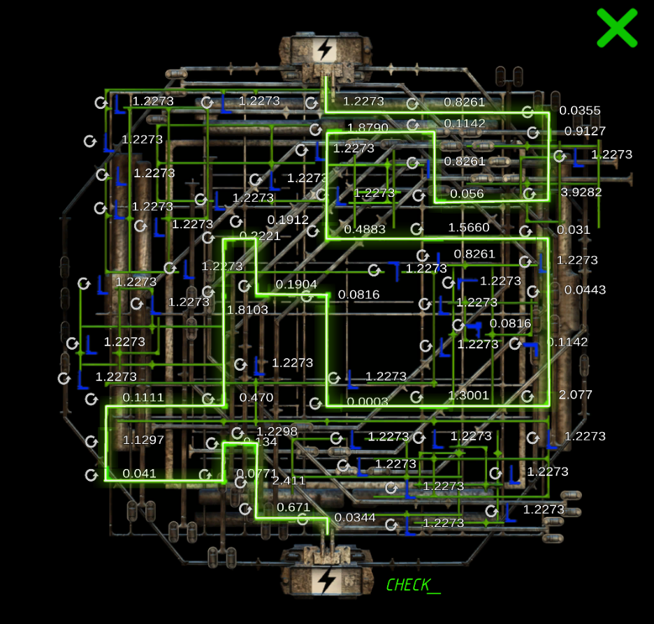

# Kngsl@yer_EncrypMsg.codek

The Kingslayer file has not been cracked yet. It requires two steps:

1. Solving a puzzle (solved)
2. Entering a password of an unknown length within a 30-second timer.

***

## The Puzzle

> 🛈 This puzzle is very time-consuming, and the password screen only allows you 30 
> seconds to try a password after you click check.

The following is the solution to the maze. The best way to win the puzzle is to start 
at the top, where the green line already lights up.
Then click each blue piece (the rotation icon will bug the puzzle) until it connects to the 
green line.
This should be 1 click for the first piece, 2 for the second, and this sequence continues to the end.

***

## Read More

- [Itch for the Cure & Kingslayer](../music/song-kingslayer-itch)
- [Project D.U.S.T.](project_dust) (Briefly mentions Project Kingslayer)