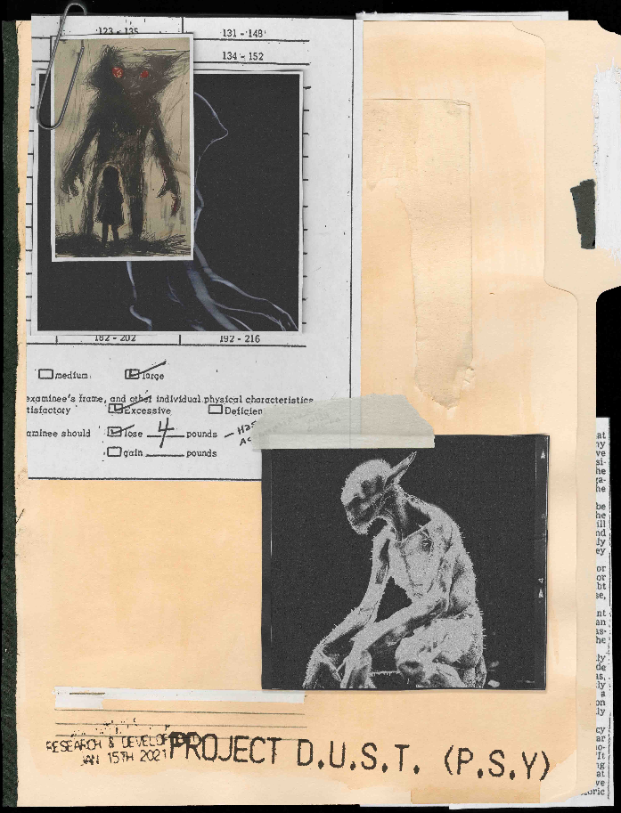
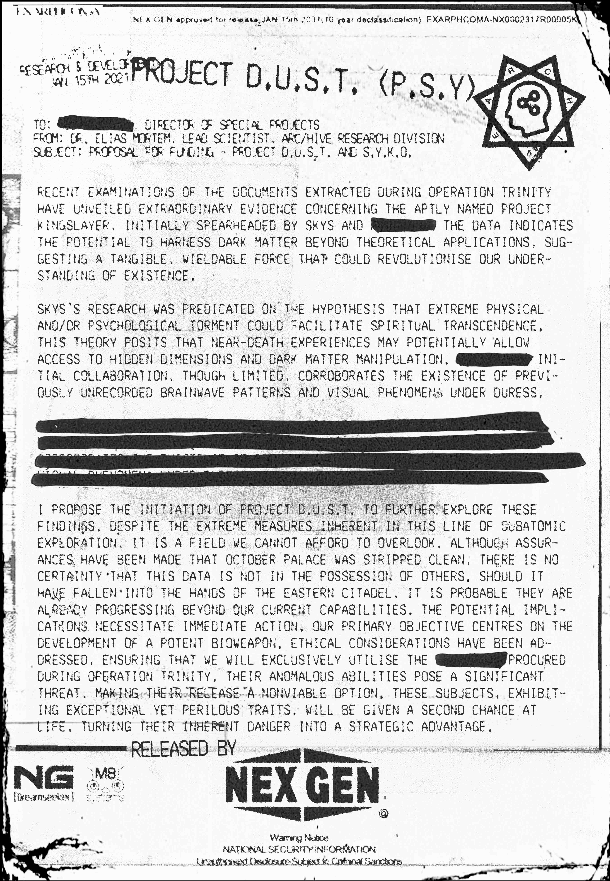
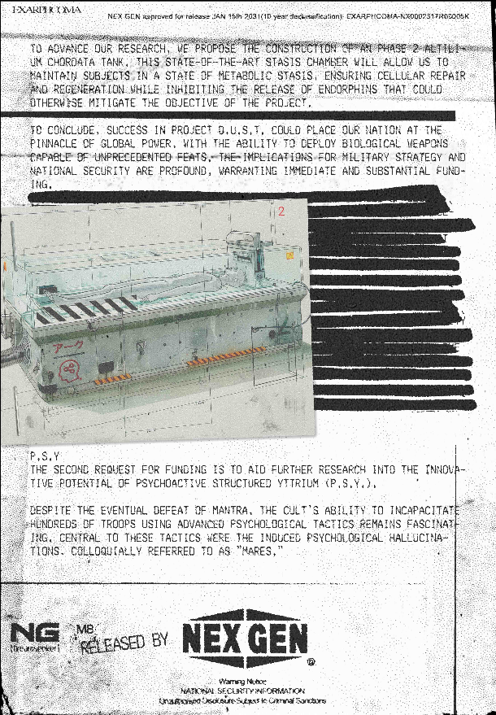
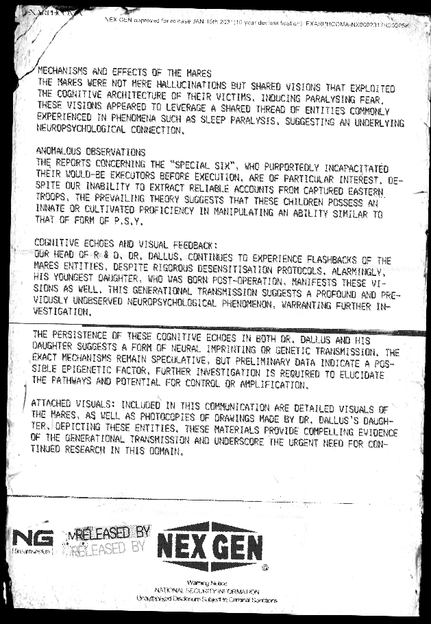

# Project D.U.S.T., P.S.Y & S.Y.K.O.

This file contains a research proposal from [ARC/HIVE](../music/amo-in-the-dark) 
for several projects. The initial proposal was finished or sent on the 15th of January 2021, 
then the document was declassified by Nex Gen exactly 10 years later.

## Document contents

## Speculation

The document speaks about "the special six", which may be the children we see in 
the official [Kool-Aid](../music/song-koolaid) music video.

## Read More

- [FOR SOF folder](./for-sof)
- [Nex Gen Corporation](../lore/nex-gen-corporation)
- [In The Dark & ARC/HIVE](../music/amo-in-the-dark)
- [Syko](../characters/syko)