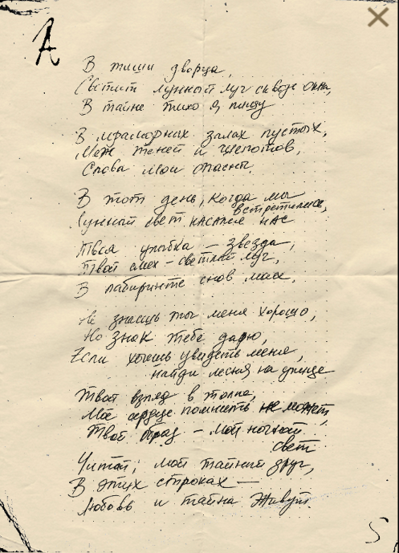
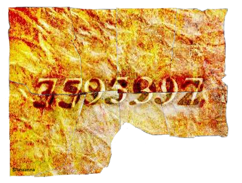

# дорогая моя любовь.doc

> 🛈 Used to be called Russian_poem.doc

> "In the silence of the palace,
> a moonbeam shines through the windows"

This file was unlocked on the 30th of June 2024, after being released 
on the 7th of June.
"дорогая моя любовь" roughly translates to "my dear love".

The password was found in an Instagram post.

***

## Document Content

  
Password

7795397

Also see the [translation to English](#translated).

***

## Transcription

### Original

> В тиши дворца, Светит лунной луч сквозь окна, В тайне тихо я плачу...
> 
> В мраморных залах пустых, Меж теней и шепотов, Слова мои опасны
>
> В тот день, когда мы встретились лунный свет касался нас
>
> Твоя улыбкаа - звезда, твоей смех - светлый луч , В лабиринте снов моих,
>
> не знаешь ты меня хорошо,
>
> Но знак тебе дарю, хочешь увидеть меня, найди меня на улице.  Твой взгляд в толпе, мое сердце помнить не может.
>
> Твой образ - мой ночной свет. Читай мой тайный друг, в этих стихах любовь и тайна живут

### Translated

> In the silence of the palace,
> A moonbeam shines through the windows,
> In secret I cry quietly...
>
> In the empty marble halls,
> Between shadows and whispers,
> My words are dangerous
>
> On the day when we met,
> the moonlight touched us
>
> Your smile is a star, your laughter is a bright ray,
> In the labyrinth of my dreams,
>
> You don't know me well,
>
> But I give you a sign, if you want to see me, find me on the street.
> Your gaze in the crowd, my heart cannot remember.
>
> Your image is my night light.
> Read my secret friend, in these verses love and mystery live.

(Transcription and translation by @dgeneresqueen on Discord)

***

## Password context

The password was found by taking multiple pieces of a letter from an 
[Instagram post](https://www.instagram.com/p/C-DhcBaC4NP/) and combining them to form the code.

The shadows behind the numbers seem different, but nothing has resulted from this at the time of writing.

***

## Read more

More from [📁 FOR SOF](./for-sof)

Currently, very little is known about this file. It dropped along with 
[Skys & the Starjammers poster](skystarjammers) and the [Unbeleevable video](unbeleevable). 
It could be related to character [Skys](../characters/skys) due to the S on the 
letter, but nothing has been confirmed.