# Selene_Personal_Journal_2037.02.doc

Document in the [FOR SOF](for-sof) folder. Selene talks about school and [Scott](scott_personal_journal), only 
being 16 years old at the time of writing.

***

## Document contents

  
Password

0003

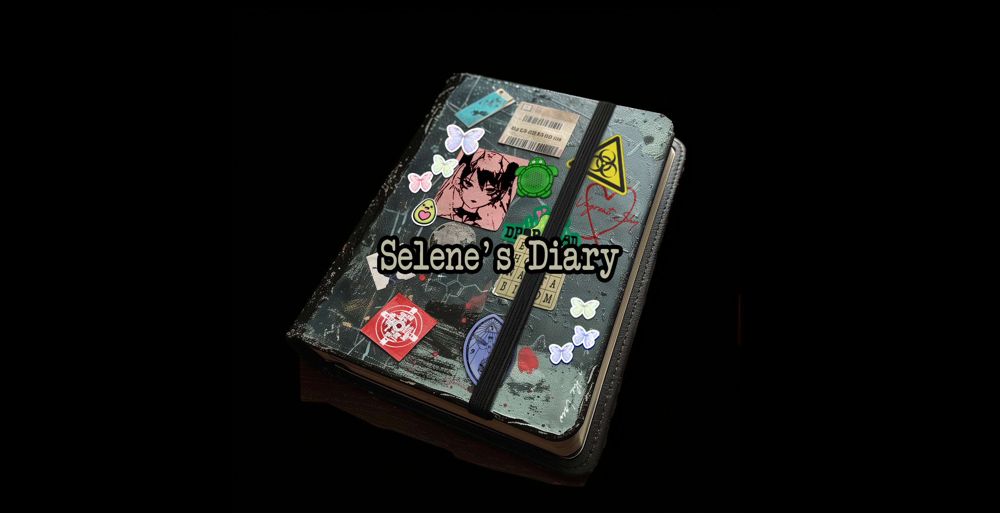
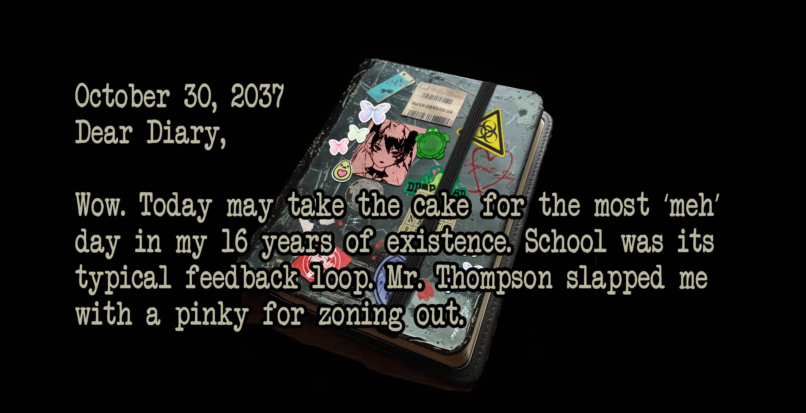
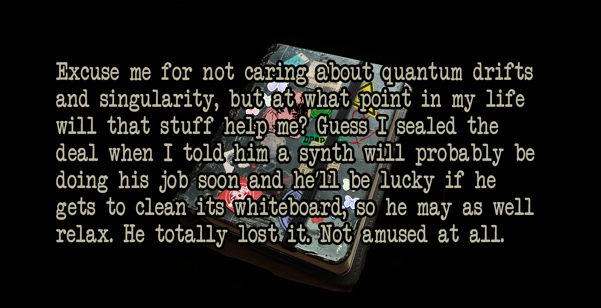
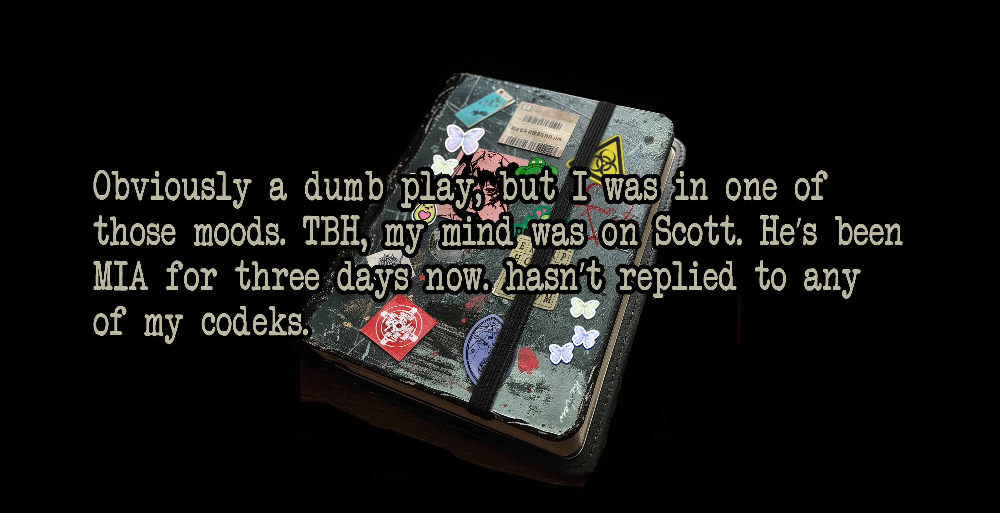
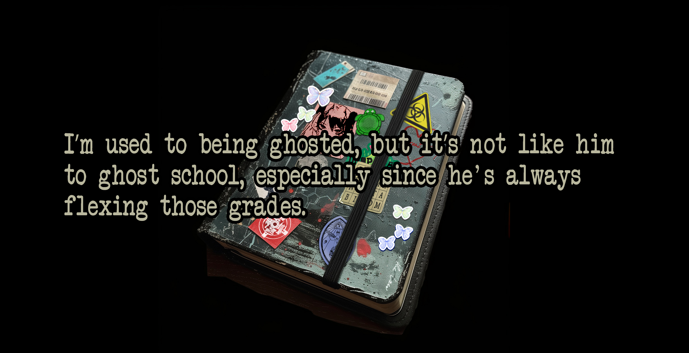
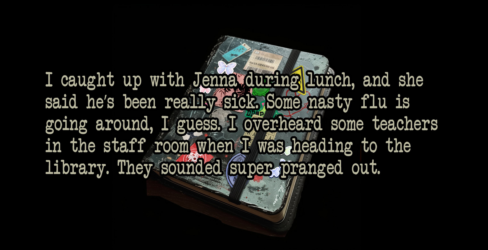
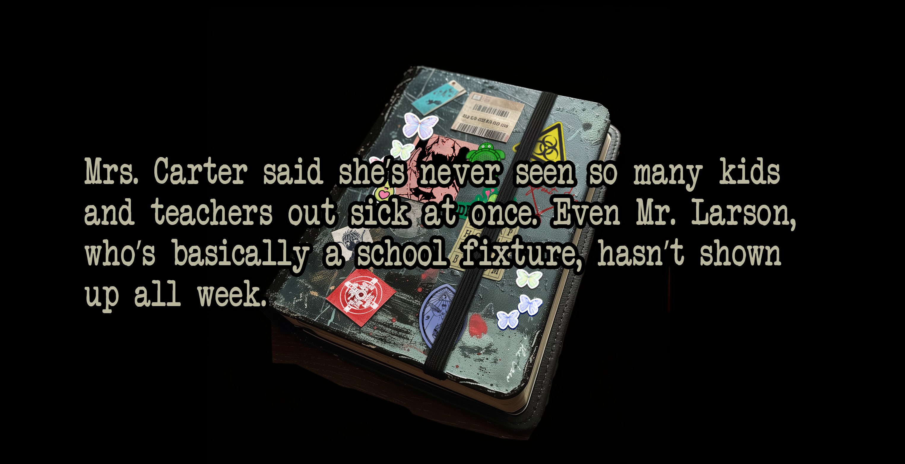
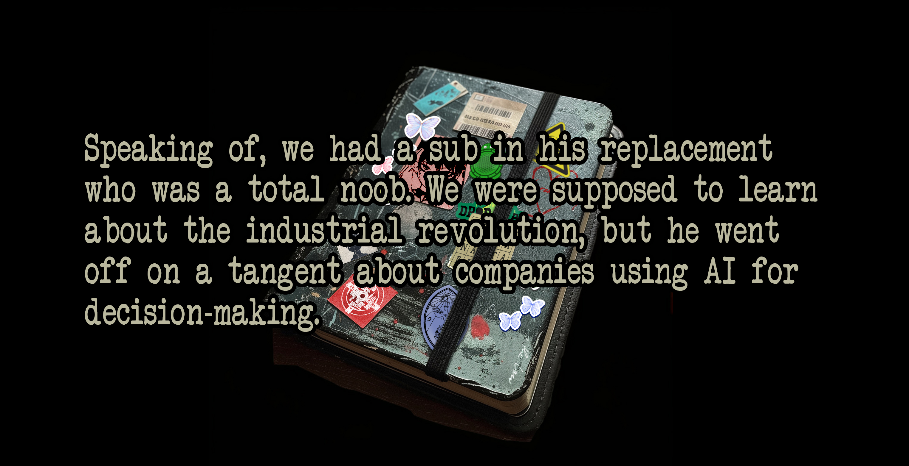
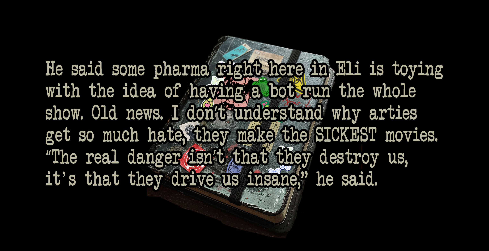

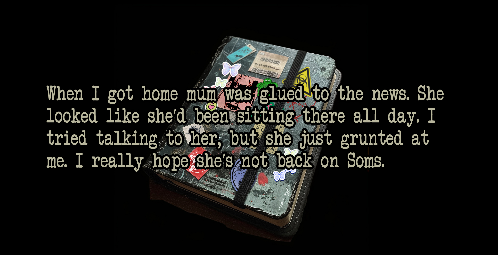
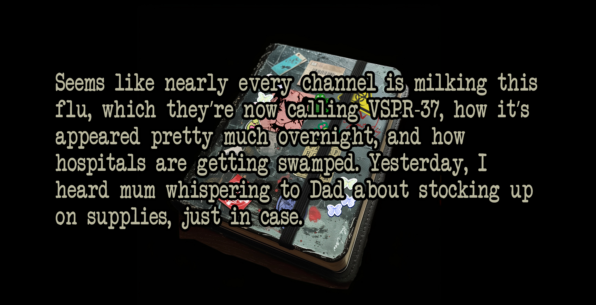

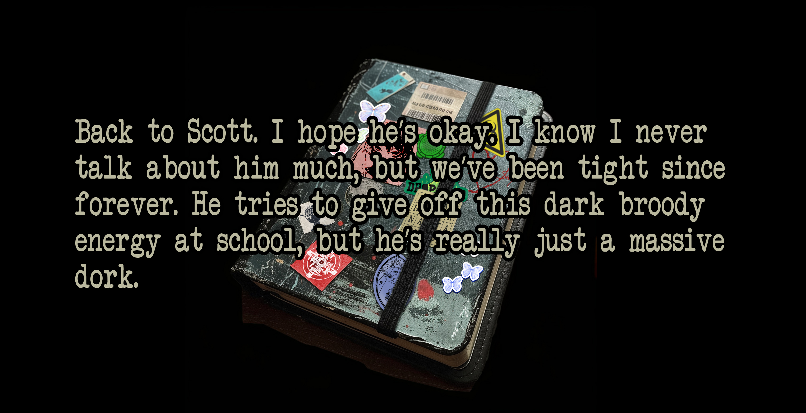
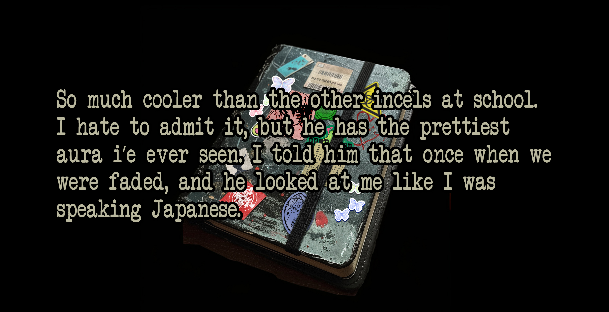
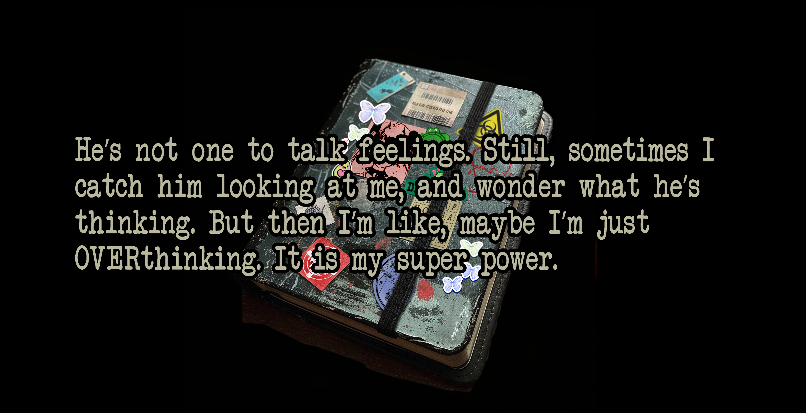
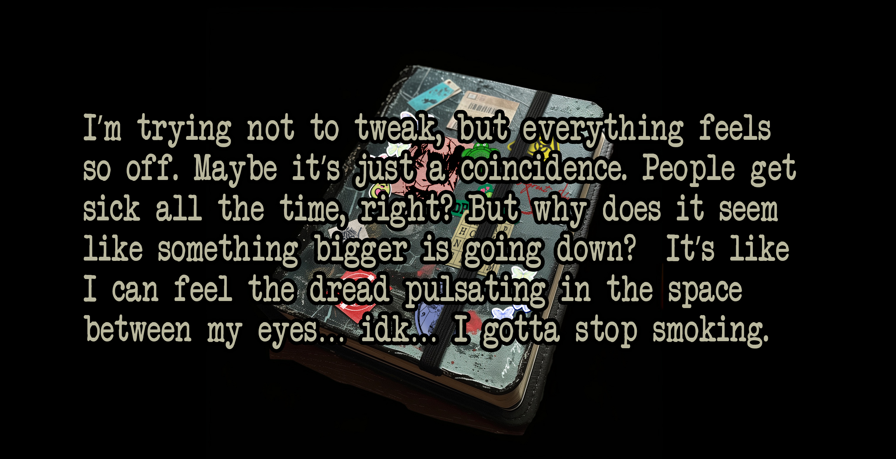
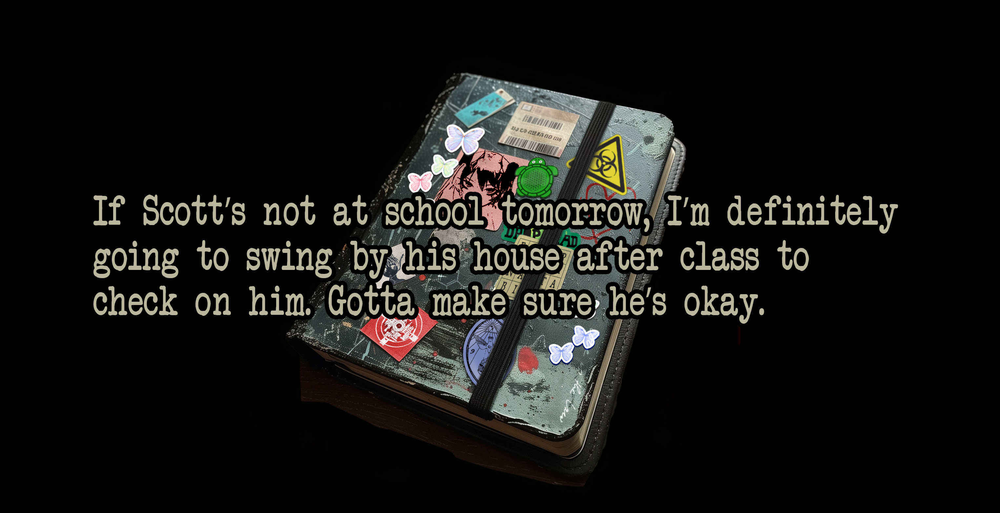
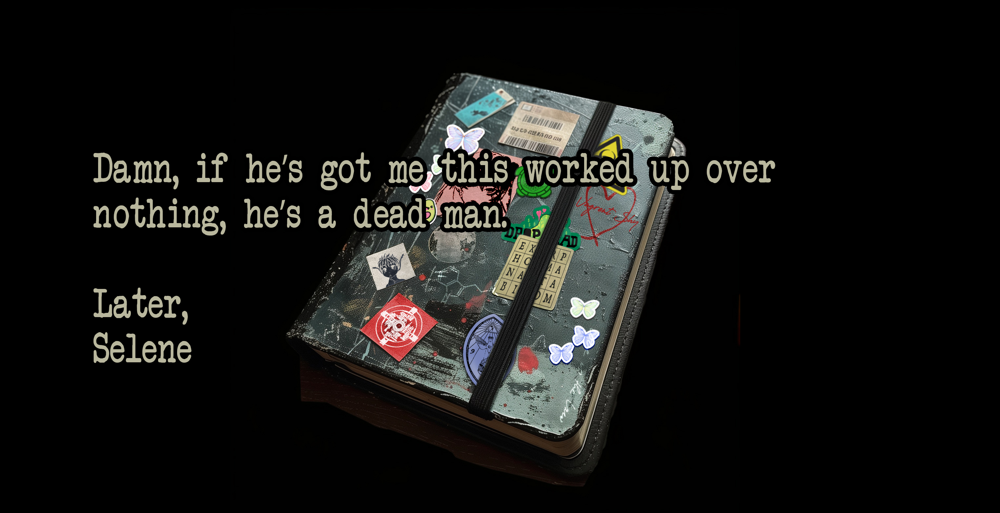

***

## Transcription

> Dear Diary,
>
> Wow. Today may take the cake for the most ‘meh’ day in my 16 years of existence. School was its typical feedback loop. Mr. Thompson slapped me with a pinky for zoning out.
>
> Excuse me for not caring about quantum drifts and singularity, but at what point in my life will that stuff help me? Guess I sealed the deal when I told him a synth will probably be doing his job soon and he’ll be lucky if he gets to clean its whiteboard, so he may as well relax. He totally lost it. Not amused at all.
Obviously a dumb play, but I was in one of those moods. TBH, my mind was on Scott. He’s been MIA for three days now, hasn’t replied to any of my codeks.
>
> I’m used to being ghosted, but it’s not like him to ghost school, especially since he’s always flexing those grades.
>
> I caught up with Jenna during lunch, and she said he’s been really sick. Some nasty flu is going around, I guess. I overheard some teachers in the staff room when I was heading to the library. They sounded super pranged out.
>
> Mrs. Carter said she’s never seen so many kids and teachers out sick at once. Even Mr. Lawson, who’s basically a school fixture, hasn’t shown up all week.
Speaking of, we had a sub in his replacement who was a total noob. We were supposed to learn about the industrial revolution, but he went off on a tangent about companies using AI for decision-making.
>
> He said some pharma right here in Eli is toying with the idea of having a boy run the whole show. Old news. I don’t understand why arties get so much hate, they make the SICKEST movies. “The real danger isn’t that they destroy us, it’s that they drive us insane” he said.
That kinda stuck with me…I was thinking about trying my synth joke on him, but decided against it.
>
> When I got home mum was glued to the news. She looked like she’d been sitting there all day. I tried talking to her, but she just grunted at me. I really hope she’s not back on Soms.
>
> Seems like nearly every channel is milking this flu, which they’re now calling VSPR-37, how it’s appeared pretty much overnight, and how hospitals are getting swamped. Yesterday, I heard mum whispering to Dad about stocking up on supplies, just in case.
>
> I don’t get them they’re so freaked out. It’s just a bug, right?
>
> Back to Scott, I hope he’s okay. I know I never talk about him much, but we’ve been tight since forever. He tries to give off this dark broody energy at school, but he’s really just a massive dork.
>
> So much cooler than the other incels at school. I hate to admit it, but he has the prettiest aura i’e ever seen. I told him that once when we were faded, and he looked at me like I was speaking Japanese.
>
> He’s not one to talk feelings. Still, sometimes I catch him looking at me, and wonder what he’s thinking. But then I’m like, maybe I’m just OVERthinking. It is my super power.
>
> I’m not trying to tweak, but everything feels so off. Maybe it’s just a coincidence. People get sick all the time, right? But why does it seem like something bigger is going down? It’s like I can feel the dread pulsating in the space between my eyes…idk…I gotta stop smoking.
> If Scott’s not at school tomorrow, I’m definitely going to swing by his house after class to check on him. Gotta make sure he’s okay.
>
> Damn, it he’s got me this worked up over nothing, he’s a dead man.
>
> Later,
> Selene

(Transcription by @elliecoptaaa on Discord)

***

## Read More

More from [📁 FOR SOF](./for-sof)

Related articles:

- [Scott's diary](scott_personal_journal)

Related characters:

- [Selene](../characters/selene)
- [Scott](../characters/syko)
