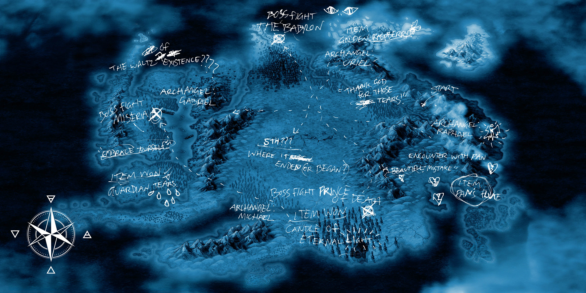

# YOUTOPIA_selenes_map.vis

> Where it ended (or began?)

Selene's map is a file unlocked early in the ARG. The map itself contains references 
to the [four insights](../lore/insights); [connection](../lore/insight1-connection), 
[empathy](../lore/insight2-empathy), [purpose](../lore/insight3-purpose) and [vision](../lore/insight4-vision).

The map also contains references to the [archangels](../characters/characters#the-archangels); 
[Raphael](../characters/raphael), [Gabriel](../characters/gabriel), [Michael](../characters/michael) and 
[Uriel](../characters/uriel).
The [omens](../characters/characters#omens) [Pan](../characters/pan), [Miseria](../characters/miseria) and 
[Vanth](../characters/vanth) are also on the map of Youtopia.

Artifacts mentioned in the insight documents, being "the Guardian Tears", "Abramelin's candle", 
"Pan's Flute" and "the Golden Raspberry".

***

## Document contents

  
Password

clive

The regions, symbols and text on this map all refer to [the insights](../lore/insights), which seem
to occupy a physical space in [Youtopia](../lore/youtopia).

***

## Read More

More from [📁 FOR SOF](./for-sof)

Related files:

- [Message for Sof](msgforsof)
- [Capslock doc](capslock_doc)
- [Dreadit](dreadit)
- [Selene's Diary](selene_personal_journal)
- [Scott's Diary](scott_personal_journal)
- [LBR Sites](lbr_sites) (through password)

Related articles:

- [Insights](../lore/insights)

Related characters:

- [Selene](../characters/selene)
- [Sof](../characters/sof)
- [Pan](../characters/pan)
- [Miseria](../characters/miseria)
- [Vanth](../characters/vanth)
