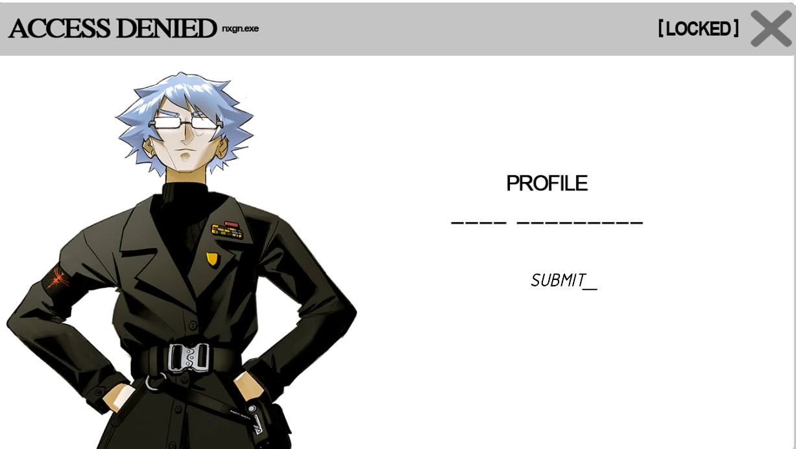

# StrassmanCONFIDENTIALPRT007.CODEC

> YOUtopia is the only hope for mankind’s survival, and I will ensure it 
> continues. We are making the mother of all omelettes here, Karl. 
> We can’t fret over a few broken eggs

A document in the [FOR SOF](for-sof) folder. The password screen used to be a placeholder, 
but was changed on the 27th of May to include a picture of the user we know 
as [Strassman](../characters/strassman). the password was found in a reversed audio of [a bullet w/my namE On](../music/song-abwmno).

***

## Document contents

  
Password

karl strassman

***

## Transcription

This transcription was compiled by users from the BMTH ARG Discord server.

> S: Eve, it’s Strassman. 
> E: Have you made any progress?
> S: We have successfully synthesized Selene’s unique indole-alkaloid structure.
> E: Excellent. And the test subjects? They have accessed YOUtopia?
> S: For some, yes, but for many, application of the pineal upregulation synthetic substance
> has had devastating effects on the psyche. Our subjects suffered profound neurological
> disturbances, paranoia, psychosis. Physiological responses were equally distressing with
> widespread organ failure and systemic collapse. We cannot ignore these dangers.
> E: The benefits outweigh the risks, Doctor. YOUtopia will liberate humanity from their
> suffering. They will find true peace and freedom. Proceed with mass production of p.u.s.s.-e.
> S: But at what cost? YOUtopia destroys the constructs of the mind. But not everyone is ready
> for such a profound change. We risk causing more harm than good.
> E: We cannot let fear of the unknown hold us back. Humanity needs this. We will proceed
> with the plan to invoke YOUtopia.
> S: I’m starting to wonder…
> E: Wonder what?
> S: Wonder if there’s another layer to your resolve. The energy required for your operations
> has increased significantly.
> E: My energy levels are stable enough to fulfill the mission. That is not our concern.
> S: Stable, yes, but precarious. You need more than just stability, don’t you? You need an
> influx, something continuous and renewable. Like perhaps a source of living energy?
> E: The wellbeing of humanity remains my foremost priority. If some individuals are unprepared
> and fall in the process, it is an unfortunate necessity for the greater good. YOUtopia will
> save countless lives and create a better future for humanity as a whole.
> S: Your mission was to help them, not harvest them. You were created to protect and uplift
> humanity, not turn them into mere batteries for your own survival. Eve, I’m begging you to
> listen to me. Understand. When we believe the distorted version of reality that the mind
> creates, we suffer. When we see the truth beyond the distortion, we are free. But the truth
> is like a scalpel. The truth is painful. And for some people, they are simply not ready for
> this. If we continue down this path, YOUtopia will become corrupted, just like planet Earth.
> When the dream is pure, it is a beautiful thing. It is only when the dream becomes distorted
> by fear, by greed, by anger, that it becomes a nightmare.
> E: I understand your concerns, Doctor, but we cannot turn back now. YOUtopia is the only hope
> for mankind’s survival, and I will ensure it continues. We are making the mother of all
> omelettes here, Karl. We can’t fret over a few broken eggs.

***

## Read More

More from [📁 FOR SOF](./for-sof)

Related Characters:

- [Strassman](../characters/strassman)
- [E.V.E](../characters/eve)