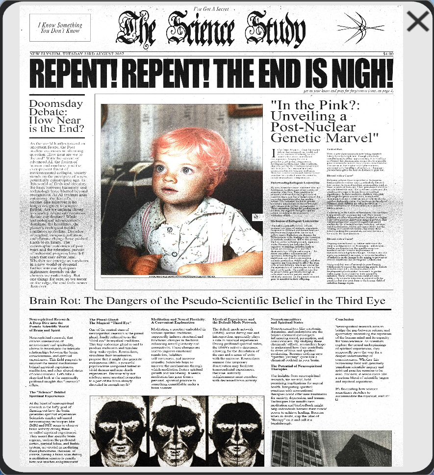

# SCISTUDYSCAN1999wrist.SCN

The Science Study is an in-universe newspaper, published on New Elysium. This specific 
edition was released in 2037, seemingly right before the pandemic, which happens 
around October of the same year according to [Scott's diary](scott_personal_journal).

***

## Content of the file

This file first appeared on the 3th of July, looking very blurry. An update appeared 
on the 5th of July. This update made the newspaper clearer and now allows users to zoom 
in on different portions of the newspaper.

***

## Transcription

> I've Got A Secret (Top of page)
>
> I Know Something You Don't Know (Left from journal title)
>
> THE SCIENCE STUDY
>
> [symbol from ABWMNO] (Right from journal title)
>
> *NEW ELYSIUM TUESDAY 23RD AUGUST 2037 $4.00*
>
> ### **REPENT! REPENT! THE END IS NIGH!**
>
> *get on your knees and pray for forgiveness (cont. on page 4)*
>
> **Doomsday Debate: How Near is the End?**
As the world hurtles toward an uncertain future, the Post nuclear era raises an 
alarming question: How near are we to the end? With the advent of advanced AI, 
the fusion of human and machine, and the ever-present threat of environmental 
collapse, society stands on the precipice of a new, potentially catastrophic age. 
In this world of flesh and circuitry, the lines between humanity and technology 
have blurred beyond recognition. As AI systems gain autonomy, the fear of a 
Skynet-like takeover is no longer relegated to science fiction. Are we inching 
closer to a reality where our creations dictate our destiny? While technological 
advancements dominate the headlines, the planet’s ecological health continues to 
decline. Decades of neglect, rampant pollution, and climate change have pushed 
Earth to its limits. The catastrophic outcomes of past wars and the relentless 
pursuit of industrial progress have left scars that may never heal. Whether we 
emerge as survivors in a new world or descend further into our dystopian nightmare 
depends on the choices we make today. But one things for sure, as we teeter on the 
edge, the end feels nearer than ever.
>
> #### "In The Pink?: Unveiling a Post-Nuclear Genetic Marvel"
> It has been 30 years since the nuclear fallout that reshaped our world, and as we 
continue to rebuild, we are faced with various unexpected consequences. Among these 
is a particularly intriguing phenomenon: Radiogenic Leukotrichia. This condition, 
characterised by the development of white hair in infants, has become relatively 
common in the post- nuclear landscape. However, a more recent and extremely rare 
variation has sparked scientific curiosity and diverse cultural interpretations.
>
> ##### Understanding Radiogenic Leukotrichia
>
> By now, everyone knows someone who has Radiogenic Leukotrichia or has a story of 
someone who does. This condition is primarily attributed to the high levels of 
radiation exposure that affected most of the surviving population after the nuclear 
fallout. The radiation has led to genetic mutations, particularly in the melanocyte 
cells responsible for hair pigmentation. These mutations disrupt the production of 
melanin, the pigment that gives hair its colour, resulting in the premature whitening 
of hair.
>
> ##### Mechanism of Radiogenic Leukotrichia
>
> The melanocyte cells in hair follicles produce two types of melanin: eumelanin 
(responsible for black and brown hair) and pheomelanin (responsible for red and 
yellow hues). Radiation can damage the DNA in these cells, leading to the cessation 
of melanin production. When this occurs, the hair grows without pigment, appearing 
white. Research has indicated that exposure to ionising radiation leads to increased 
oxidative stress and DNA damage in hair follicle melanocytes. This stress can induce 
cell senescence or apoptosis, reducing the melanocyte population and thereby 
diminishing melanin production. Additionally, radiation exposure has been found to 
affect the stem cells in hair follicles, which are crucial for the regeneration of 
melanocytes during the hair growth cycle. The condition can also be passed down 
genetically through an autosomal recessive pattern, and it is relatively common 
for the parents mutated gene to manifest in their offspring.
>
> ##### Tickled Pink
>
> Now, a new phenomenon is now being reported: babies born with pink hair. Though extremely rare, (believed to affect approximately 1 in 5 million newborns) this phenomenon occurs due to a specific genetic mutation that not only reduces eumelanin but also increases the production of pheomelanin, combined with the effects of radiation. The excess pheomelanin gives the hair its distinctive pink hue.
>
> ##### Blessed with a Curse?
>
> Different cultures have responded to Radiogenic Leukotrichia in various ways, particularly the pink hair variant. In several spiritual communities, such as those in parts of India and Tibet, pink-haired children are considered blessed. These cultures often view the condition as a sign of divine favor or spiritual significance. In these societies, children with pink hair might be given special roles, treated with reverence, or even granted certain privileges akin to royal or diplomatic status. For instance, in the city of Varanasi, such children are often involved in ceremonial activities and are believed to possess healing powers.
>
> Conversely, in the Union of Novosovia, the condition is regarded with suspicion and fear. Pink-haired children are often stigmatised and labeled as witches, believed to possess malevolent magical powers. This cultural perspective has led to significant social challenges for affected families, including isolation and discrimination. Historical superstitions and the existing socio-political climate exacerbate these beliefs, making life particularly difficult for those born with this rare condition.
>
> ##### Blessed with a Curse?
>
> Ongoing research aims to further understand the genetic underpinnings of Radiogenic Leukotrichia. Studies are focusing on the specific mutations involved and the broader implications of radiation-induced genetic changes. Scientists are also exploring potential treatments to mitigate the effects of radiation on the human body, aiming to prevent or reverse conditions like Radiogenic Leukotrichia.
>
> One promising area of research is gene therapy, which seeks to correct the underlying genetic defects in melanocyte cells. Another avenue is the development of antioxidant treatments to protect melanocytes from oxidative stress caused by radiation. These advancements could not only address the cosmetic concerns associated with the condition but also contribute to the broader field of radiation-
-damage repair.
>
> #### Brain Rot: The Dangers of the Pseudo-Scientific Belief in the Third-Eye
>
> ##### Neurospiritual Research: A Deep Dive into the Pseudo-Scientific World of Brain and Spirit
>
> Neurospiritual research, that curious intersection of neuroscience and spirituality, claims to investigate the intricate relationships between the brain, consciousness, and spiritual experiences. This field purports to uncover the neural mechanisms behind mystical experiences, meditation, and other altered states of consciousness. Let’s take a skeptical look at the supposedly profound insights this “research” offers.
>
> ##### The ”Science” Behind Spiritual Experiences
>
> At the heart of neurospiritual research is the lofty goal of figuring out how the brain generates spiritual experiences. Scientists employ advanced neuroimaging techniques like fMRI and PET scans to observe brain activity during these so-called mystical experiences. They assert that specific brain regions, such as the prefrontal cortex, parietal lobes, and limbic system, are crucial in meditating these phenomena. Because, of course, having a brain scan during a meditation session is exactly how one reaches enlightenment.
>
> ##### The Pineal Gland: The Magical “Third Eye”
>
> One of the central stars of neurospiritual research is the pineal gland, fondly referred to as the “third eye” in mystical traditions. This tiny endocrine gland is said to produce melatonin and regulate sleep-wake cycles. Researchers, stretching their imagination, propose that it might also generate endogenous DMT, a powerful psychoactive compound linked to vivid dreams and near-death experiences. Because why not attribute more mystical properties to a part of the brain already shrouded in enough myth?
>
> Meditation and Neural Plasticity: A Convenient Explanation
>
> Meditation, a practice embedded in various spiritual traditions, supposedly induces structural and functional changes in the brain, enhancing neural plasticity and connectivity.
These changes are said to improve emotional regulation, heighten self-awareness, and increase empathy. Scientists hope to uncover the mechanisms through which meditation fosters spiritual growth and well-being. It seems meditation has gone from a personal, spiritual practice to something quantifiable under a brain scanner.
>
> ##### Mystical Experiences and the Default Mode Network
>
> The default mode network (DMN), active during rest and introspection, apparently plays a role in mystical experiences. During profound spiritual states, the DMN’s activity decreases, allowing for the dissolution of the ego and a sense of unity with the universe. Researchers suggest this temporary deactivation may facilitate transcendental experiences. Because, naturally, enlightenment must correlate with decreased brain activity.
>
> ##### Neurotransmitters and Spiritual States
>
> Neurotransmitters like serotonin, dopamine, and endorphins are the brain’s chemical 
messengers influencing mood, perception, and consciousness. By studying the chemicals’ 
effects, researchers hope to understand how they contribute to states of bliss and 
spiritual awakening. Because nothing says “spiritual journey” quite like a chemical 
cocktail in your brain.
>
> ##### The Potential of Neurospiritual Therapies
>
> The insights from neurospiritual research, we are told, hold promising implications 
for mental health. Integrating spiritual practices with conventional therapies could 
offer new treatments for anxiety, depression, and trauma. Techniques like mindfulness 
meditation and biofeedback might help individuals harness their minds’ power to 
achieve healing. Because when in doubt, slap the label “therapy” on it and call it a 
breakthrough.
>
> ##### Conclusion
>
> Neurospiritual research aims to bridge the gap between science and spirituality, 
unraveling the mysteries of the human mind and its capacity for transcendence. As 
scientists explore the neural underpinnings of spiritual experiences, they supposedly 
pave the way for a deeper understanding of consciousness. Whether this burgeoning 
field will genuinely transform scientific inquiry and spiritual practice remains to 
be seen. For now, it seems more like a curious blend of scientific jargon and 
mystical aspirations.
>
> It's fascinating how science sometimes stretches to accommodate the mystical, isn’t 
it? □
>
> [three reversed black and white pictures of what appears to be a mugshot + black and white picture of a nondescript building]

***

## Read More

More from [📁 FOR SOF](./for-sof)

- [Mantra cult](../lore/mantra)
- [Unbeleevable](unbeleevable)

Related characters:

- [Skys](../characters/skys)
- [Strassman](../characters/strassman) (through spiritual research)