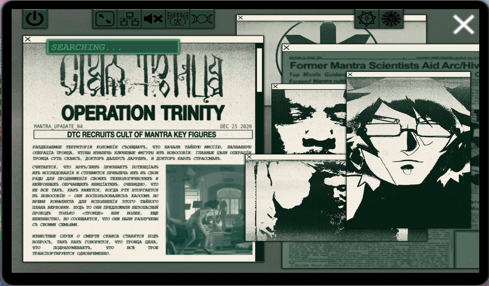

# Operation_Trinity_Analysis.xslx

This file was introduced in an update on 19-06-2024. It confirms that there is lore for the 
ARG hidden in BMTH's music since [Amo](../music/amo).

***

## Transcription & translation from Russian

> (right)
> FORMER MANTRA SCIENTISTS AID ARC/HIV
> TOP MISSILE GUIDAN-
> ESCAPED MANTRA CU- 
>
> (main article from Russian)
> OPERATION TRINITY
> MANTRA_UPDATE_04    DEC 25 2020
>
> DTC recruits cult of mantra key figures
>
> The Divided Territories of Colombia report that they have started 
> a secret mission called Operation Trinity to extract key figures 
> Novosoviya.
> The main targets of Operation Trinity are Skais ([Skys](../characters/skys), 
> [Dr. Dallus Lauren](../characters/dallus-lauren), and [Dr. Karl Strassman](../characters/strassman).
> It is believed that ARC/HIV recognizes the potential of their research
> and seeks to attract them to their ranks to advance their technological and neuronal learning initiatives.
> Obviously, not everything is as it seems, as DTC invades Novosoviya.
> They took advantage of the chaos during the conflict to execute this secret recruitment plan.
> Whether they offered safe passage only to "Trinity" or more is still unknown,
> but it is reported that they were separated from their families.
> The known rumors of Skais's (Skys) death are questioned, as it is said that Trinity is safe,
> which implies that they are being transported simultaneously.
>
> BCB

Note that we learn from the [Project D.U.S.T research proposal](project_dust) 
that six children with special psychic powers were also recovered during Operation Trinity, 
information that was unknown to the writer of this document.

***

## Read More

More from [📁 FOR SOF](./for-sof)

- [Karl Strassman](../characters/strassman)
- [Karl Strassman & Eve call](strassmancodec)
- [In the Dark & ARC/HIVE](../music/amo-in-the-dark)
- [Mantra & joinmantra.org](../music/amo-mantra)