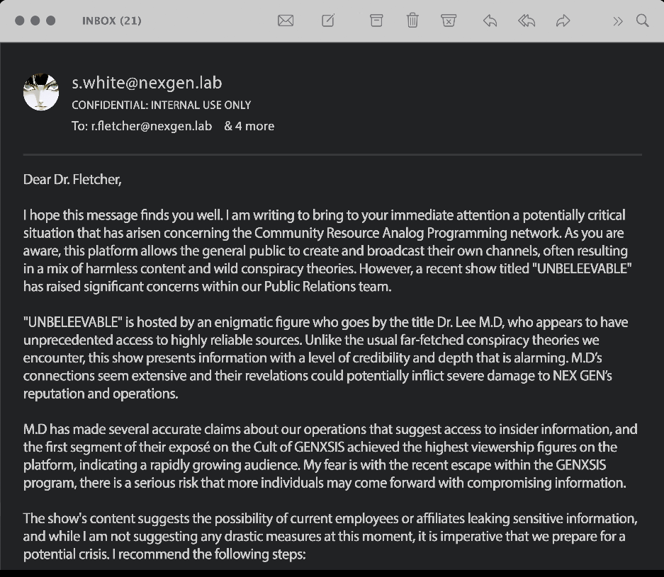
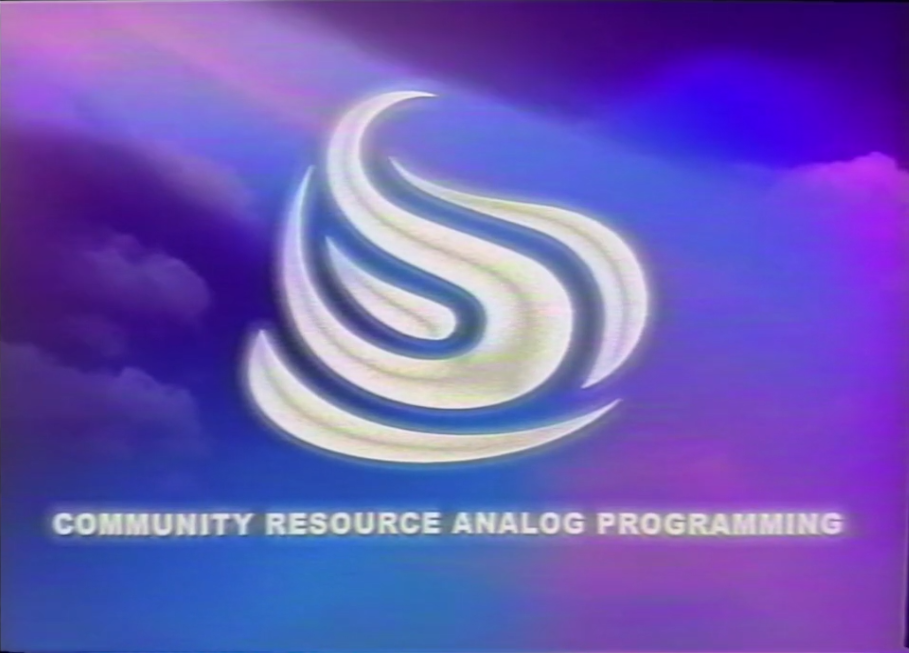
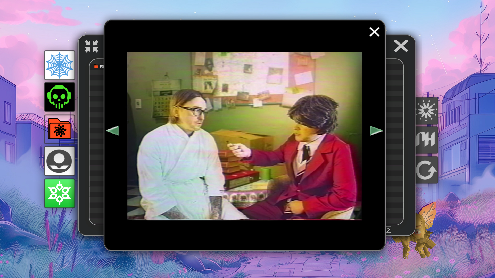

# Nex Gen leak "UNBELEEVABLE".doc

This file contains an email from Nex Gen's internal network and the video attached to said email. 
It is currently unknown whether the Dr. Lee MD from the video is also [Madman](../characters/madman) in the ARG.

***

## Document contents

### Email

### Video

The video the email is referring to is a video of Lee speaking about the Mantra
cult. You can watch the [Unbeleevable video on YouTube](https://youtu.be/fQG3O6avUrw?si=zOYCqH0iVpDiaB2V)

Within the ARG, this is broadcasted by Community Resource Analog Program (CRAP).

***

## Transcription

### Email

> INBOX (21)
>
> s.white@nexgen.lab
> CONFIDENTIAL: INTERNAL USE ONLY
> To: r.fletcher@nexgen.lab
>
> Dear Dr. Fletcher
>
> I hope this message finds you well. I am writing to bring to your immediate attention a potentially critical situation that has arisen concerning the Community Resource Analog Programming network. As you are aware, this platform allows the general public to create and broadcast their own channels, often resulting in a mix of harmless content and wild conspiracy theories. However, a recent show titled “UNBELEEVABLE” has raised significant concerns within our Public Relations team. 
>
> “UNBELEEVABLE” is hosted by an enigmatic figure who goes by the title Dr. Lee M.D, who appears to have unprecedented access to highly reliable sources. Unlike the usual far-fetched conspiracy theories we encounter, this show presents information with a level of credibility and depth that is alarming. M.D’s connections seem extensive and their revelations could potentially inflict severe damage to NEX GEN’s reputation and operations.
>
> M.D has made several accurate claims about our operations that suggest access to insider information, and the first segment of their exposé on the Cult of GENXSIS achieved the highest viewership figures on the platform, indicating a rapidly growing audience. My fear is with the recent escape within the GENXSIS program, there is a serious risk that more individuals may come forward with compromising information.
>
> The show’s content suggests the possibility of current employees or affiliates leaking sensitive information, and while I am not suggesting any drastic measures at this moment, it is imperative that we prepare for a potential crisis. I recommend the following steps:
>
> -    Brief FANTOM Unit: Ensure the FANTOM tactical team is briefed on this development and ready for a rapid slate wipe if deemed necessary.
> -    Monitor the Show: Assign a dedicated team to monitor “UNBELEEVABLE” and analyse its content for any actionable intelligence.
> -    Internal Review: Conduct an internal review to identify potential sources of leaks and reinforce security protocols.
> -    Public Relations Strategy: Develop a contingency PR strategy to address any allegations or revelations that may emerge from this show.
>
> For your review, I have attached a segment from the latest episode of “UNBELEEVABLE” which highlights some of the concerning claims made by Dr. Lee. I strongly advise viewing this segment to understand the gravity of the situation.
>
> Your prompt attention to this matter is crucial. Should you require further details or wish to discuss this in person, please do not hesitate to contact me directly.
>
> Best regards,
>
> Susan White
> Public Relations Department
> NEX GEN
> [logo of genxsis]
>
> __Attachments: [Segment of “UNBELEEVABLE”]__

### Video

>
> **Loading File…**
>
> **COMMUNITY RESOURCE ANALOG PROGRAMMING**
>
> **Lee:** “In a world full of nutters, you’re gonna get the odd psychopathic cult or two, but let me tell you, nault compares to the one we will be looking at tonight. Cause when it comes to barmy, the next cult really takes the cake. Or should I say, the ceremonial wafer. 
>
> “Now I’ve been around the block, and I’ve heard some right shit in my time, but this next one is up there with the best of them. A cult supposedly run by a sentient I.A. robot that’s now the big cheese at a company riddled with more problems than a pub with no pints. I’m telling you; this lot are madder than a bag of foreskins. Tonight, we’ll be investigating the deranged tales of the cult of Genxsis, a cult so secret even they have secrets, the secrets have seschrets(?). 
>
> “After the nuclear fallout of World War 3, Novosovia was a place tougher than your Grandad’s old leather boots. You see, the government weren’t just running the show, they were using fundamentalist religion to keep everyone in line. 
>
> “Out of the ashes of this radioactive mess, a special little lad was born. Why was he so special? One word: pink hair. Now, as I’m sure you know, white-haired babies have been popping up all over the shop since the war as a result of the radiation messing about with the melanin production or summat, but Noviasovia saw these as the harebringers of doom. So can you imagine their horror when a pink-haired baby popped out. They thought he represented the devil’s ballbag itself. Superstition ran wild and the poor little bastard was cast out by his parents at the little age of 8. Kicked to the curb with nothing but his wits, Skys had to fend for himself in a world that hated him just for being different.
>
> “After that, it’s said young Skys fell in with a right set of turnips. For a moment imagine Charles Manson on disco burgers but with a supernatural twist. Skys wandered the globe into all sorts of bother. I can tell you one thing for sure… Keep rolling rate.
>
> “I can tell you one thing for sure, that at some point he picked up a guitar and tried his hand at music. And wouldn’t you know it, he actually started making a name for himself. His band, “Skys and the Starjammers” were drawing in crowds like flies on shit, and soon he had every sandal sniffer in the palm of his hand and the ladies loved him. Skys’ charisma and mysterious aura had everyone hooked. Soon, tales of powers and mystical realms started to surface and it weren’t long before Skys became known as some kind of modern day Merlin. 
>
>  “Enter Dr. Karl Strassman and Dr. Dallas Lauren. Two brain boxes intrigued by the claims Skys was making. These three ended up pushing neo-spiritualism to it’s absolute limits and before you knew it, the “Neosages” were born. And if that name is not ringing any bells, you might know them better as “The Cult of Mantra”. And these nutters my friends, set the stage for what would eventually become “GENXSIS”.
>
> “I know what you’re all thinking, what the fuck are you on about Lee? But bear with me, it all gets madder from here. Trust me, chapter two’s absolutely off it’s tits. Thanks for watching guys, and remember, don’t stop beleeving”
>
> [credits roll]
>
> **UNBELEEVABLE**
>
> **DIRECTED BY LEE M.D.**
>
> **I.A RENDERING BY LEE M.D.**
>
> **THEME BASED ON MELODIES ORIGINALLY WHISTLED BY LEE M.D.**
>
> **Lee:** “And for my premium beleevers, I’ll be interviewing the man who doesn’t know who he is or where he’s been.”
>
> [cuts back to Lee and a man]
>
> **Lee:** “Who are you?”
>
> **Man (Matt Nicholls):** “Don’t know…”
>
> **Lee:** “And where have you been”
>
> **Man (Matt Nicholls):** “Don’t know”
>
> **Lee:** “Unbeleevable”

(Transcription by Alec)

***

## More Screenshots

This man does not know who he is and is being interviewed by Dr. Lee MD. This is Matt Nichols, 
one of the band members, although it is unknown whether he is also playing [Pickles](../characters/pickles) here.

***

## Read More

More from [📁 FOR SOF](./for-sof)

Related Articles:

- [Mantra cult](../lore/mantra)
- [MANTRA (song)](../music/amo-mantra)
- [Operation Trinity](trinity_document)
- [The Science Study](thesciencestudy)
- [Sky_&_The_Starjammers.png](skystarjammers)