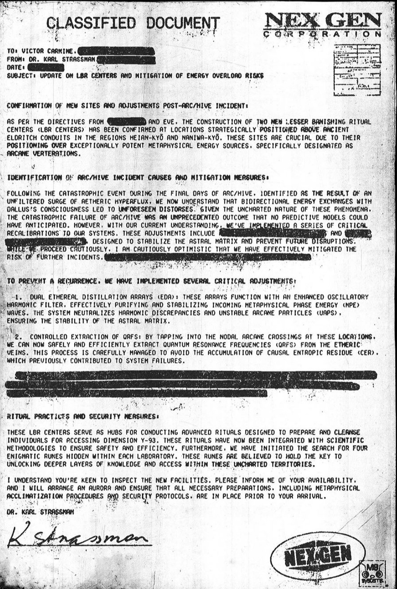

# LBR_sites.Confidential.doc

> These sites are crucial due to their positioning over exceptionally potent metaphysical energy sources, specifically designated as Arcane Verterations. 

The `LBR_sites.Confidential.doc` file was originally introduced on the 7th of August 2024, 
before becoming unlockable on the 8th of August.
The document speaks about an incident at [ARC/HIVE](../lore/archive) and measures taken 
by [Nex Gen](../lore/nex-gen-corporation) to prevent more incidents.
The letter is written by [Strassman](../characters/strassman) and another name seems to 
be redacted.
It is addressed to [Victor Carmine](../characters#victor-carmine) and another
redaction follows.

***

## Document contents

  
Password

{{"[lbr password](../../Resources/files/lbr_sites/lbr_password.jpg)" | markdownify}}

***

## Transcription

> **NEX GEN CORPORATION**
> 
> **CLASSIFIED DOCUMENT**
> 
> To: Victor Carmine, [redacted]
> 
> From: Dr. Karl Strassman, [redacted]
> 
> Date: [redacted]
> 
> Subject: Update on LBR Centers and Mitigation of Energy Overload Risks
>
> **Confirmation of New Sites and Adjustments Post-ARC/HIVE Incident:**
>
> As per the directives from [redacted] and EVE, the construction of two new Lesser Banishing Ritual Centers (LBR Centers) has been confirmed at locations strategically positioned above ancient Eldritch Conduits in the regions Heian-kyō and Naniwa-kyō. These sites are crucial due to their positioning over exceptionally potent metaphysical energy sources, specifically designated as Arcane Verterations.
>
> **Identification of ARC/HIVE Incident Causes and Mitigation Measures:**
>
> Following the catastrophic event during the final days of ARC/HIVE, identified as the result of an unfiltered surge of Aetheric Hyperflux, we now understand that bidirectional energy exchanges with Dallus’s consciousness led to unforeseen distorses. Given the uncharted nature of these phenomena, the catastrophic failure of ARC/HIVE was an unprecedented outcome that no predictive models could have anticipated. However, with our current understanding, we’ve implemented a series of critical recalibrations to our systems. These adjustments include advanced filtration protocols and energy modulation techniques, designed to stabilize the Astral Matrix and prevent future disruptions. While we proceed cautiously, I am cautiously optimistic that we have effectively mitigated the risk of further incidents.
>
> **To prevent a recurrence, we have implemented several critical adjustments:**
>
> Dual Ethereal Distillation Arrays (EDA): These arrays function with an enhanced Oscillatory Harmonic Filter, effectively purifying and stabilizing incoming Metaphysical Phase Energy (MPE) waves. The system neutralizes Harmonic Discrepancies and Unstable Arcane Particles (UAPs), ensuring the stability of the Astral Matrix.
>
> Controlled Extraction of QRFs: By tapping into the Nodal Arcane Crossings at these locations, we can now safely and efficiently extract Quantum Resonance Frequencies (QRFs) from the Etheric Veins. This process is carefully managed to avoid the accumulation of Casual Entropic Residue (CER), which previously contributed to system failures.
>
> **Ritual Practices and Security Measures:**
>
> These LBR Centers serve as hubs for conducting advanced rituals designed to prepare and cleanse individuals for accessing Dimension Y-93. These rituals have now been integrated with scientific methodologies to ensure safety and efficiency. Furthermore, we have initiated the search for four enigmatic runes hidden within each laboratory. These runes are believed to hold the key to unlocking deeper layers of knowledge and access within these uncharted territories.
>
> I understand you're keen to inspect the new facilities. Please inform me of your availability, and I will arrange an AURORA and ensure that all necessary preparations, including metaphysical acclimatization procedures and security protocols, are in place prior to your arrival.
>
> Dr. Karl Strassman
>
> [K. Strassman handwritten signature]
>
> APPROVED BY THE NEX GEN
> RESEARCH DEPARTMENT
>
> [NEX GEN logo] [M8 SYSTEMS logo]

(Transcription by Alec)

***

## Read More

Related articles:

- [Nex Gen Corporation](../lore/nex-gen-corporation)
- [ARC/HIVE](../lore/archive)

Related characters:

- [EVE](../characters/eve)
- [Rebecca Sinclair](../characters/rebecca)
- [Karl Strassman](../characters/strassman)
- [Dallus Lauren](../characters/dallus-lauren)
- [Victor Carmine](../characters#victor-carmine)
