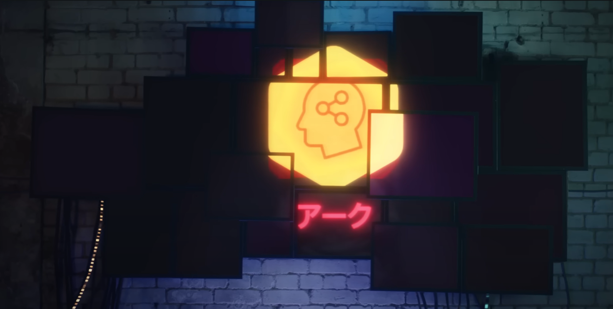
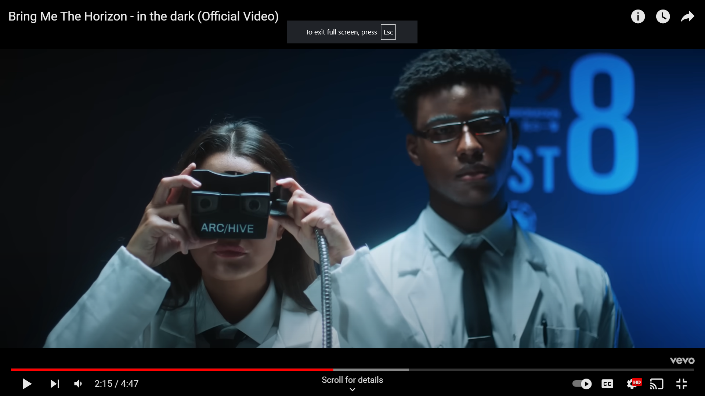
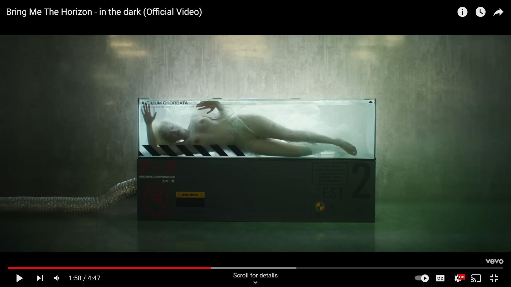
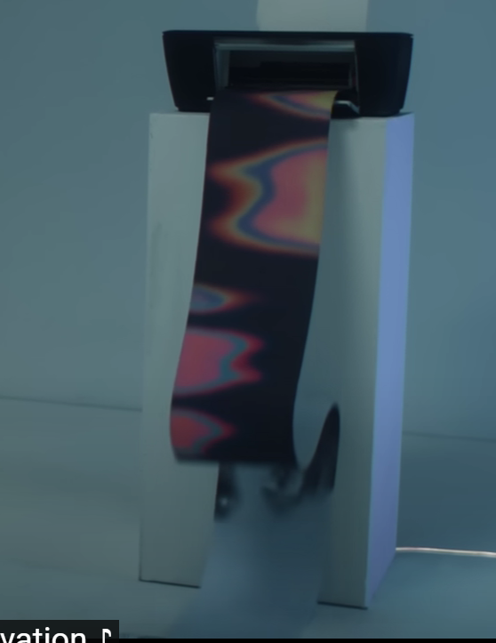

# ARC/HIVE

The logo for ARC/HIVE.

Arc/hive is an organisation that develops technology. They played a role in [Operation Trinity](../files/trinity_document) 
to get access to [Strassman](../characters/strassman), [Skys](../characters/skys) and 
[Dallus Lauren](../characters/dallus-lauren).
This document also helped link the character Dallus Lauren to the [In The Dark](../music/amo-in-the-dark) music video,
which takes place at ARC/HIVE.

We learn more about their experimentation in the [Project D.U.S.T. Research Proposal](../files/project_dust) from 2021.
This proposal was sent by [Dr. Elias Mortem](../characters/characters#dr-elias-mortem), head of R&D at ARC/HIVE.
This research proposal also refers to Project S.Y.K.O, likely referring to the character [Syko](../characters/syko).
This document was declassified in 2031, exactly 10 years later, by [Nex Gen Corporation](nex-gen-corporation).

***

## Experiments

A woman in the altilium chordata tank (the glass on the top left states this). The number 2 indicates that we might be 
looking at the second version of the tank, mentioned in [Project D.U.S.T](../files/project_dust).

***

## Read More

Related lore:

- [MANTRA](../music/amo-mantra)
- [Nex Gen Corporation](nex-gen-corporation)
- [Operation Trinity](../files/trinity_document)
- [Project D.U.S.T](../files/project_dust)

Related characters:

- [Dallus Lauren](../characters/characters#dallus-lauren)
- [Karl Strassman](../characters/characters#karl-strassman)
- [Skys](../characters/characters#skys)