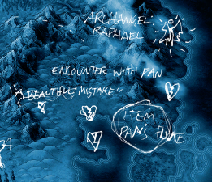
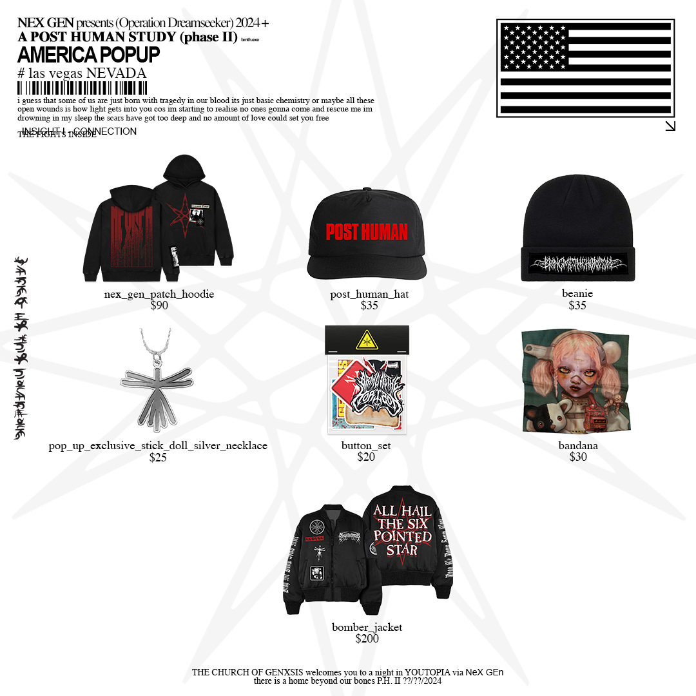
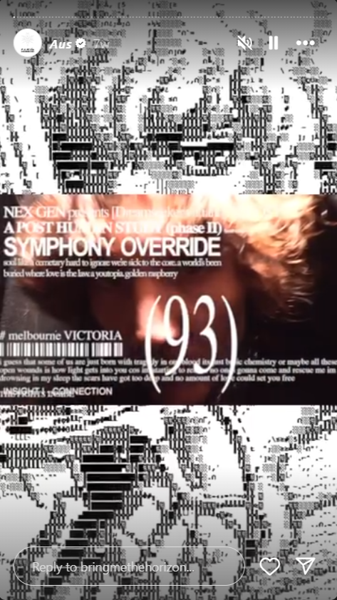

# Insight 1: Connection

> *"Manifest Divine Harmony"*

Connection is the first one of the four insights that we will need to master according 
to the documents in the 'FOR SOF' folder.

***

## Associations
 
Song: **[Top 10 staTues tHat CriEd bloOd](../music/song-top10)**
Element: Air
Archangel: [Raphael](../characters/raphael)
Omen: [Pan](../characters/pan)
Curse: ???
Direction: East
Relic: [Pan](../characters/pan)'s Flute
Symbol: triangle with line through the middle horizontally

A region on [Selene's map](../files/for-sof)

Insight 1 is also associated with [Syko](../characters/syko).

**Top 10 Statues That Cried Blood** also has a lyric video with inconsistent capitalization, 
possibly indicating another code (might lead to [capslock doc](../files/capslock_doc). 

***

## Document contents

  
Password

connection

### Gallery



***

## Transcription

> ## CONNECTION: MANIFEST, DIVINE, HARMONY 
>
> **ELEMENT**: AIR
> 
> **ARCHANGEL**: RAPHAEL
> 
> **OMEN**: PAN
> 
> **DIRECTION**: EAST
> 
> **RELIC**: PAN’S FLUTE
> 
> **BAND MEMBER**: SYKO
> 
> In the realm of human connection, the influence of conditioning and upbringing on our ability to form meaningful relationships is profound. Early experiences and societal norms shape out worldview, creating patterns of behaviour and thought that can hinder our capacity to connect deeply with others.
>
> Consider the impact of family dynamics on our understand of relationships. Those raised in environments where emotional expression is discouraged may struggle to establish intimate connections later in life.
>
> These psychosocial issues can lead to a sense of disconnection from others and from oneself, making it challenging to access states of inner peace and fulfilment.
>
> To overcome these barriers, individuals should approach their relationships with an open mind and a willingness to understand others without prejudice or preconceived notions. Making assumptions about others can create barriers to genuine connection by clouding our reception and distorting our understanding of their thoughts, feelings, and experiences. 
>
> By practicing this principle, we cultivate deeper connections built on mutual respect, trust, and understanding. We recognise the uniqueness of each individual and honour their truth without judgment or bias. In doing so, we foster a sense of belonging and acceptance that nurtures meaningful and fulfilling relationships. 
>
> By challenging ingrained beliefs and conditioning, individuals can cultivate empathy, authenticity, and a willingness to embrace vulnerability, thus forging deeper connections with others.
>
> (transcription by @elliecoptaaa on discord)

***

## Notable mentions

The first insight was revealed to be connection on a 
[Facebook post](https://www.facebook.com/photo/?fbid=979801893503451&set=pb.100044209477369.-2207520000)
on the 26th of April 2024.

An instagram story revealing connection to be the first insight ~6 weeks before album launch.

***

## Read More

More from [📁 FOR SOF](../files/for-sof)

Related characters:

- [Raphael](../characters/raphael)
- [Pan](../characters/pan)
- [Syko](../characters/syko)

Other insights:

- [The Insights](./insights)
- [Insight 2: Empathy](insight2-empathy)
- [Insight 3: Purpose](insight3-purpose)
- [Insight 4: Vision](insight4-vision)
