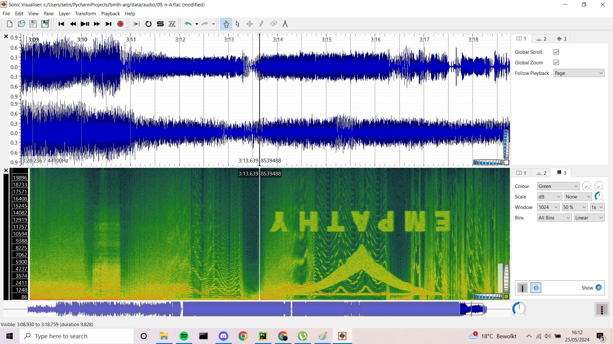
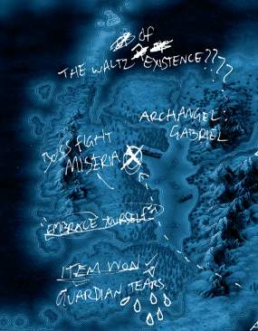
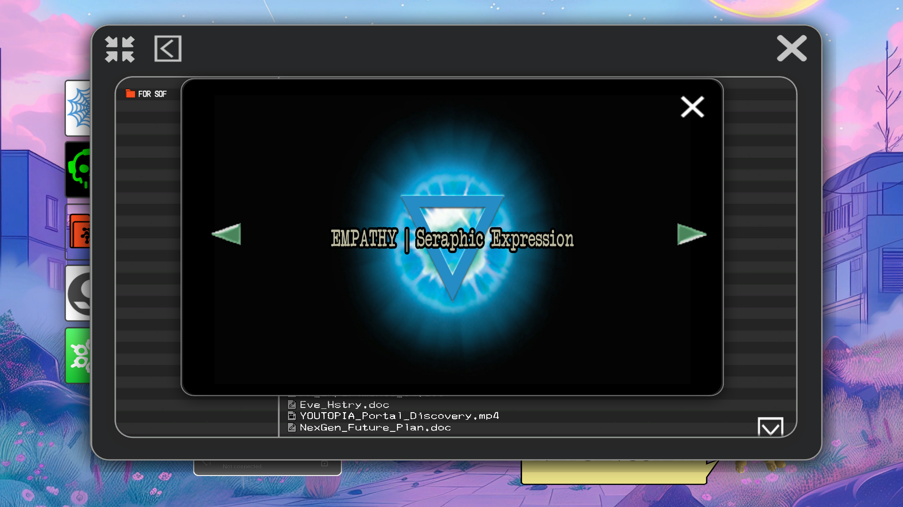
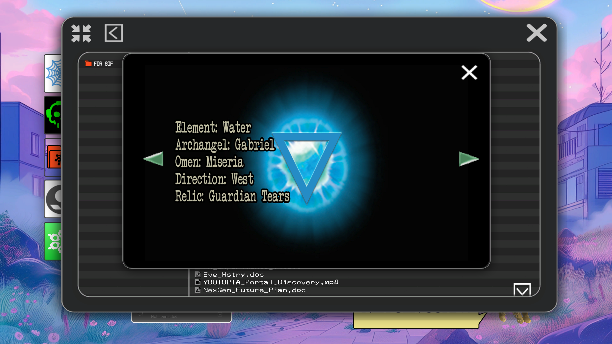
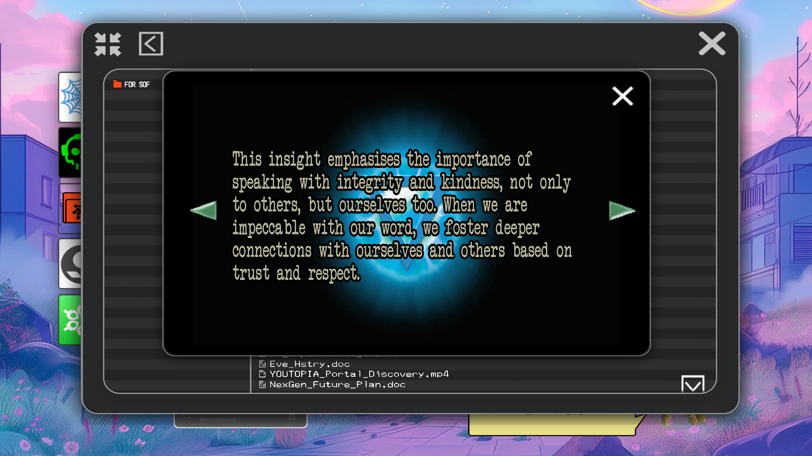
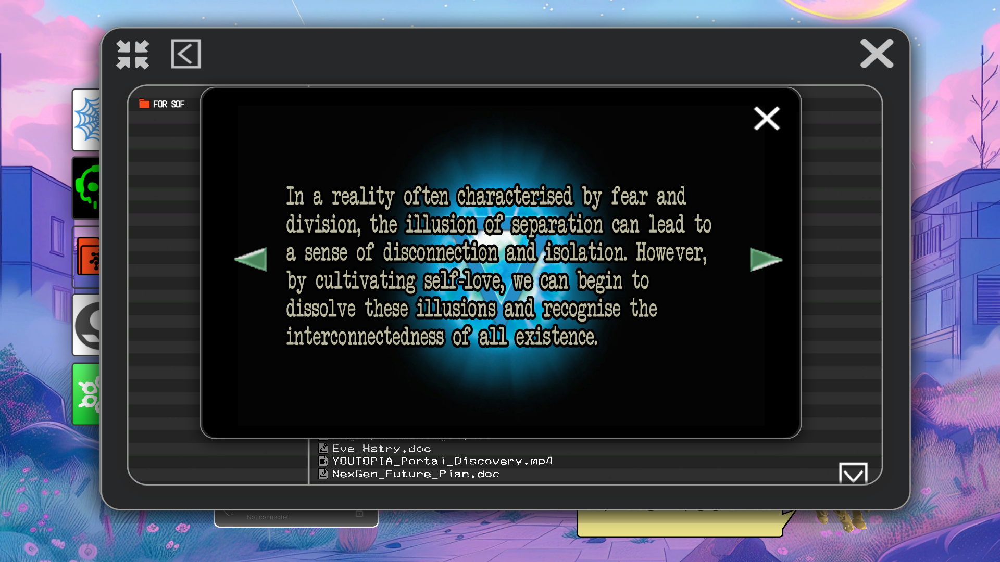
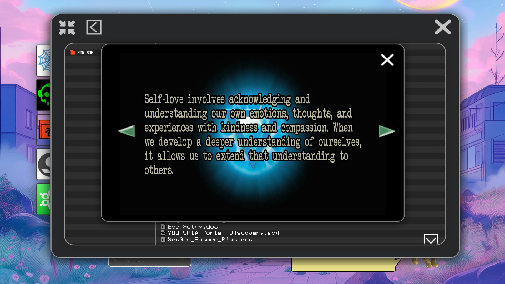
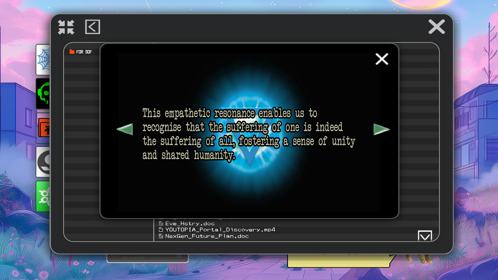
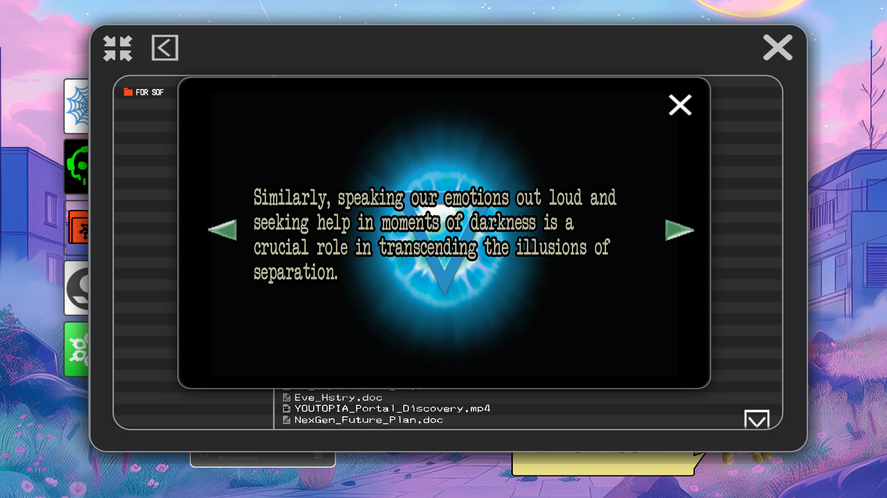
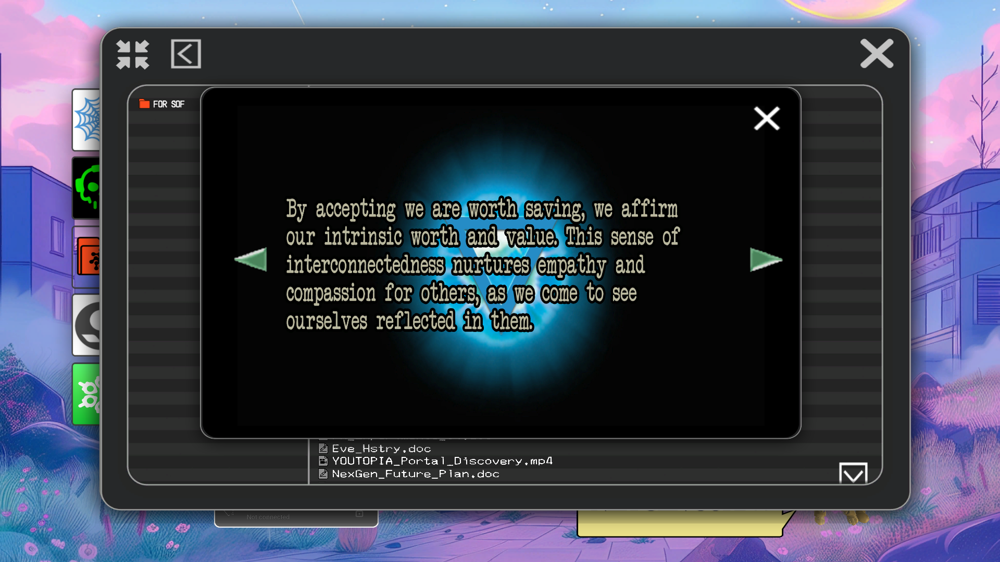

# Insight 2: Empathy
*Seraphic Expression*

Empathy is the second insight we gather from the [spectrograms](../music/spectrograms).

## Associations

Song: **n/A**
Element: Water
Archangel: [Gabriel](../characters/gabriel)
Omen: [Miseria](../characters/miseria)
Curse: ???
Direction: West
Relic: Guardian Tears

A region on [Selene's map](../files/for-sof#YOUTOPIA_selenes_mapvis)

Insight 2 is also associated with [Madman](../characters/madman).

## Document in FOR SOF

Password: `empathy`

## Read More

- [Gabriel](../characters/gabriel)
- [Miseria](../characters/miseria)
- [The Insights](insights)
- [Insight 1: Connection](insight1-connection)
- [Insight 3: Purpose](insight3-purpose)
- [Insight 4: Vision](insight4-vision)