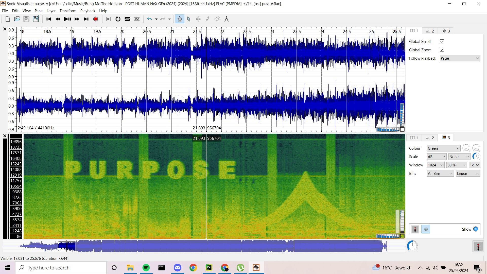
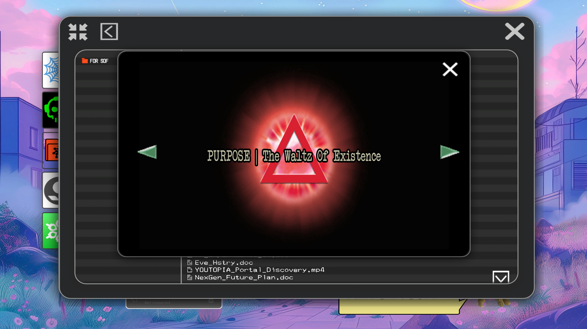
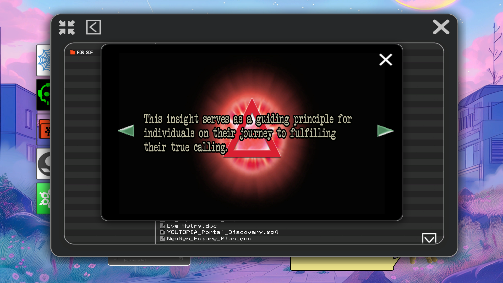
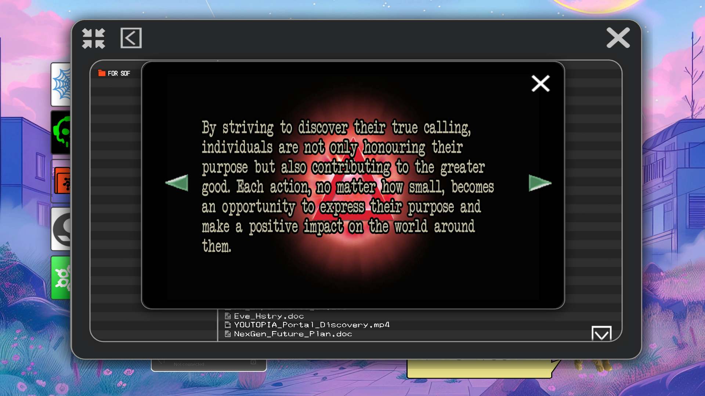
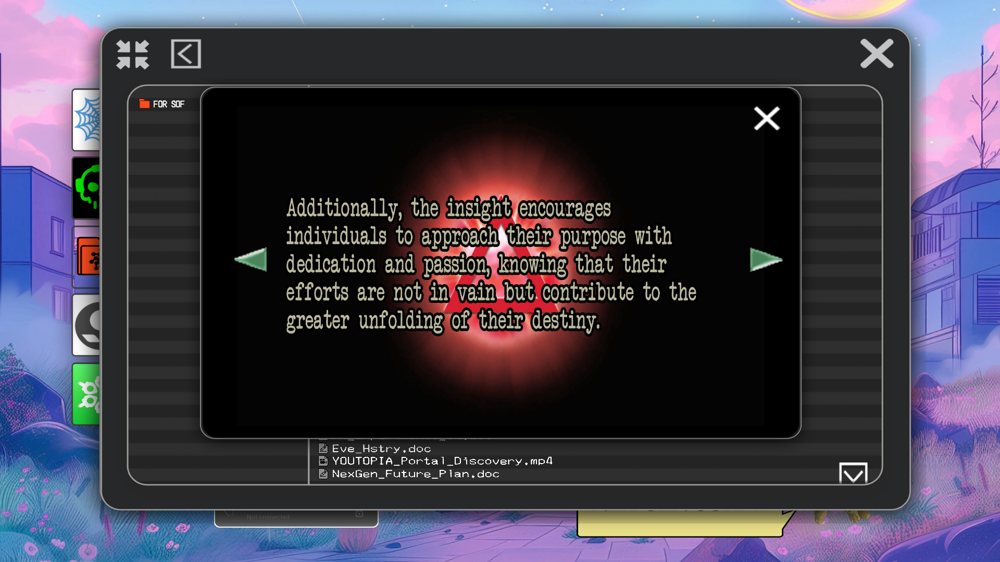
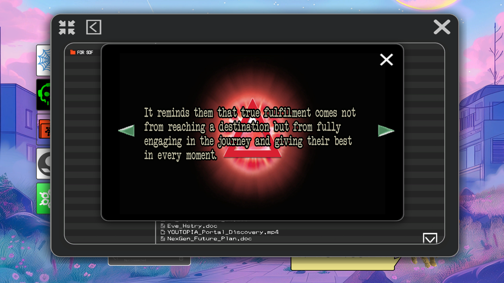
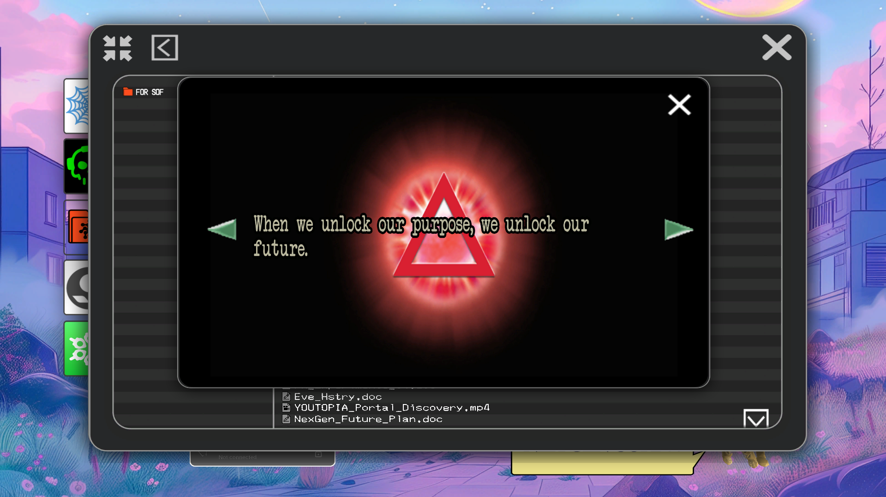

# Insight 3: Purpose
*The Waltz Of Existence*

Purpose is the third insight, found in the spectrogram of puss-e.

## Associations

- Song: **puss-e**
- Archangel: [Michael](../characters/michael)
- Omen: [Vanth](../characters/vanth): Princess of Death
- Curse: ???
- Direction: South
- Relic: Abramelin's Candle Of Eternal Light
- 

Insight 3 is also associated with [Pickles](../characters/pickles).

# Document in FOR SOF

Password: purpose

## Speculation

The Prince of Death might be the curse of this Insight, according to 
[Selene's map](../files/for-sof#YOUTOPIA_selenes_mapvis). However, following that logic 
the Babylon would be both the curse and the omen of [Vision](insight4-vision).

## Read More

- [Michael](../characters/michael)
- [Vanth](../characters/vanth)
- [The Insights](insights)
- [Insight 1: Connection](insight1-connection)
- [Insight 2: Empathy](insight2-empathy)
- [Insight 4: Vision](insight4-vision)