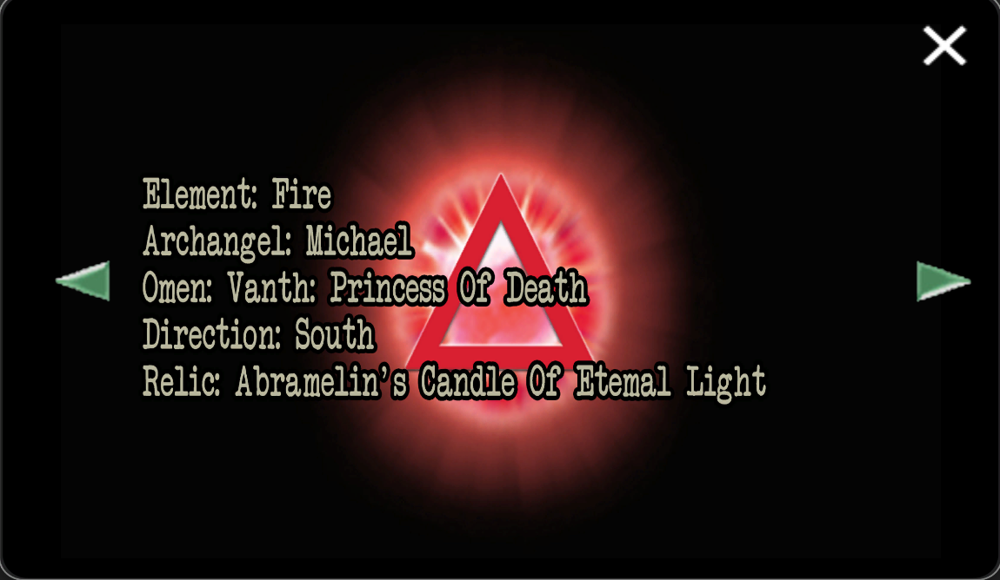

# Insight 3: Purpose

>*The Waltz Of Existence*

Purpose is the third insight, found in the spectrogram of puss-e.

## Associations

- Song: **puss-e**
- Archangel: [Michael](../characters/michael)
- Omen: [Vanth](../characters/vanth): Princess of Death
- Curse: ???
- Direction: South
- Relic: Abramelin's Candle Of Eternal Light

Insight 3 is also associated with [Pickles](../characters/pickles).

# Document in FOR SOF

  
Password

`purpose`

## Read More

- [Michael](../characters/michael)
- [Vanth](../characters/vanth)
- [The Insights](insights)
- [Insight 1: Connection](insight1-connection)
- [Insight 2: Empathy](insight2-empathy)
- [Insight 4: Vision](insight4-vision)