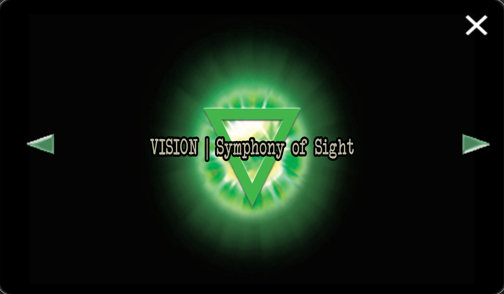

# Insight 4: Vision

>*Symphony of Sight*

The last insight in the numbered order is Vision. Its spectogram was found in the song 'DIg It'.

***

## Spectrogram

***

## Associations

- Song: **DIg It**
- Archangel: [Uriel](../characters/uriel)
- Omen: The Babylon
- Direction: North
- Relic: Golden Raspberry

From Selene's map

Insight 4 is also associated with [Vegan](../characters/vegan.md).

***

## FOR SOF

  
Password

`vision`

***

## Read More

- [Uriel](../characters/uriel)
- [The Insights](insights)
- [Insight 1: Connection](insight1-connection)
- [Insight 2: Empathy](insight2-empathy)
- [Insight 3: Purpose](insight3-purpose)