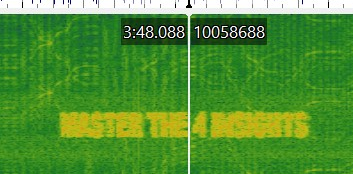
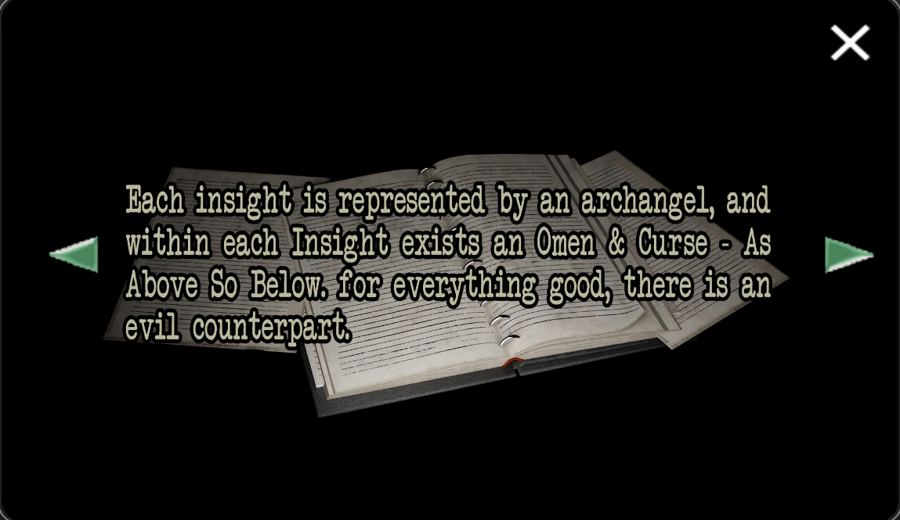
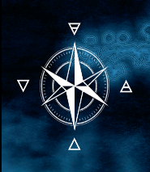
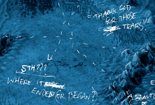
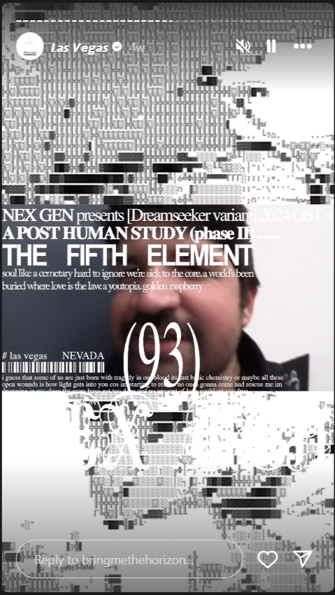
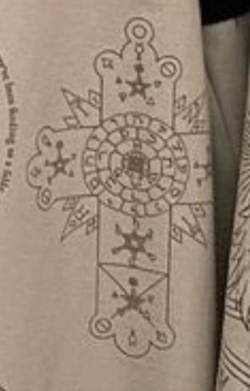

# The Four Insights

The first hint about the four insights was found in a spectrogram of the song YOUtopia.

Around 3:48 in the song, the message is hidden.

***

## Insight Spectrograms

The following songs also contain hidden images related to the insights:

- [Top 10 staTues tHat CriEd bloOd](../music/song-top10) (Connection)
- [n/A](../music/song-na) (Empathy)
- [[ost] puss-e](../music/song-pusse) (Purpose)
- [DIg It](../music/song-digit) (Vision)

Please explore their articles for more details.

***

## Introduction to the Insights

The [FOR SOF](../files/for-sof) folder contains a document `THEINSIGHTS.doc` that introducees us
to the insights.
We do not know the author, but we know that Selene likely left the files there for [Sof](../characters/sof).

Note that this document states that each insight comes with an omen and a curse. 
The omens are mentioned in the documents for the insights, but the curses are not.

All the insights also contains a reference to the four elements: air, water, fire and earth.

Compass from Selene's map. North is [vision](insight4-vision), East is [connection](insight1-connection), 
South corresponds to [purpose](insight3-purpose) and West is [empathy](insight2-empathy).

Each insight is also linked to a specific region in [Youtopia](youtopia), as indicated on 
[Selene's map](../files/for-sof#YOUTOPIA_selenes_mapvis). If we face East on this map, 
with Raphael before us, think links to the position of the archangels as we hear in [[ost] spiritual](../music/song-spiritual).

The following four insights are the ones referred to throughout the ARG. 
They are assigned numbers according to the folder structure for `FOR SOF`. 
They make the most sense if read in the original order.

1. [Connection — Air](insight1-connection)
2. [Empathy — Water](insight2-empathy)
3. [Purpose — Fire](insight3-purpose)
4. [Vision — Earth](insight4-vision)

The four insights also seem to be directly linked to the in-universe [characters](../characters/characters#band-members) 
for the band.

The fourth document ends with the conclusion that we need to apply the insights.

***

## The Fifth Insight: Spirit

While there was speculation, the fifth insight first seems to be confirmed through Selene's map.

Reference on Bring Me The Horizon's Instagram story.

The pentagram that often occurs in the ARG also represents five elements, being: 
water, earth, fire, air and **spirit**. 

The Dreamseeker tour jacket Oli wore during the European tour also contains 
several symbolic references, including a pentagram with the four triangles 
and the symbol for spirit.

***

## Read More

More from [📁 FOR SOF](../files/for-sof)

The four insights:

1. [Connection — Air](insight1-connection)
2. [Empathy — Water](insight2-empathy)
3. [Purpose — Fire](insight3-purpose)
4. [Vision — Earth](insight4-vision)

The [archangels](../characters#archangels):

- [Raphael](../characters/raphael)
- [Gabriel](../characters/gabriel)
- [Michael](../characters/michael)
- [Uriel](../characters/uriel)
