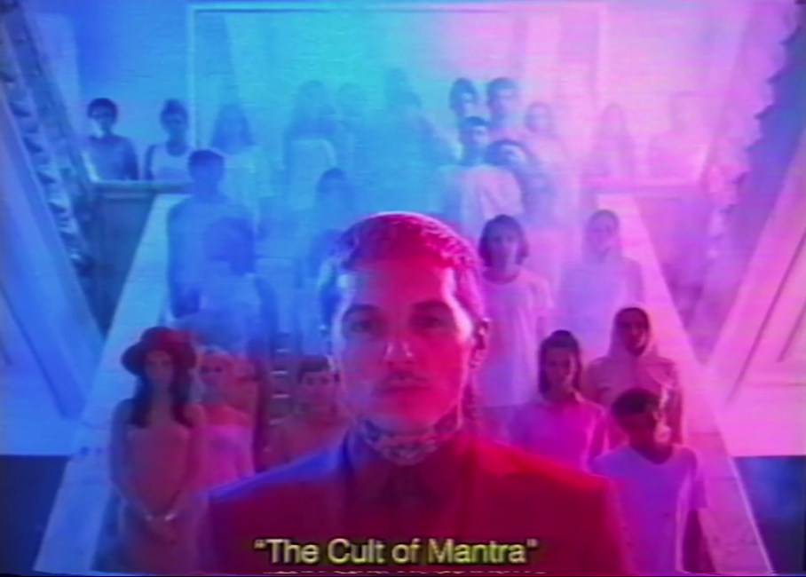

# Mantra Cult

The Neosages, better known as the Mantra, are a cult with their leader being
[Skys](../characters/skys).
Skys is also in a band called 'Skys & the Starjammers',
we learn from the [Unbeleevable episode](../for-sof/unbeleevable).
One of the files in the [FOR SOF](../for-sof) folder contains a [poster](../for-sof/skystarjammers) 
for the band, inviting people to their show at October Palace in 2004.

***

## Backstory

The cult was started by a man named Skys, who was born with pink hair. His parents abandoned 
him at 8 years old.
After this point he fell in with a group of 'nutters'
(as stated by Dr. Lee MD in [Unbeleevable](../for-sof/unbeleevable)) 
and traveled the world.

At some point he then picked up a guitar and his band got somewhat successful.
Whether this was as a result of the cult, or before the Mantra cult is currently unknown.

In the music video for [Mantra](../music/amo-mantra) we see the fall of the cult.
We see Skys in his office (seemingly) taking Mantra.
He is found by a woman in red and a funeral is planned.
The music video also shows us the funeral, where the cult members all take Mantra and start 
convulsing violently, along with the woman in red.
A mysterious electricity-like power knocks out or kills all the cult members.
We then see Skys open his eyes in his coffin, indicating that he is not dead.

The [Trinity document](../for-sof/trinity_document) also reveals that Skys' death was indeed faked and that he 
was extracted from Novosoviya in Operation Trinity.

> It is believed that ARC/HIV recognizes the potential of their research
> and seeks to attract them to their ranks to advance their technological and neuronal learning initiatives.

[ARC/HIVE](archive) seems to be interested in the practices of the Neosages/Mantra cult, extracting Skys along 
with [Dallus Lauren](../characters/dallus-lauren) and [Karl Strassman](../characters/strassman).
It is unknown what happens to Skys after he is extracted.

***

## joinmantra.org

joinmantra.org was a promotion for the music video for [Mantra (song)](../music/amo-mantra).

*An invitation to salvation* is shown on the webpage, along with the Mantra logo.
The website contained a slightly moving image of Oli in the music video.
It was revealed to be a teaser for the song.

The website sadly does not exist in this form,
but it can be viewed on the [wayback machine](https://web.archive.org/web/20190408225654/http://www.joinmantra.org/).

***

## Speculation

- Skys ended up at ARC/HIVE and can be seen in the [In the Dark](../music/amo-in-the-dark) music video.
- Skys ended up changing his name after faking his death. He could have changed his name to [Victor Carmine](../characters#victor-carmine), 
a mysterious man who is named along with Dallus and Strassman in the [Tekka interview](../for-sof/tekka_interview)

***

## Read More

Related music:

- [Mantra](../music/amo-mantra)
- [Sugar Honey Ice and Tea](../music/amo-shit)
- [In the Dark](../music/amo-in-the-dark) (Unconfirmed)

Related characters:

- [Skys](../characters/skys)

Related files:

- [Operation Trinity](../for-sof/trinity_document)
- [Skys & the Starjammers poster](../for-sof/skystarjammers)
- [Unbeleevable video](../for-sof/unbeleevable)
- [The Science Study newspaper](../for-sof/thesciencestudy)
- [Dreadit post](../for-sof/dreadit)