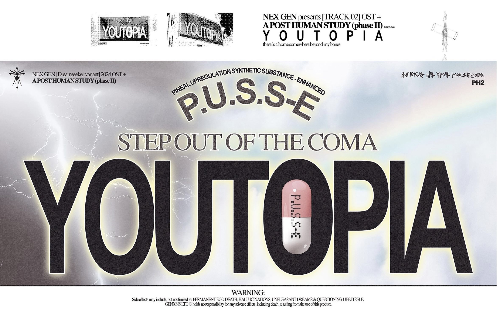
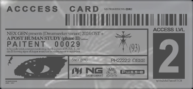

# P.U.S.S-E

> *This page refers to the concept within the ARG, not the [song](../music/song-pusse).*

P.U.S.S-E is short for Pineal Upregulation Synthetic Substrance Enhanced, 
as seen in promotional posts.
It is based on DMT, as confirmed in the [song](../music/song-pusse).

> *"What would you do for P.U.S.S-E?"*

P.U.S.S-E seems to be a drug, implied by instagram posts, a pill bottle at the end of the spectrogram in 
[the song](../music/song-pusse) and additional promotional information. The stylization of puss-e (like P.u.s.s-e) is 
different between the tracklist and the instagram.

Promotional post from the BMTH instagram, see page on [social posts](../socials/social-posts)

The small text on the access card on the main ARG page also recommends two doses 
of P.U.S.S-E a day for this patient.

***

## Read more

- [P.U.S.S-E (song)](../music/song-pusse)
- [Nex Gen Corporation](nex-gen-corporation)
- [Youtopia](youtopia)
- [Dreadit file](../files/dreadit)
