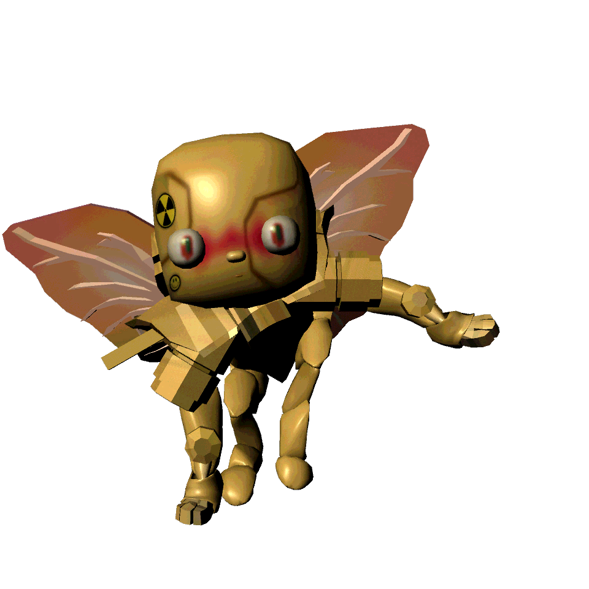
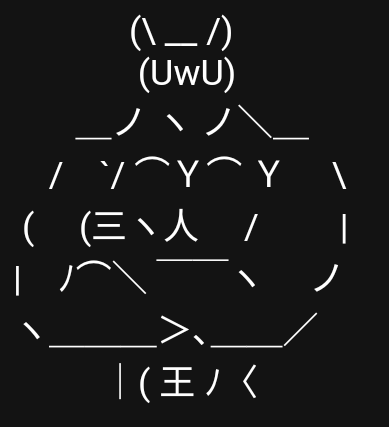

# M8

> "Greetings, meatbag!"

M8, short for Multidimensional Navigator 8, is a system helping us on our journey. It is revealed by Selene in the 
[FOR SOF audiolog](files/for-sof) that M8 is a *she*. She is hiding the secrets of the past from [SOF](characters/sof.md), 
with Selene hinting there might be a good reason for that in the same audio recording.

***

## Trivia

- Is made of heavy metal (according to M8 herself)
- Has 'Clive' as a middle name

***

## Read More

- [Sof](characters/sof)
- [Selene](characters/selene)
- [Eve](characters/eve)

***

## Gallery


