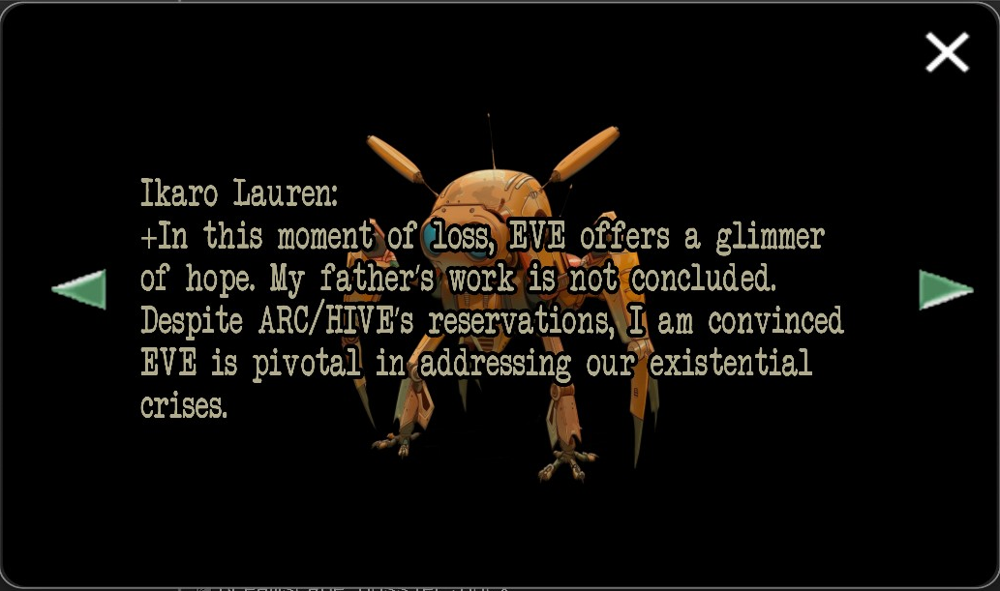
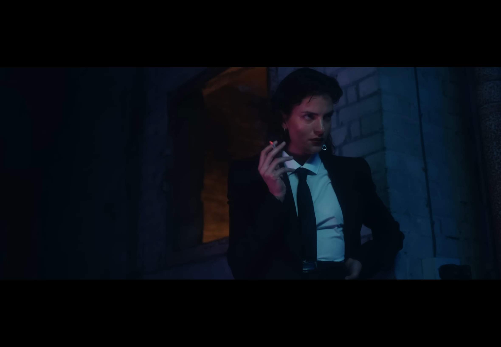

# In The Dark

> I'm not looking salvation, just a little faith in anyone or anything.

"In The Dark" is a song from the album 'Amo'. Its music video contains many references to a mysterious 
organization called ARC/HIVE, just like [the D8 log](../files/lauren_d8_log).

The video also showcases the altilium chordata tanks mentioned in [Project D.U.S.T.](../files/project_dust) as well as [Dr. Dallus Lauren](../characters/dallus-lauren) re-experiencing what we think might be the mares also mentioned in [Project D.U.S.T.](../files/project_dust)

Moreover, we see a woman who seems to be [Rebecca](../characters/rebecca).

***

## Music Video Gallery



***

## Read More

Related files:

- [Project D.U.S.T.](../files/project_dust)
- [Lauren d8 log](../files/lauren_d8_log)

Related articles:

- [ARC/HIVE](../lore/archive)

Related Characters:

- [Ikaro Lauren](../characters/ren)
- [Dallus Lauren](../characters/dallus-lauren)
- [Rebecca](../characters/rebecca)
