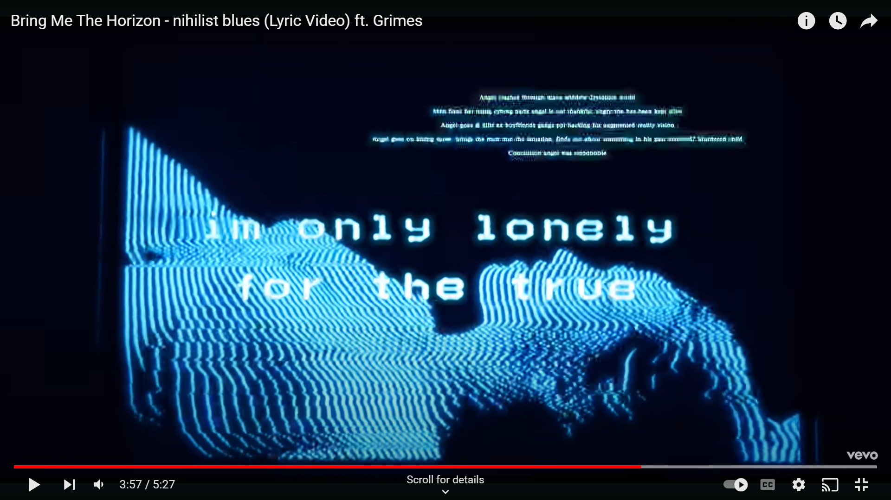
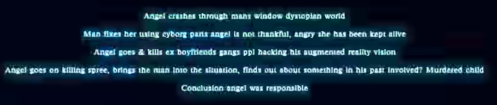

# Nihilist Blues

Nihilist Blues is a song from the album [Amo](amo), featuring Grimes. 
An official lyric video for it was released, containing strange messages 
that seem to relate back to the ARG. However, there has been no evidence 
to directly link this song to the ARG.

***

## Lyric Video

The [lyric video for Nihilist Blues](https://www.youtube.com/watch?v=iwzfR7-33Wc) 
contains some strange messages.

 

At 3:57 in the lyric video we see message flashing on the screen.

When we isolate the message it becomes readable:

> angel crashes through man's window dystopian world
man fixes her using cyborg parts angel is not thankful, angry she has been kept alive
angels goes & kills ex boyfriend gangs ppl hack his augmented reality vision (EYE)
Angel goes on killing spree, brings the man man into the situation, finds out about something in his past involved? Murdered child
Conclusion angel was responsible

An interesting revenge story is laid out here, talking about cyborg parts 
and angels. It is currently unclear whether this story is about one of our ARG characters.

***

## Read More

- [amo](amo)
- [MANTRA](amo-mantra)
- [in the dark](amo-in-the-dark)
- [sugar honey ice & tea](amo-shit)