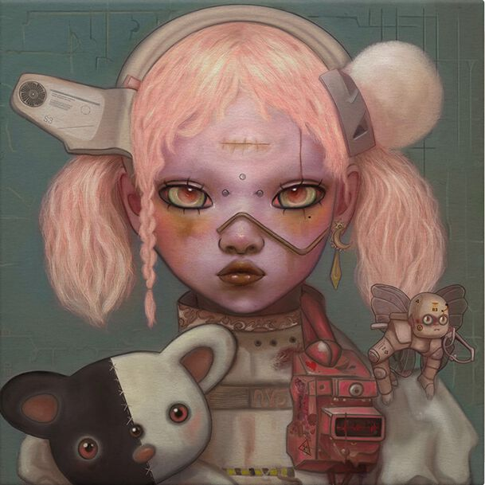
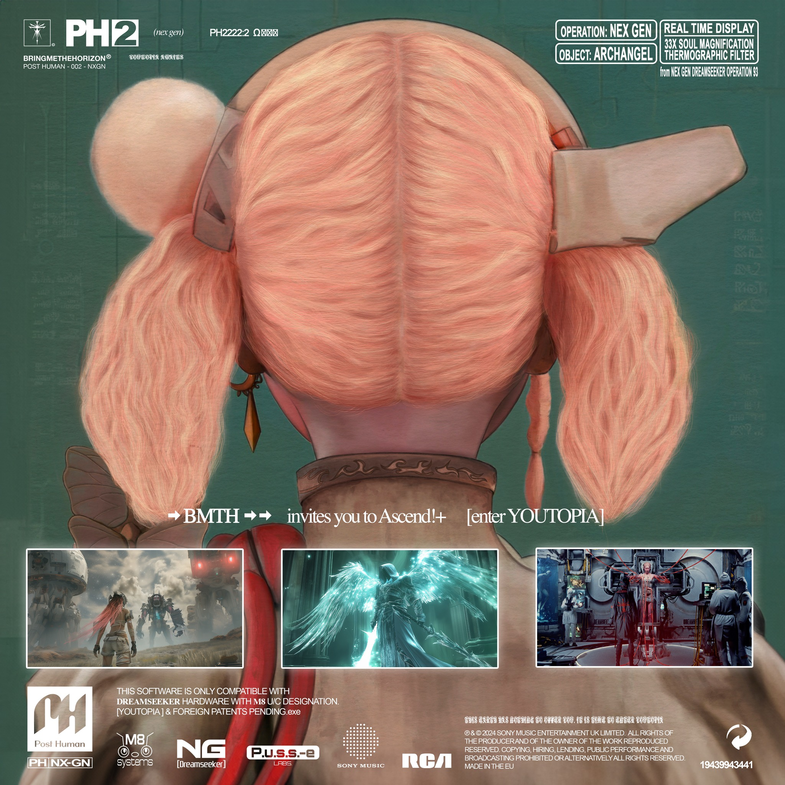

# POST HUMAN: NeX GEn

POST HUMAN: NeX GEn is the 2nd album/EP in the POST HUMAN line. 

***

## Tracks

All tracks for Nex Gen have their own articles.

- [01. [ost] Dreamseeker](song-dreamseeker)
- [02. YOUtopia](song-youtopia)
- [03. Kool-Aid](song-koolaid)
- [04. Top 10 staTues tHat CriEd bloOd](song-top10)
- [05. liMOusIne](song-limousine)
- [06. DArkSide](song-darkside)
- [07. a bulleT w/my namE On](song-abwmno)
- [08. [ost] (spi)ritual](song-spiritual)
- [09. n/A](song-na)
- [10. LosT](song-lost)
- [11. sTraNgeRs](song-strangers)
- [12. R.i.p (duskCOre RemIx)](song-rip)
- [13. AmEN!](song-amen)
- [14. [ost] puss-e](song-pusse)
- [15. DiE4u](song-die4u)
- [16. DIg It](song-digit)

Additionally, there are some [songs](website-songs) on the music player on the [webpage](../webpage), 
including two versions of Kool-Aid (8-bit version).

***

## Connections

See [interview on NexGen](https://www.youtube.com/watch?v=wLAoyZ4geIA).
Oli states that some songs directly connect/mirror each other.

### YOUtopia - Kool-Aid

Oli stated in an interview that [YOUtopia](song-youtopia) and [Kool-Aid](song-koolaid) are 
"two sides of the same coin".

### Top 10 staTues tHat CriEd bloOd - liMOusIne

He stated the same thing about [Top 10 staTues tHat CriEd bloOd](song-top10) and 
[liMOusIne](song-limousine)

### The Rehab Trilogy

- [09. n/A](song-na)
- [10. LosT](song-lost)
- [11. sTraNgeRs](song-strangers)

Oli described n/A as group therapy, LosT as a one-on-one therapy session and sTraNgeRs as sharing that pain and 
connecting over it with others.

***

## Read More

- [POST HUMAN: Survival Horror](ph-survival-horror)
- [amo](amo)