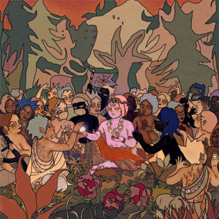
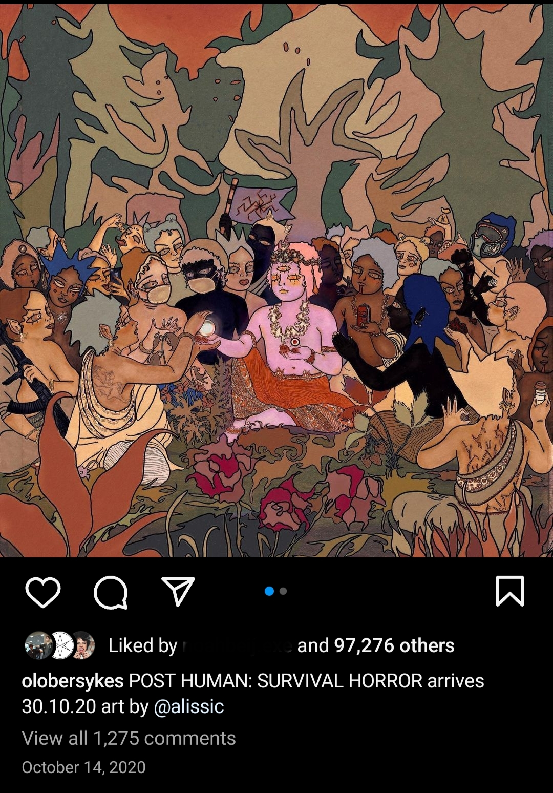
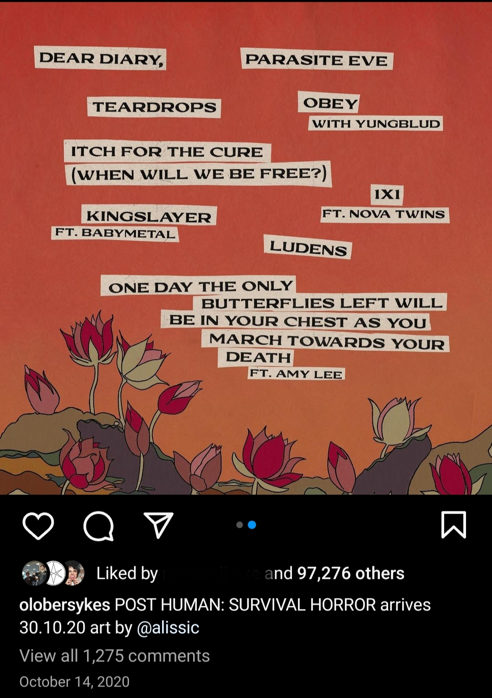
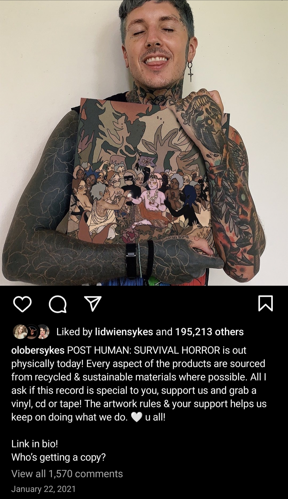

# POST HUMAN: SURVIVAL HORROR

Post Human: Survival Horror (PH:SH) was the first Post Human album. PH:SH was supposed to be the first of four albums 
([source: Kerrang](https://www.kerrang.com/oli-sykes-on-bring-me-the-horizons-post-human-ep-series-theres-gonna-be-a-record-for-everyone)), 
explicitly citing they were all part of a bigger project. We also find references to the song `Dear Diary,` in 
[Scott's journal](../files/scott_personal_journal).

***

## Song articles

[1. Dear Diary,](song-dear-diary)
[2. Parasite Eve](song-parasite-eve)
[3. Teardrops](song-teardrops)
[4. Obey](song-obey)
[5. Itch for the Cure (When Will We Be Free?)](song-kingslayer-itch)
[6. Kingslayer](song-kingslayer-itch)
[7. 1x1](song-1x1)
[8. Ludens](song-ludens)
[9. One Day The Only Butterflies Left Will Be In Your Chest As You March Towards Your Death](song-butterflies)

***

## Interviews

This section contains snippets of interviews about the album as a whole.

> During this period, he and the rest of the five-piece stayed sane by working remotely on
 ‘Post Human: Survival Horror’, the first in a run of four EPs coming in the next year, 
 all part of a project that they’ve dubbed ‘Post Human’.
> 
> Describing the ‘Survival Horror’ EP as “a recruitment record with battle songs”, Sykes 
says that its nine tracks are a rallying cry to act now against inequality and 
environmental peril – which were there all along, but have become impossible to ignore 
amid the chaos of the coronavirus crisis: “We’re trying to get as many people as angry 
and pissed off as possible so that they join the cause. It feels like we’re on the verge 
of something, dealing with how our culture is and how we look to destroy people. We can 
become something better than what humans are right now.”
> 
> With nature itself turning against us, Sykes says that humanity needs to put divisions 
and greed aside: “The way the world works has shown us it isn’t right,” he insists. 
“If something as simple as a virus can destabilise our whole planet, then it isn’t 
really working, is it?”
>
> [Source: NME](https://www.nme.com/big-reads/bring-me-the-horizon-cover-interview-2020-post-human-survival-horror-2804768)

***

## Socials

The art was made by Oliver's wife @alissic, who also made the cover for Post Human: 
Nex Gen.

***

## Speculation

- It is theorized that the girl on the cover of PH:SH (with the pink skin) is Sof 
from NEx Gen. The theory is supported by the fact that both characters have a third eye 
(with Sof's seemingly being sewn shut).

***

## Read More

- [Spectrograms](spectrograms)
- [POST HUMAN: NeX GEn](ph-nex-gen)