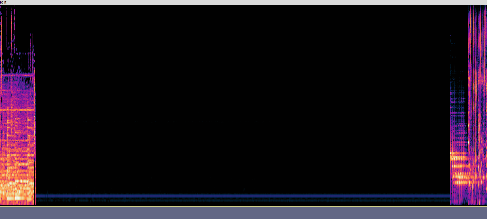

# DIg It (Song)

DIg It is the final song on the album. It contains dialogue and hints from M8 after a 
period of silence (93 seconds). [Insight 4: Vision](../lore/insight4-vision) can be found 
in the [spectrogram](spectrograms), as well as the [QR code](../webpage#qr-code) that lead 
users to the webpage, starting the ARG.

***

## Lyrics

Source: [lyrics video](https://www.youtube.com/watch?v=15Fg3sTag4w).

Expand lyrics

> pins and needles in my face i
> can’t trust my feelings anymore
> shouldn’t of looked behind the veil my
> whole world’s at war
> cos they’ve been feeding us a fable
> swallowing the rabbit whole
> i cant keep quiet at the table
> anymore, no oh 
>
> i hate my fucking guts right now
> reckon you’d be better if i never existed sorry that i let you down
> found a way to hide
> and now i’m addicted 
>
> give me something to believe in
> some kind of system override
> i need to give my ghost a reason
> to let it slide
> cos everyone’s too scared to heal
> they don’t give a fuck how they feel
> and i just don’t know how to deal anymore
> maybe the damage is done
> maybe the darkness has won
> and we were programmed
> just to suffer 
>
> i hate my fucking guts right now
> i’m sorry that i let you down 
>
> i hate my fucking guts right now
> reckon you’d be better if i never existed
> sorry that i let you down
> found a way to hide
> and now i’m addicted
> cos the world is a scary place
> scary future
> scary fate
> thought the pain
> would teach me somehow
> but the only thing
> i figured out
> is life is a grave
> and i dig it
> and i dig it 
>
> i don’t wanna lose myself again
> i don’t wanna lose myself again 
>
> cos the world is a scary place
> scary humans
> scary race
> thought the pain
> would teach me somehow
> but the only thing
> i figured out
> is life is a grave
> and i dig it
>
> cos everyone’s too scared to heal
> they don’t give a fuck how they feel
> and i just don’t know how to deal anymore
> well maybe the damage is done
> maybe the darkness has won
> and we were programmed
> just to suffer 
>
> i hate my fucking guts right now
> reckon you’d be better if i never existed
> i’m sorry that i let you down
> when you find this letter
> hope you don’t get it twisted
> cos the world is a scary place
> scary future
> scary fate
> thought the pain
> would teach me somehow
> but the only thing
> i figured out
> is life is a

***

## 93 second silence

The number 93 often appears, like in these 93 seconds of silence.

***

## Read More

- [POST HUMAN: NeX GEn](ph-nex-gen)
- [Insight 4: Vision](../lore/insight4-vision)
- [Webpage](../webpage)