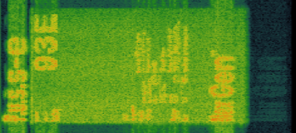

# [ost] p.u.s.s-e (song)

*This article refers to the song, not the [general concept](../lore/pusse)*

[ost] p.u.s.s-e is the 14th song on the album. It has been found to contain hidden images in its [spectrograms](spectrograms),
both including one of the [insights](../lore/insights), and an image at the end.

## Lyrics & text

This song contains very few lyrics, functioning as an interlude on [the album](ph-nex-gen). 
Since [P.U.S.S-E](../lore/pusse) is pretty significant to the lore, this transcription 
also attempts to transcribe the talking we hear throughout.

<details class="lyrics">
<summary>Expand lyrics</summary>

```
- Talking:
It's simple folk-
[???]ogram therapeutic
It's DMT! And how could it help you access Youtopia?
Everybody stick around because we're gonna have some fun and look at this-
(Woman talking fast and jumbled)
I just wanted to try something new
Ecsta[sy]
You're si-
(Screaming)
GET AWAY, GET AWAY
(More distorted screaming)

I think the question on everyone's lips is 
what would you do for P.U.S.S-E?

(Music, flashes of "LET PUSS-E GUIDE YOU THERE")

Do you wanna join the millions of people that already ascended to Youtopia?

(Music, more imagery)

State of the art emotion simulator
Ancestors of the [yesteryears?]

- Singing:
THE BLOODS ON OUR HANDS
THE BLOODS ON OUR HANDS

- Talking:
WHAT WOULD YOU DO FOR PUSS-E

[SYMBOLS FLASHING, GENXSIS VIDEO, HIDDEN IMAGERY]

Remember when you used to care?
Remember when it used to mean something?
Remember when it was as simple as the summer sunset?
No? [man grumbling] You will.
```

</details>

## Spectrograms

For more details, see the page on [spectrograms](spectrograms).



## Read More

- [POST HUMAN: NeX GEn](ph-nex-gen)
- [P.U.S.S-E (concept)](../lore/pusse)
- [Spectrograms](spectrograms)
- [Insight 4: Purpose](../lore/insight4-vision)
