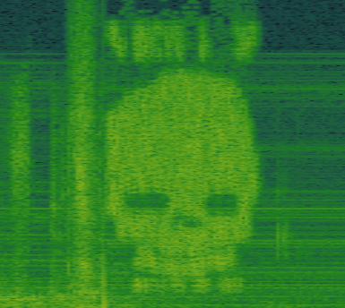
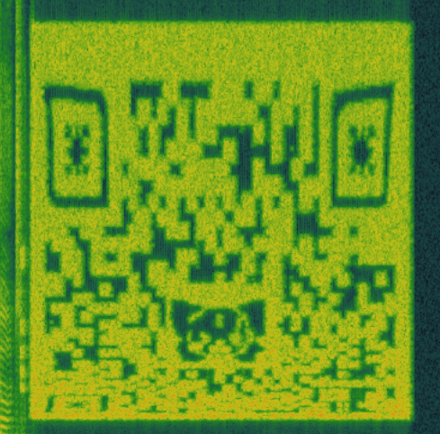

# Spectrograms

In the songs on NexGen, several anomalies can be found in the spectrograms.

***

## Known spectrograms

The following songs (all on NexGen) have been discovered to contain hidden messages. 
They are listed in order of album appearance.

### Top 10 Statues That Cried Blood

[See Insight 1: Connection](../lore/insight1-connection.md)

### [ost] (spi)ritual

Seems to contain an image of the four archangels.

### n/A

[See Insight 2: Empathy](../lore/insight2-empathy)

## [ost] puss-e

[See Insight 3: Purpose](../lore/insight3-purpose)

This song also contains an image of what has been described as a label or pill bottle.

### R.i.p. (duskCOre Remix)

Contains an image of a skull, with characters above and below that have not been identified. This song also 
contains a small audio fragment from the game Undertale, specifically to a skeleton named Sans. The skull is likely a 
reference and might not be a clue to the ARG itself.

### DIg It

DIg It contains the QR code that lead to the website, as well as 
[Insight 4: Vision](../lore/insight4-vision).

***

## Read More

- [POST HUMAN: NeX GEn](ph-nex-gen)
- [Top 10 staTues tHat CriEd bloOd](song-top10) (Connection)
- [n/A](song-na) (Empathy)
- [puss-e](song-pusse) (Purpose)
- [DIg It](song-digit) (Vision)
- [[ost] spi(ritual)](song-spiritual)