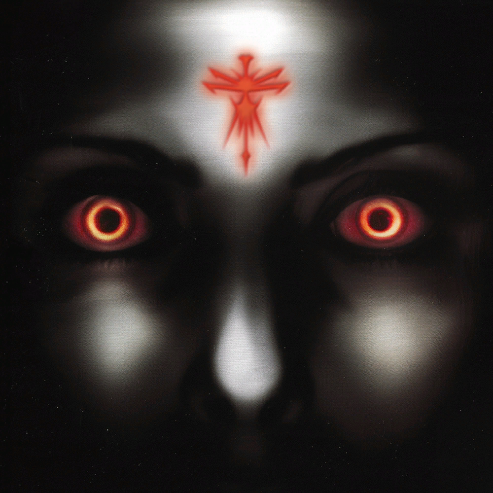
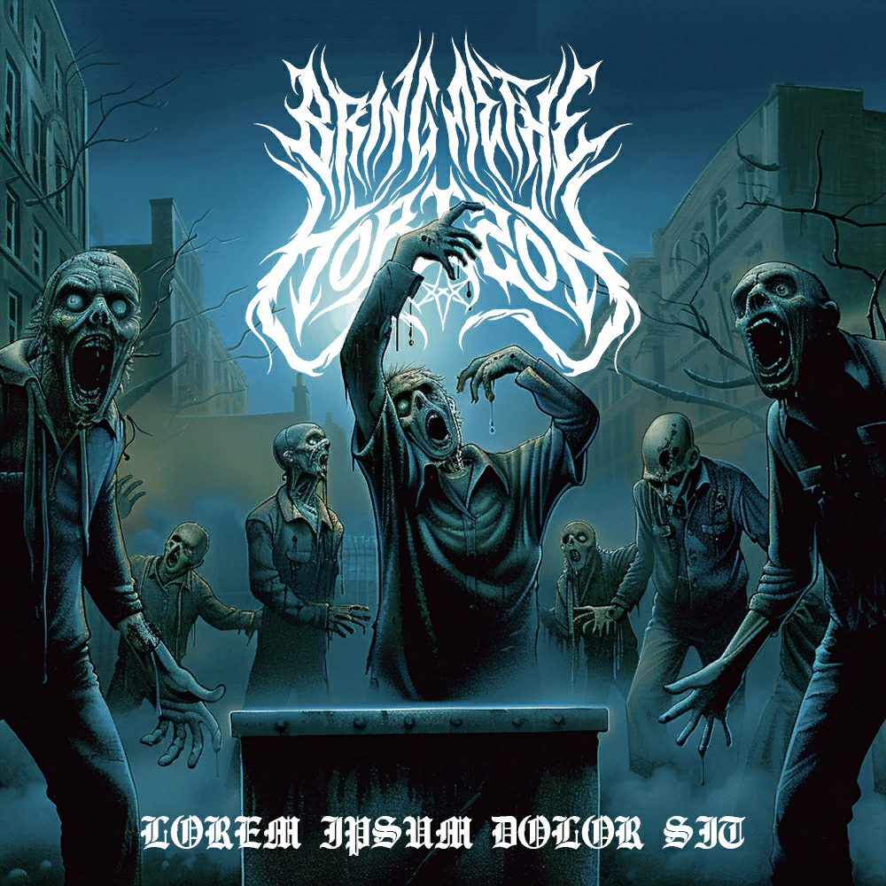
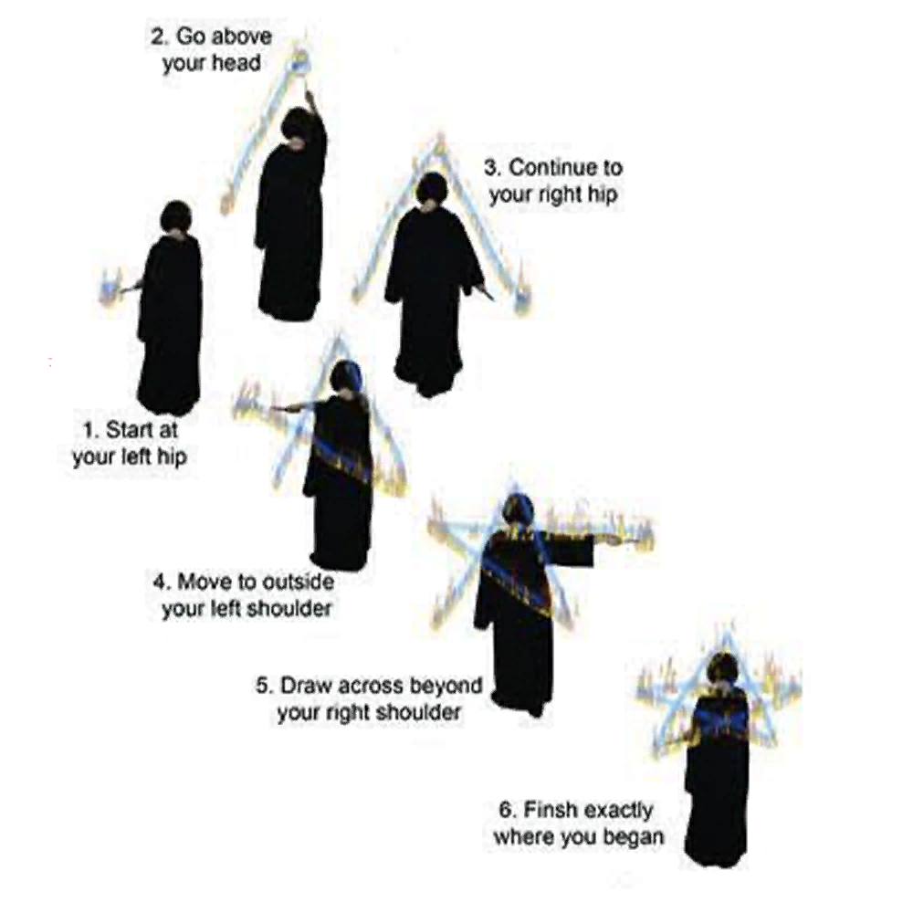
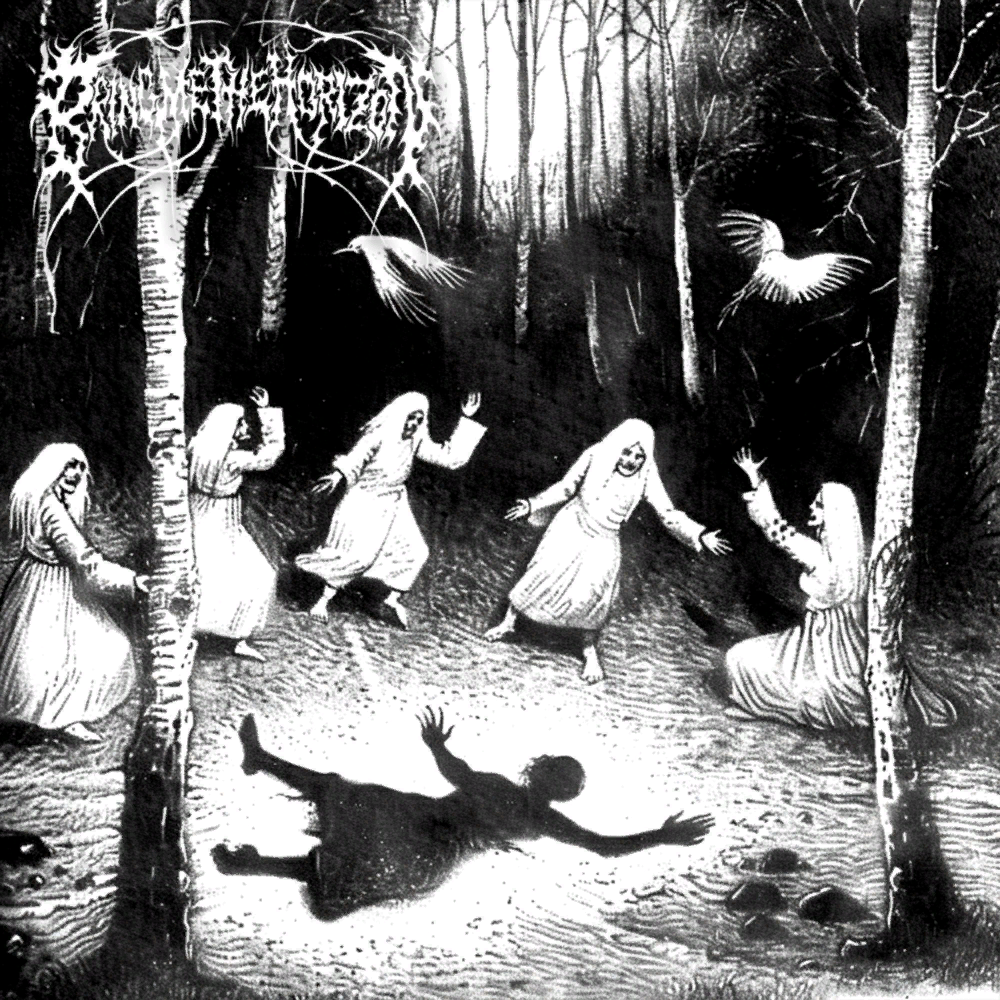
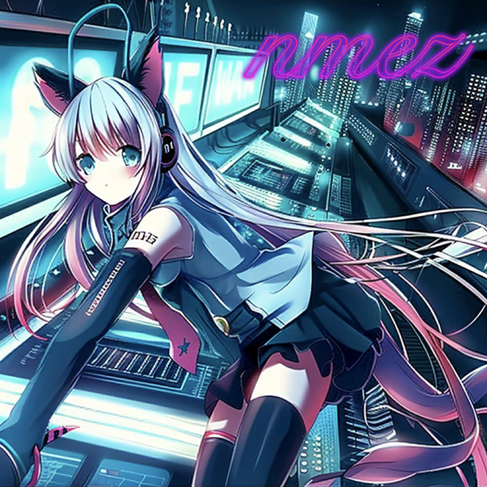

# Website Songs

The website's song player Nocturne also includes a few songs and artwork.
Since the 28/05/2024 update it is now possible to 💔 it, keeping the button red while 
being logged in.

1. GLOBAL DESTRUCTION

2. AY00000

3. KOOLAID(8-BIT) (has been removed)

4. d.w.t. DEVIL

This song makes M8 sad, as added in the 28/05/2024 update.

5. WRIST

Update: after some songs are removed, WRIST is currently the first song in the player.

6. nmez!

[MOLKO screenshot](../../Resources/webpage/molko.jpg)

7. MOLKO (has been removed before 25-05-2024).

## Hear More

The website songs uploaded to YouTube:

- [1. Global Destruction](https://www.youtube.com/watch?v=45qzhosnLd8)
- [2. AY000](https://www.youtube.com/watch?v=Uw9ntJukzPA)
- [3. Kool-Aid 8-bit (v1)](https://www.youtube.com/watch?v=bJ9rwo_dm48)`
- **3. Kool-Aid 8-bit (v2)**: sadly not on YouTube yet.
- [4. d.w.t. DEVIL](https://www.youtube.com/watch`?v=fI6FdYM8OY0)
- [5. WRIST](https://www.youtube.com/watch?v=89q8OXs2IAY)
- [6. nmez!](https://www.youtube.com/watch?v=e4I4quwlxGM)
- [7. MOLKO](https://www.youtube.com/watch?v=R42y99A9d-U)

## Read More

- [POST HUMAN: NeX GEn](ph-nex-gen)