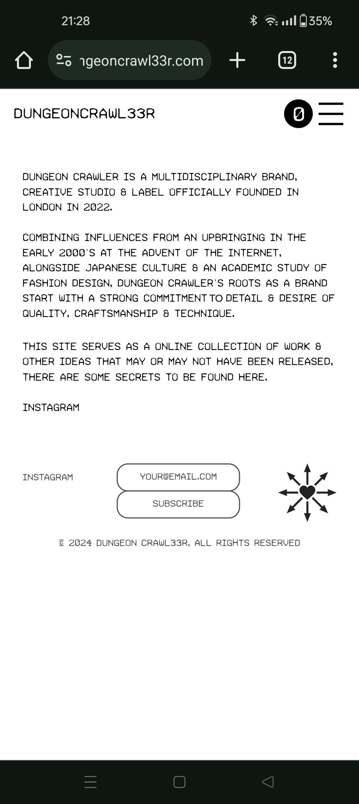

# Other webpages

A few other pages have been relevant to the investigation, mostly 
including [social media pages](socials/social-posts).

***

## Downloadfest

A cypher found on a Downloadfest webpage was re-used in the ARG, as evidenced 
by the use of these symbol in different promotional posts. Also see the 
page on [downloadfest](lore/downloadfest).

***

## Dungeoncrawl33r.com

This site seems to be relevant to the lore of the ARG and states that it contains secrets. 
It uses some references the ARG also uses and some bar codes on social media posters have linked 
directly to this website.
It also has coordinates on the front page pointing to the Temple of Solomon.

***

## Read More

- [Webpage](webpage)
- [Social posts](socials/social-posts)